## PostGIS Extension to PostgreSQL Database for Hosting GeoServer

**PostGIS** is an spatial extension for the PostgreSQL object-relational database, which adds support for geographic objects allowing location queries to be run in SQL. With PostGIS extension PostgreSQL can be used as a backend spatial database for GIS.

**GeoServer**, in its turn, is an open source Java software server, used for generating, sharing and managing geospatial data. Using open standards GeoServer publishes data from any major spatial data source.

So, let’s investigate how to extend PostgreSQL database with PostGIS and deploy the GeoServer to environment to work with shared geospatial data.

## Create Environment

First of all you need to create an environment as a basis for your application.

1. Log into your PaaS account an click on the **Create environment** button.
2. Select **Tomcat 7** as your application server and **PostgreSQL 9** as a database you want to use. Set up the resource limits for each node and enter your environment name (e.g. geoserver). Confirm the environment creation.

<div style={{
    display:'flex',
    justifyContent: 'center',
    margin: '0 0 1rem 0'
}}>

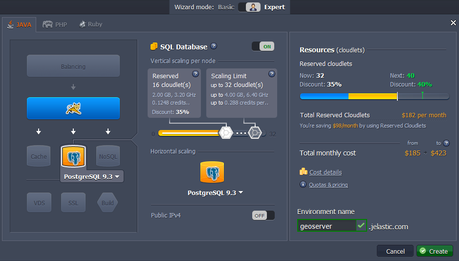

</div>

3. In a few minutes your environment will appear on the dashboard.

<div style={{
    display:'flex',
    justifyContent: 'center',
    margin: '0 0 1rem 0'
}}>

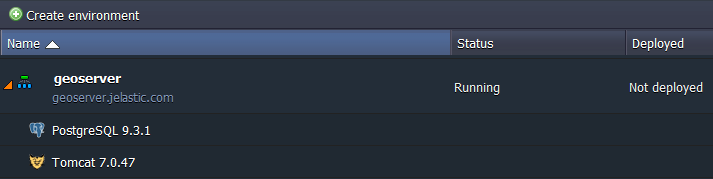

</div>

## GeoSever Deployment

Now we can proceed to GeoServer software deploy.

1. Open the **[GeoServer official web-site](https://cloudmydc.com/)** and download the latest stable release as a web archive.

<div style={{
    display:'flex',
    justifyContent: 'center',
    margin: '0 0 1rem 0'
}}>

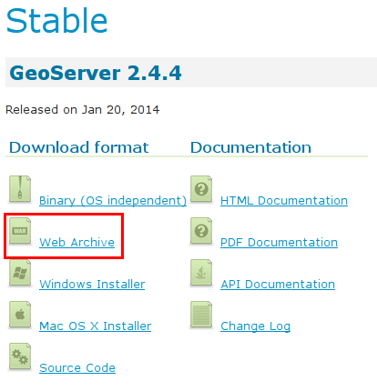

</div>

2. When downloading is completed, extract the archive you’ve got.

<div style={{
    display:'flex',
    justifyContent: 'center',
    margin: '0 0 1rem 0'
}}>

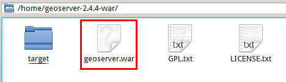

</div>

3. Navigate back to the platform dashboard and upload the **_geoserver.war_** file, located in the folder with extracted archive content.

<div style={{
    display:'flex',
    justifyContent: 'center',
    margin: '0 0 1rem 0'
}}>

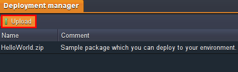

</div>
<div style={{
    display:'flex',
    justifyContent: 'center',
    margin: '0 0 1rem 0'
}}>

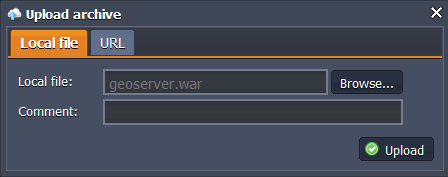

</div>

4. Finally, press **Deploy to..** button next to this **.war** file in the packages list and choose created before environment in order to deploy GeoServer app to it.

<div style={{
    display:'flex',
    justifyContent: 'center',
    margin: '0 0 1rem 0'
}}>

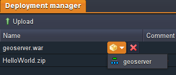

</div>
<div style={{
    display:'flex',
    justifyContent: 'center',
    margin: '0 0 1rem 0'
}}>

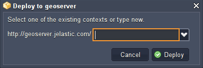

</div>

## PostGIS Configurations

At this step we are going to add PostGIS extension for our PostgreSQL database.

1. Open **phpPgAdmin** for the PostgreSQL database in your environment by pressing **Open in browser** button next to it.

<div style={{
    display:'flex',
    justifyContent: 'center',
    margin: '0 0 1rem 0'
}}>

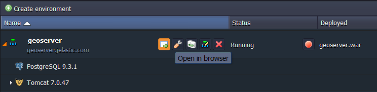

</div>

2. Log in with PostgreSQL credentials you’ve received via email after the environment creation.

<div style={{
    display:'flex',
    justifyContent: 'center',
    margin: '0 0 1rem 0'
}}>

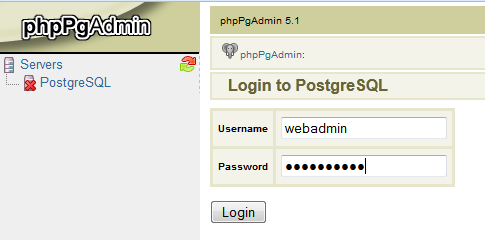

</div>

3. Now you need to create a new database. For that press **Create database** button in the opened window.

<div style={{
    display:'flex',
    justifyContent: 'center',
    margin: '0 0 1rem 0'
}}>

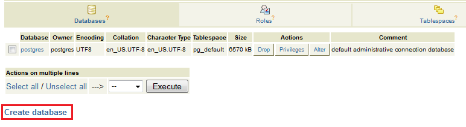

</div>

4. Fill in the form:

- state the name for a new database (in our case, nyc)
- choose UTF8 encoding in the drop-down list
- fill in the other fields if it is required

Click **Create** button.

<div style={{
    display:'flex',
    justifyContent: 'center',
    margin: '0 0 1rem 0'
}}>

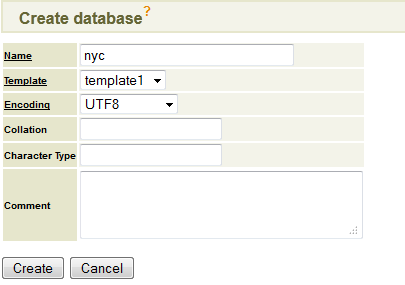

</div>

5. Choose newly created database in the expandable list on the left-hand panel and navigate to the SQL tab.

<div style={{
    display:'flex',
    justifyContent: 'center',
    margin: '0 0 1rem 0'
}}>

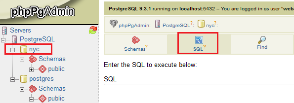

</div>

6. Enter the following SQL queries and execute them:

```bash
CREATE EXTENSION postgis;
CREATE EXTENSION postgis_topology;
CREATE EXTENSION fuzzystrmatch;
CREATE EXTENSION postgis_tiger_geocoder;
```

where the attributes are:

- _postgis_: for PostGIS enabling (includes raster)
- _postgis_topology_: for Topology enabling
- _fuzzystrmatch_: fuzzy matching is needed for Tiger
- _postgis_tiger_geocoder_: for US Tiger Geocoder enabling

:::tip Note

Don’t forget to tick off the Paginate results line under the form in order not to get any errors.

:::

<div style={{
    display:'flex',
    justifyContent: 'center',
    margin: '0 0 1rem 0'
}}>

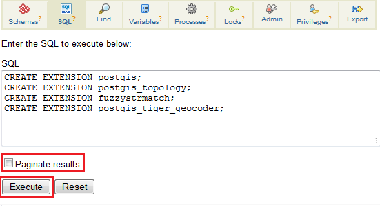

</div>

That’s all. PostGIS extension is enabled and can be used.

## Dataset Import

Now let’s import PostGIS dump of a dataset to our PostreSQL database. As an example, we are going to use [nyc_buildings.zip](https://cloudmydc.com/) with dataset of buildings from New York City.

1. Download [nyc_buildings.zip](https://cloudmydc.com/) package and extract it. You’ll get the **_nyc_buildings.sql_** file.
2. Enter **phpPgAdmin** for PostgreSQL with your credentials and navigate again to the SQL tab for your database with PostGIS extension (in our case, **_nyc_** database).

<div style={{
    display:'flex',
    justifyContent: 'center',
    margin: '0 0 1rem 0'
}}>


</div>

3. Browse the extracted dataset (e.g. _nyc_buildings.sql_) on your local computer and upload as an SQL script.

<div style={{
    display:'flex',
    justifyContent: 'center',
    margin: '0 0 1rem 0'
}}>

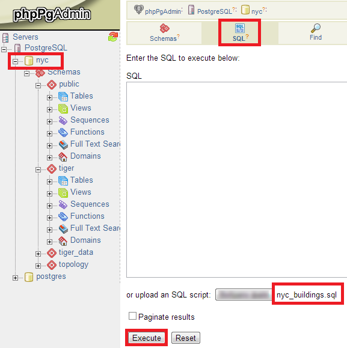

</div>

4. Tick off the Paginate results line under the form and **Execute** the script.

## Connect GeoServer with Database

Now we need to connect our GeoServer application with the PostgreSQL database. For this we’ll create a **data store** for our **nyc** database.

1. Navigate to the platform dashboard and open the GeoServer environment (press **Open in browser** next to it).

<div style={{
    display:'flex',
    justifyContent: 'center',
    margin: '0 0 1rem 0'
}}>


</div>

2. In the opened browser tab log in with the default GeoServer credentials (_admin/geoserver_).

<div style={{
    display:'flex',
    justifyContent: 'center',
    margin: '0 0 1rem 0'
}}>

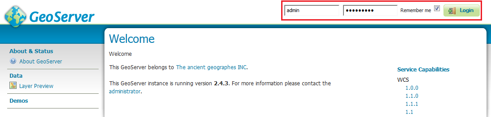

</div>

3. Then navigate to the **Data > Stores** menu item in the left-hand panel and click **Add new Store** line.

<div style={{
    display:'flex',
    justifyContent: 'center',
    margin: '0 0 1rem 0'
}}>

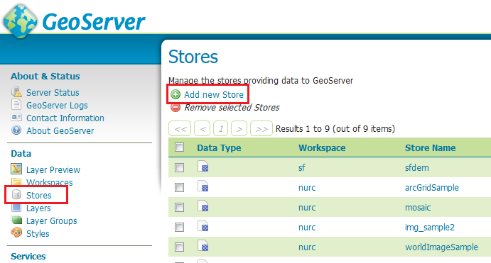

</div>

4. In the **New data source** window press **_PostGIS - PostGIS Database_** option.

<div style={{
    display:'flex',
    justifyContent: 'center',
    margin: '0 0 1rem 0'
}}>

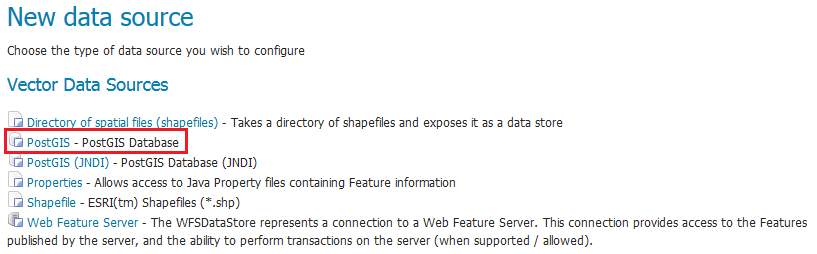

</div>

5. In the appeared **New Vector Data Source** window fill in the following fields:

- **Basic Store Info**
  Select the **cite** Workspace from the dropdown list.
  Enter the **Data Source Name** (for example, nyc_buildings) and a brief **Description**.

<div style={{
    display:'flex',
    justifyContent: 'center',
    margin: '0 0 1rem 0'
}}>

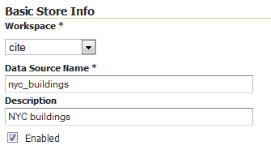

</div>

- PostGIS database **Connection Parameters**
- **_host_** - database host can be taken from the Info button

<div style={{
    display:'flex',
    justifyContent: 'center',
    margin: '0 0 1rem 0'
}}>

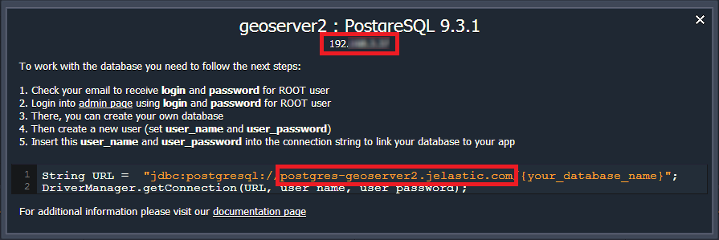

</div>

**_database_** - name of the database you’ve created with PostGIS extension (in our case, **nyc**)
**_user_** and **_passwd_** - credentials to the PostgreSQL you’ve received while creating the environment

Other fields are filled by default, you can leave the initial values.

<div style={{
    display:'flex',
    justifyContent: 'center',
    margin: '0 0 1rem 0'
}}>

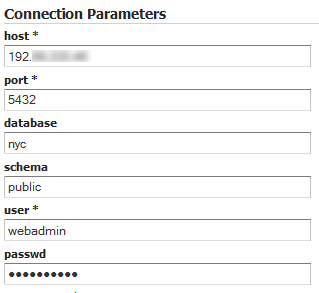

</div>

Also scroll a little bit lower and check if the **Validate connections** line is ticked. Then press **Save**.

<div style={{
    display:'flex',
    justifyContent: 'center',
    margin: '0 0 1rem 0'
}}>

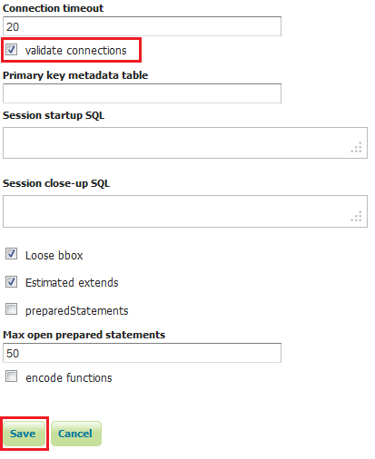

</div>

The connection is established and as a result you can see the uploaded to PostreSQL nyc_buildings in the list of application resources.

## Publish and Preview Dataset

At last we need to make just a few configurations to publish the dataset (e.g. nyc_buildings) and to make the required geographical object ready to use.

1. **New Vector Data Source** (saved in the previous step) will appear in the list of **New Layers**.
   Press **Publish** next to the added layer (e.g. _nyc_buildings_).

<div style={{
    display:'flex',
    justifyContent: 'center',
    margin: '0 0 1rem 0'
}}>

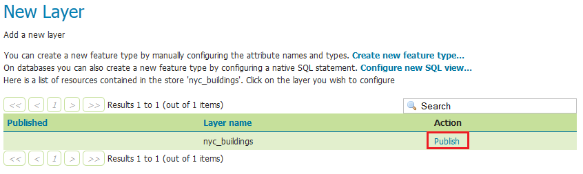

</div>

2. In the opened **Edit Layer** window enter a **Title** and an **Abstract** for your resource.

<div style={{
    display:'flex',
    justifyContent: 'center',
    margin: '0 0 1rem 0'
}}>

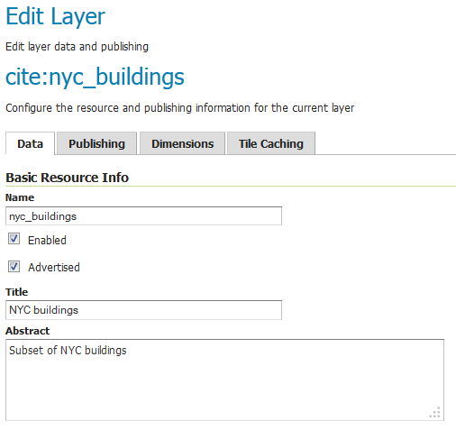

</div>

3. Scroll a little bit lower and press **_Compute from data_** and **_Compute from native bounds_** buttons in the **Bounding Boxes** configuration block.

<div style={{
    display:'flex',
    justifyContent: 'center',
    margin: '0 0 1rem 0'
}}>

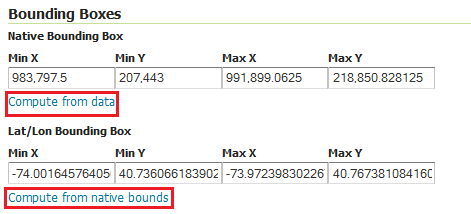

</div>

4. Then switch to the **Publishing** tab and ensure the **polygon** layer style is selected as default.

<div style={{
    display:'flex',
    justifyContent: 'center',
    margin: '0 0 1rem 0'
}}>

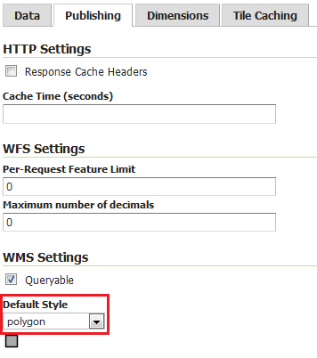

</div>

5. Finally, scroll down to the bottom of the page and press **Save** button. The layer is published.

6. Now you can navigate to the **Data > Layer Preview** menu item. Here you’ll see a list of all layers configured in GeoServer with previews provided in various formats for each.

<div style={{
    display:'flex',
    justifyContent: 'center',
    margin: '0 0 1rem 0'
}}>

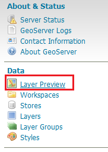

</div>

7. Press **OpenLayers** button next to your layer (NYC buildings, in our case).

<div style={{
    display:'flex',
    justifyContent: 'center',
    margin: '0 0 1rem 0'
}}>

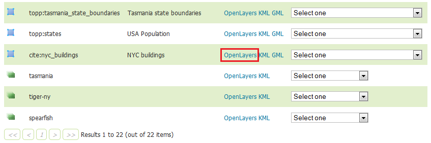

</div>

:::tip Note

you can select any other preview mode or download your resource in different formats using the options in the drop-down list next to the required layer.

:::

8. As a result you will see the required geographical object. In our case this is an interactive map of New York City buildings.

<div style={{
    display:'flex',
    justifyContent: 'center',
    margin: '0 0 1rem 0'
}}>

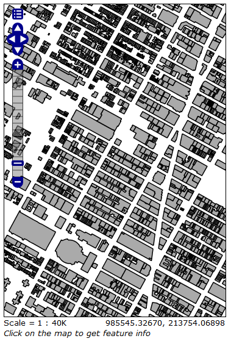

</div>

You can use the Preview Map to zoom and pan around the dataset, as well as display the attributes of features. Enjoy!
