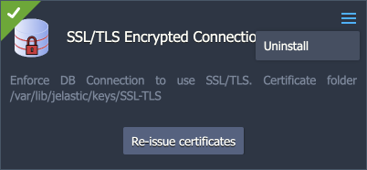
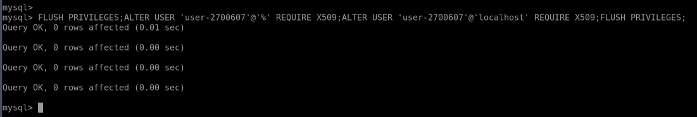

## SSL/TLS Encryption in Transit for Redis

The Virtuozzo-certified Redis database is provided with a built-in add-on that implements **_“encryption in transit”_**. The functionality ensures data protection with SSL/TLS encrypted connection while it moves between servers. After the add-on installation, support for a secure connection is configured on a separate port 6380, while maintaining the default port 6379 to accept unencrypted connections for backward compatibility (if needed, it can be disabled via settings).

## Add-On Installation

The add-on can be installed on top of the Redis nodes only.

1. In the platform dashboard, go to the **Add-Ons** section of the appropriate Redis database layer, and click **Install** for the Redis Encrypted Connection solution.

:::tip Tip

The add-on is also available from the [Marketplace](https://cloudmydc.com/) and can be imported from the appropriate GitHub repository.

:::

<div style={{
    display:'flex',
    justifyContent: 'center',
    margin: '0 0 1rem 0'
}}>


</div>

2. Within the opened installation window, select the target **Environment** and **Node Group(s)** where the add-on will be installed.

<div style={{
    display:'flex',
    justifyContent: 'center',
    margin: '0 0 1rem 0'
}}>


</div>

Click **Install** to continue.

3. In a minute, your environment will be configured.

<div style={{
    display:'flex',
    justifyContent: 'center',
    margin: '0 0 1rem 0'
}}>


</div>

:::danger Note

Port **_6380_** is used for secure connection by default and is automatically added to the firewall rules during the add-on installation.

<div style={{
    display:'flex',
    justifyContent: 'center',
    margin: '0 0 1rem 0'
}}>


</div>

:::

You can find generated SSL certificates under the **/var/lib/jelastic/keys/SSL-TLS** folder.

## Add-On Specifics

Below you can learn about certificates generation processes and specifics:

- Add-on pre-installs **[Redli](https://cloudmydc.com/)** – a humane Go-based alternative to the official redis-cli utility.
- Certificates are generated with the **_/usr/local/sbin/selfcertgen_** utility.
- Certificates are self-signed and issued for the hostname of the particular node. It means that each node has a set of own certificates, and you must use the ones corresponding to the accessed node for authentication.
- Due to Redis specifics, the alternative hostname is added when creating the server certificate:

```bash
echo "subjectAltName = @alt_names

[alt_names]
IP.1 = ${ALTNAME}" > /tmp/altname.ext
RANDFILE=/tmp/.random openssl x509 -req -in ${CERT_DIR}/server-req.pem -days 3650 -CA ${ROOT_CERT} -CAkey ${ROOT_KEY} -set_serial 01 -extfile /tmp/altname.ext > ${CERT_DIR}/server.crt
```

- Certificates are stored within the **/var/lib/jelastic/keys/SSL-TLS** folder (accessible via the **_keys_** shortcut in the file manager). Two subfolders are present:
  - **_server_** – server certificates are used to provide the TLS encryption of connection to the Redis database
  - **_client_** – downloadable client certificates can be used to authenticate client connection to the database server

<div style={{
    display:'flex',
    justifyContent: 'center',
    margin: '0 0 1rem 0'
}}>


</div>

**Redis configurations:**

All the add-on configurations are provided via a separate **_/etc/redis.conf_** configuration file (also added to the Favorites list in the file manager).

<div style={{
    display:'flex',
    justifyContent: 'center',
    margin: '0 0 1rem 0'
}}>



</div>

Below, you can check a list of the most common SSL-related settings:

- **_tls-port_** - specifies the port which is used for SSL connection (6380).
- **_port_** – sets a port that can accept unencrypted connections (6379).

:::tip Tip

Both values are intentionally kept separate by default to ensure backward compatibility. If you want to disable the unencrypted connection completely, set the **_port_** directive to 0.

:::

- **_tls-cert-file, tls-key-file, tls-ca-cert-file_** – directives specify paths to server-side SSL certificates
- **_tls-auth-clients_** – configures if clients (including replica servers) on a TLS port are required to authenticate using valid client-side certificates. Set to “optional” by default - if provided, client certificates are accepted and must be valid (but they are not required).
- **_tls-replication_** and **_tls-cluster_** - can be enabled if needed to support TLS interconnection in the Redis cluster

## Add-On Configuration

After the installation, the add-on can be found under the **Add-Ons** tab for the appropriate layer.

<div style={{
    display:'flex',
    justifyContent: 'center',
    margin: '0 0 1rem 0'
}}>


</div>

Here you can click the **Re-issue certificates** button to generate SSL certificates for secure connection anew.

If no longer needed, remove the add-on from the layer by choosing the **Uninstall** option in the add-on menu in the top-right corner.

## Secure Connection to Redis

For secure connection (we’ll use the **[redis-cli](https://cloudmydc.com/)** utility as an example), specify the command with the following options:

:::tip Tip

You can store the database password in the dedicated REDISCLI_AUTH variable to avoid exposing it in the command line:

```bash
export REDISCLI_AUTH={password}
```

:::

```bash
redis-cli -p 6380 --tls --cacert /var/lib/jelastic/keys/SSL-TLS/client/root.crt {command}
```

<div style={{
    display:'flex',
    justifyContent: 'center',
    margin: '0 0 1rem 0'
}}>


</div>

You can execute any preferred **_{command}_** or omit it to connect to the database in the interactive mode.

If the server requires authentication using a client-side certificate, you can specify a certificate and a corresponding private key using **_--cert_** and **_--key_** parameters.

```bash
redis-cli -p 6380 --tls --cert /var/lib/jelastic/keys/SSL-TLS/client/client.crt --key /var/lib/jelastic/keys/SSL-TLS/client/client.key --cacert /var/lib/jelastic/keys/SSL-TLS/client/root.crt {command}
```

<div style={{
    display:'flex',
    justifyContent: 'center',
    margin: '0 0 1rem 0'
}}>



</div>

For external connection, the client needs to upload the certificate files (client.crt, client.key, root.crt) to their computer/container/VM and use the -h option to specify a remote hostname or an IP address.

## SSL Configuration Examples

- **forcing SSL connection (for standalone nodes)**
  Enforce TLS encrypted connection and completely disable the non-secure connection for clients.

1. Go to the **_/etc/redis.conf_** configuration file and change the **_“port”_** directive to 0. It will disable unencrypted connections.

2. Next, change the **_“tls-port”_** option to the default Redis port 6379 in the same file.

3. If you want to make the usage of client certificates (for auth and mutual TLS) obligatory, set the **_“tls-auth-clients”_** directive to “yes”.

4. Go to the firewall settings and remove the rule for port 6380, as it is no longer needed.

5. Lastly, restart the Redis container to apply the changes.

Now, Redis service is available only through the SSL connection on port 6379.

- **cluster/sentinel interconnection through SSL**
  Redis cluster interconnections are kept plain (non-secure) by default. It ensures backward compatibility with the already existing clusters. However, if you want to enable interconnection encryption, follow the steps below:

:::danger Note

The automatic and manual scaling can work incorrectly after the changes due to being designed for plain non-SSL connections.

:::

1. If you are using the clustered solution, ensure that the **_“tls-cluster”_** directive in the **_/etc/redis.conf_** file is set to “yes” (uncomment the option).

2. If you are using the sentinel replication, uncomment the **_“tls-replication”_** option as well (should be the “yes” value).

3. The **_“tls-auth-clients”_** directive should be kept as _“optional”_ (default value).

4. The default cluster configuration uses port 6379 for the cluster interconnection, so you should either change the **_“tls-port”_** directive to 6379 or change the cluster/replication port to 6380.

5. Restart the Redis cluster to apply the changes.

- **multi-regional cluster SSL interconnection**

When working with the [multi-regional Redis cluster](https://cloudmydc.com/), the same root certificate must be used on all the nodes of all the environments for successful interconnection between nodes through the TLS.

1. Install the SSL add-on on the first environment of the multi-regional cluster.

2. Copy **_/var/lib/jelastic/keys/SSL-TLS/server/root.crt_** and **_/var/lib/jelastic/keys/SSL-TLS/server/root.crt_** to the **_/var/lib/jelastic/keys/SSL-TLS/_** directories on all the nodes of the second and third environments.

3. Now install the SSL add-on on these environments as usual – new root certificates will not be generated this way.
