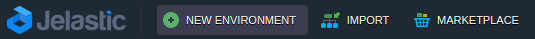
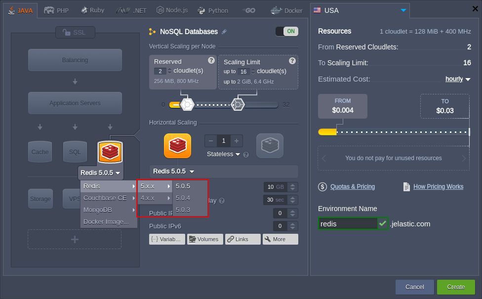

## Redis

**[Redis](https://redis.io/)** is an open-source advanced key-value cache and data storage, which provides a heightened durability. It is often perceived as a data structure server, as far as keys can contain different types of data: strings, hashes, lists, sets, sorted sets, bitmaps and hyperloglogs. All of these data elements can be processed with different atomic operations, such as appending to a string, pushing an element to a list, incrementing the value in a hash, getting the member with the highest ranking in a sorted set, etc.

One more important Redis feature is an outstanding performance. It is achieved by means of operating with in-memory datasets. In order to store such a database you can use either dumping to disk every once in a while or appending each command to a log. This persistence can be also optionally disabled, if all you need is just a feature-rich, networked, in-memory cache.

And now let’s figure out how to get your own environment with Redis data structure server in it just within a few clicks.

## Redis Installation

1. Log in to the platform.
2. Click **New Environment** in the upper left corner.

3. You’ll see an environment topology wizard opened. Navigate to the tab with the preferred programming language and pick **Redis** (**4.0.9**, **4.0.11**, **5.0.3**, **5.0.4**, **5.0.5**) instance from the list of available NoSQL databases. Set the amount of fixed and dynamic cloudlets for it, name your environment, and click the **Create** button.

4. After environment is successfully created, you’ll receive an email with your Redis node’s data: DNS address, IP address, port number it can be connected through, and access credentials.

Use this information for making any required configurations and managing your Redis server.
