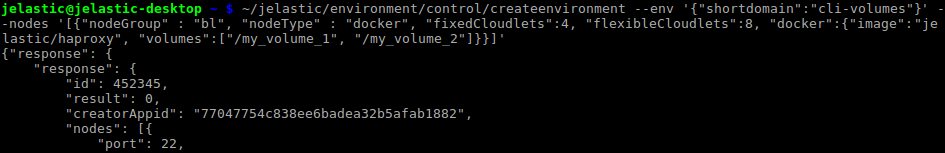
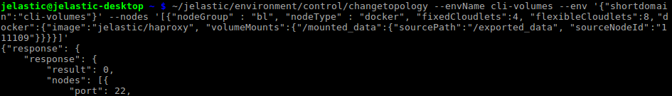
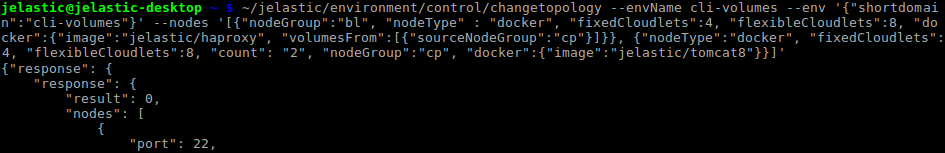
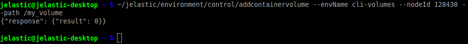
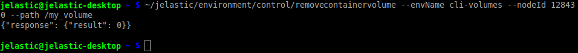
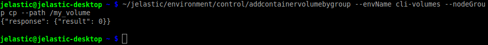
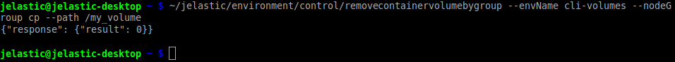

## CLI Tutorial: Container Volumes

[Container (Docker) Volumes](https://cloudmydc.com/) management functionality at the platform allows creating a persistent [local storage](https://cloudmydc.com/), designed to be not affected by various operations during container lifecycle. Creation of such a storage right inside a container helps to ensure high level of integrity and prevent loss of important data.

Using platform CLI, you can set up container volumes in two ways:

- [within topology settings](https://cloudmydc.com/)
- [via direct CLI methods](https://cloudmydc.com/)

## Set Volumes via Environment Topology

The first way to create container volume we’ll consider is to define it right during the [environment creation](https://cloudmydc.com/) (or when [changing its topology](https://cloudmydc.com/)). So, in order to setup your local container storage, the following [parameters](https://cloudmydc.com/) can be used while executing the appropriate CLI method:

- **_volumes_** - sets list of local volumes
- **_volumeMounts_** - allows to configure [mount points](https://cloudmydc.com/)
- **_volumesFrom_** - imports existing volumes from node on your account

:::tip Tip

These parameters can be used within your [JPS](https://cloudmydc.com/) manifests as well.

:::

1. All of these parameters are to be declared within the appropriate **_docker_** section. For example, the first parameter can be set in the following way:

```bash
... "docker":{... "volumes": ["{local_volume}", "{local_volume}", ...]}
```

<div style={{
    display:'flex',
    justifyContent: 'center',
    margin: '0 0 1rem 0'
}}>



</div>

Here, **_{local_volume}_** is a placeholder for the path your local volume should be placed inside a container. You can specify multiple volumes at once using comma separator.

E.g., within the image above, we create an environment with the _jelastic/haproxy_ image inside and two local volumes attached, namely: _/my_volume_1 and /my_volume_2_.

2. The second **_volumeMounts_** parameter has the next syntaxis:

```bash
... "docker":{... "volumeMounts" : {"{local_path}" : {"sourcePath" : "{remote_path}", "sourceNodeId" : "{node_ID}", "readOnly" : {true/false}}, ...}}
```

<div style={{
    display:'flex',
    justifyContent: 'center',
    margin: '0 0 1rem 0'
}}>



</div>

The highlighted data should be changed to the appropriate values:

- **_{local_path}_** - path to the folder within nodes of the specified environment layer the mounted content should be placed at

- **_{remote_path}_** - the required directory location at the remote container (i.e. address of source data)

- **_{node_ID}_** - unique identifier of the node your data will be mounted from

:::tip Note

Alternatively to the _“sourceNodeId”_ parameter, you can also use:

- _“sourceNodeGroup”_ - defines [environment layer](https://cloudmydc.com/), which master node will be used as a source for mount operation
- _“sourceHost”_ - external IP or [custom domain](https://cloudmydc.com/) name of the data storage server (including [external one](https://cloudmydc.com/))

:::

- **_{true/false}_** - the appropriate values define read only or _read & write_ rights for client nodes while operating mounted data (_false_ by default)

As an example, using the command on image above, we’ve mounted data from the _111109_ node of the used account.

3. With the last **_volumesFrom_** parameter, it’s possible to mount all the existing volumes from one node to another (i.e. copy them), e.g.:

```bash
... "docker":{... "volumesFrom":[{"sourceNodeId" : "{node_ID}", "readOnly" : {true/false}, "volumes" : ["{local_volume}", "{local_volume}", ...]}]}
```

<div style={{
    display:'flex',
    justifyContent: 'center',
    margin: '0 0 1rem 0'
}}>



</div>

Here:

- **_{node_ID}_** - unique identifier of the node the data should be mounted from

:::tip Note

Alternatively, it is possible to use _“sourceNodeGroup”_ to define the [environment layer](https://cloudmydc.com/), which master node will be used as a source for mount operation.

:::

- **_{true/false}_** - the appropriate values define _read only_ or _read & write_ rights for client nodes while operating mounted data (_false_ by default)

- **_{local_volume}_** - list of volumes to be mounted (if not specified all of them will be copied)

In such a way, using the command in the image above, we’ve added a new layer with two _jelastic/tomcat8_ Docker images and mounted the volumes to the existing _jelastic/haproxy_ node.

## Direct Volumes Management

The platform provides you with a number of CLI methods, that are developed specially for volumes management and do not affect the rest of environment topology:

1. The first one is the **_AddContainerVolume_** command, which lets you add a new volume to the existing environment:

```bash
~/jelastic/environment/control/addcontainervolume --envName {env_name} --nodeId {node_ID} --path {path}
```

where:

- **_{env_name}_** - domain name of the environment you’d like to modify
- **_{node_ID}_** - unique identifier of the node in chosen environment, a new container volume should be added to
- **_{path}_** - path in local filesystem to your volume directory

<div style={{
    display:'flex',
    justifyContent: 'center',
    margin: '0 0 1rem 0'
}}>



</div>

2. The removal process is absolutely similar to the just described addition process and uses the same parameters:

```bash
~/jelastic/environment/control/removecontainervolume --envName {env_name} --nodeId {node_ID} --path {path}
```

<div style={{
    display:'flex',
    justifyContent: 'center',
    margin: '0 0 1rem 0'
}}>



</div>

3. In case you need to add volumes not to a single node, but to a whole environment layer at once, the **_AddContainerVolumeByGroup_** method will be more suitable:

```bash
~/jelastic/environment/control/addcontainervolumebygroup --envName  {env_name} --nodeGroup  {node_group} --path  {path}
```

Here, the **_{node_group}_** parameter allows to define a layer in the current environment (e.g. _cp, bl, storage_, etc.), which nodes should be modified with a new volume.

<div style={{
    display:'flex',
    justifyContent: 'center',
    margin: '0 0 1rem 0'
}}>



</div>

4. Surely, you can remove a volume for the whole layer in a single command as well:

```bash
~/jelastic/environment/control/removecontainervolumebygroup --envName  {env_name} --nodeGroup  {node_group} --path  {path}
```

<div style={{
    display:'flex',
    justifyContent: 'center',
    margin: '0 0 1rem 0'
}}>



</div>

In such a way, using these CLI methods, you can easily take control over your container volumes and manage them in a matter of minutes. And in case you are in need of adding some [Mount Points](https://cloudmydc.com/) alongside with volumes, use the linked guide for detailed instruction.

:::tip TIP

If you face any issues while working with platform CLI, feel free to appeal for our technical experts' assistance at [Stackoverflow](https://cloudmydc.com/).

:::
