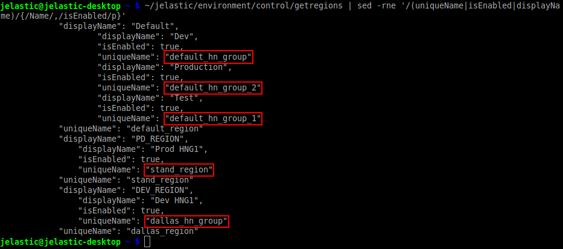
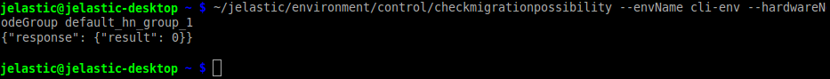
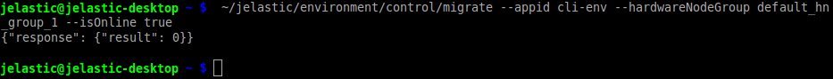

## CLI Tutorial: Environment Migration

Sometimes, it may be required to move your application to another [environment region](https://cloudmydc.com/) with better conditions and\or location or, for example, to distribute several [cloned](https://cloudmydc.com/) environment copies among different hardware sets to achieve increased availability. To perform this remotely, you’ll need to execute the corresponding **_migrate_** CLI method via your terminal. So, let’s consider it in more details.

1. To start with, you have to get the list of regions which are available at a Platform.
   For that, the **_getregions_** command should be used, with the appropriate search filter being applied in order to shorten the output and simplify the perception:

        

        

          1
        

        

           
        

    

You’ll see the list of environment regions, available for your account (i.e. where _“isEnabled”_ states in _true_), with their names at dashboard (_displayName_) and unique identifiers (_uniqueName_). Here, the last parameter is the one you need to remember.

:::tip Note

The first list level displays global info on data centers, whilst the regions' parameters you actually require to retrieve for further operations are shown a level below (such lines are shifted to the right).

To make it more clear, the appropriate _uniqueName_ values are circled in the image above.

:::

2. It is also a good practice to check the migration possibility before running the operation itself. Use the appropriate simple **_CheckMigrationPossibility_** CLI method for this:

        

        

          1
        

        

           
        

    

Here:

- **_{env_name}_** - name of the environment you’d like to relocate
- **_{region_id}_** - unique identifier of the target environment region from the previous step

3. Now you have all the required data to call the migration procedure:

        

        

          1
        

        

           
        

    

The only new parameter here is the _isOnline_ one, which can be set as **_{true/false}_** for using the [live](https://cloudmydc.com/) or [offline](https://cloudmydc.com/) migration mode correspondingly.

Soon (the exact time of migration may vary depending on your environment content) the operation will be finished and your application will be successfully relocated.
