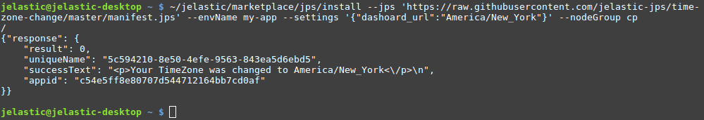
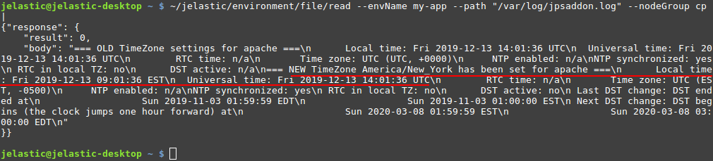
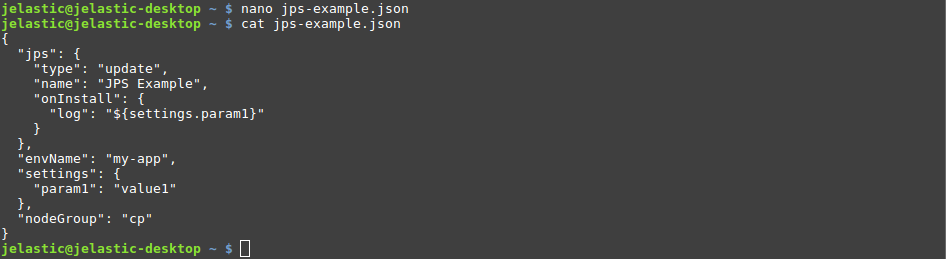
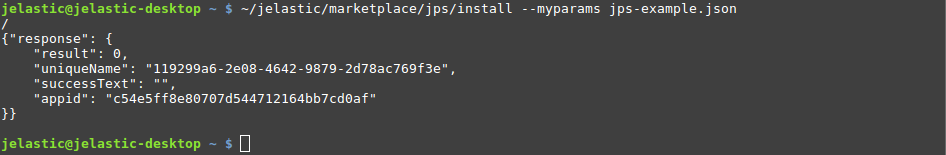
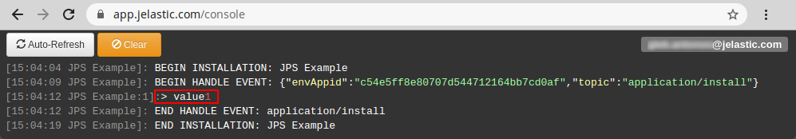

## CLI Tutorial: Install JPS

In this tutorial, we’ll show how to install a [JPS package](/docs/Deployment%20Tools/Cloud%20Scripting%20&%20JPS/Application%20Manifest) via CLI. Such a solution can contain steps to create a new environment with predefined customization (e.g. application deployment and configuration) or perform some actions on the existing instances.

Let’s start by learning about the appropriate **_Install_** method that executes the JPS packages and all of its parameters:

```bash
~/jelastic/marketplace/jps/install --jps {jps} [--envName {envName}] [--settings {settings}] [--nodeGroup {nodeGroup}] [--displayName {displayName}] [--region {region}] [--envGroups {envGroups}] [--ownerUid {ownerUid}] [--logsPath {logsPath}] [--loggerName {loggerName}] [--skipNodeEmails {skipNodeEmails}]
```

Here, the parameters in square brackets **_[ ]_** are optional:

- **_jps_** - link to your [manifest file](/docs/Deployment%20Tools/Cloud%20Scripting%20&%20JPS/Application%20Manifest) or its body
- specific settings for <u>jpsType: install</u> manifests (new environments):
  - **_[displayName]_** - [alias](/docs/EnvironmentManagement/Environment%20Aliases) for the created environment
  - **_[region]_** - unique name of a [region](/docs/EnvironmentManagement/Environment%20Regions/Choosing%20a%20Region) (e.g. get it with the _GetRegions_ method), where an environment should be created
  - **_[envGroups]_** - list of [env groups](/docs/EnvironmentManagement/Environment%20Groups/Overview) the created environment should be included to (specified as JSON array, e.g. [*“mygroup”, “group/subgroup”*])
- specific settings for <u>jpsType: update</u> manifests (add-ons for existing environments):
  - **_[nodeGroup]_** - an environment layer the add-on should be applied to (_bl, cp, cache, sqldb, nosqldb, storage, vps, build_ or your custom one for [Docker containers](/docs/Container/Container%20Types))
- **_envName_** - a name of the newly created/target environment for the application/add-on installation respectively
- **_[settings]_** - list of settings required by the package (specified as a JSON object with key/value pairs)
- **_[ownerUid]_** - user ID of the [shared account](/docs/Account&Pricing/Accounts%20Collaboration/Collaboration%20Overview), where JPS package should be installed
- **_[loggerName]_** - a name displayed next to the timestamp of each operation in the JPS installation log file (learn more about [loggerName](https://docs.cloudscripting.com/troubleshooting/#loggername))
- **_[logsPath]_** - path to the file to log JPS installation flow (**cs.log** by default)
- **_[skipNodeEmails]_** - enables (_true_, by default) or disables (_false_) email notifications about new nodes creation by this package (learn more about [skipNodeEmails](https://docs.cloudscripting.com/creating-manifest/basic-configs/#skip-node-emails))

Now, we can proceed to the real case examples:

- [TimeZone Change Add-on Installation via URL](/docs/Deployment%20Tools/API%20&%20CLI/Platform%20CLI/Installing%20JPS#timezone-change-add-on-installation-via-url)
- [JPS Installation Using Configuration File with Parameters](/docs/Deployment%20Tools/API%20&%20CLI/Platform%20CLI/Installing%20JPS#jps-installation-using-configuration-file-with-parameters)

## TimeZone Change Add-on Installation via URL

The [**TimeZone Change**](/docs/ApplicationSetting/Managing%20Timezone%20Settings) add-on allows easily switch timezone on any container to the desired one. The sources and manifest file of the add-on can be found at the [JPS Collection](https://github.com/jelastic-jps) repository at GitHub.

1. Install platform CLI and log into your account, if you haven’t before. The required steps are described in the [overview guide](/docs/Deployment%20Tools/API%20&%20CLI/Platform%20CLI/Platform%20CLI%20Overview).

2. Call the **_Install_** method with the required parameters:

```bash
~/jelastic/marketplace/jps/install --jps {jps} --envName {envName} --settings {settings} --nodeGroup {nodeGroup}
```

<div style={{
    display:'flex',
    justifyContent: 'center',
    margin: '0 0 1rem 0'
}}>



</div>

Here:

- **_{jps}_** - link to the TimeZone Change add-on manifest file, i.e. [_https://raw.githubusercontent.com/jelastic-jps/time-zone-change/master/manifest.jps_]
- **_{envName}_** - name of your existing environment, e.g. _my-app_
- **_{settings}_** - according to the manifest, this particular add-on requires you to provide one additional parameter - the desired [timezone](https://en.wikipedia.org/wiki/List_of_tz_database_time_zones), e.g. {_“dashoard_url”_:**_"America/New_York"_**}
- **_{nodeGroup}_** - target [layer](/docs/PlatformOverview/Basics%20&%20Terminology#layer) of the environment, e.g. _cp_

If there are no issues, the script will respond with _“result”_: 0 (i.e. operation success).

3. For this add-on, you can check the detailed result in the **_/var/log/jpsaddon.log_** file. Let’s **_Read_** it.

```bash
~/jelastic/environment/file/read --envName {envName} --path "/var/log/jpsaddon.log" --nodeGroup {nodeGroup}
```

<div style={{
    display:'flex',
    justifyContent: 'center',
    margin: '0 0 1rem 0'
}}>



</div>

As you can see, the timezone has been successfully set as the one specified in the previous step, _America/New_York_ in our case. The local time on the corresponding containers is adjusted accordingly to this new timezone.

## JPS Installation Using Configuration File with Parameters

If needed, you can provide all the parameters within a single file and refer to it upon executing a CLI method.

1. Let’s create a JSON file (using any preferable editor) with the required parameters. In our case, we’ll run a simple JPS, which logs the value of the provided parameter:

```bash
{
  "jps": {
    "type": "update",
    "name": "JPS Example",
    "onInstall": {
      "log": "${settings.param1}"
    }
  },
  "envName": "my-app",
  "settings": {
    "param1": "value1"
  },
  "nodeGroup": "cp"
}
```

<div style={{
    display:'flex',
    justifyContent: 'center',
    margin: '0 0 1rem 0'
}}>



</div>

:::tip Tip

It is possible to provide a URL to your manifest file instead of specifying it explicitly in the **_jps_** parameter (similar to the [TimeZone example](/docs/Deployment%20Tools/API%20&%20CLI/Platform%20CLI/Installing%20JPS#timezone-change-add-on-installation-via-url)).

:::

2. Next, call the **_Install_** method using the created configuration file.

```bash
~/jelastic/marketplace/jps/install --myparams {myparams.json}
```

<div style={{
    display:'flex',
    justifyContent: 'center',
    margin: '0 0 1rem 0'
}}>



</div>

:::tip Tip

If needed, you can explicitly provide a parameter to redefine the value inside the file. For example, it is possible to change the environment name without adjusting the configuration file itself:

```bash
~/jelastic/marketplace/jps/install --myparams {myparams.json} --envName {envName}
```

:::

3. You can ensure that the value of the provided parameter was successfully logged via the platform console (_https://app._[**_{platformDomain}_**](/docs/QuickStart/Hosters%20List%20&%20Info)_/console_).

<div style={{
    display:'flex',
    justifyContent: 'center',
    margin: '0 0 1rem 0'
}}>



</div>

Utilization of the configuration files with a list of predefined parameters is a great way to simplify and automate frequent calls.
