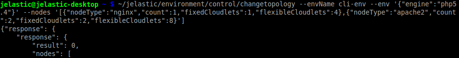

##CONTEXT CODE

## CLI Tutorial: Server Scaling

When the environment is already created, in some cases it may be required to change its topology - for example, to scale a particular server or the whole environment layer (using the [vertical](https://cloudmydc.com/) and/or [horizontal](https://cloudmydc.com/) scaling respectively) due to the changed incoming load. This may be accomplished with the corresponding **_changetopology_** CLI method:

```bash
~/jelastic/environment/control/changetopology --envName {env_name} --env '{"engine" : "{engine_type}"}' --nodes ['{"nodeType" : "{node_type}","count" : {nodes_amount}, "fixedCloudlets" : {cloudlets_amount}, "flexibleCloudlets" : {cloudlets_amount}}, {"nodeType" : "{node_type}", "count" : {nodes_amount}, "fixedCloudlets" : {cloudlets_amount}, "flexibleCloudlets" :  {cloudlets_amount}}']
```

<div style={{
    display:'flex',
    justifyContent: 'center',
    margin: '0 0 1rem 0'
}}>



</div>

The whole [set of possible parameters](https://cloudmydc.com/) is the same as for the [createenvironment](https://cloudmydc.com/) method, except the _–envName_ **_{env_name}_** - here it is used to point to the already existing environment, that should be adjusted.

As for the rest of options, in this example we use the following ones:

- **_{engine_type}_** - engine the instances of the chosen environment are powered by (an obligatory string)
- **_{node_type}_** - stack type identifier, according to the [list](https://cloudmydc.com/)
- **_{nodes_amount}_** - amount of nodes to be set (applies [horizontal scaling](https://cloudmydc.com/))
- **_{cloudlets_amount}_** - number of fixed (_fixedCloudlets_) and/or flexible (_flexibleCloudlets_) cloudlets to be allocated for the specified node type (applies [vertical scaling](https://cloudmydc.com/))

:::danger Note

For the proper work of horizontally scaled application server, do not miss to add a [load balancing node](https://cloudmydc.com/) to your environment topology beforehand (if it’s absent).

:::

Reconfiguration of environment topology may take several minutes in order to be accomplished.
