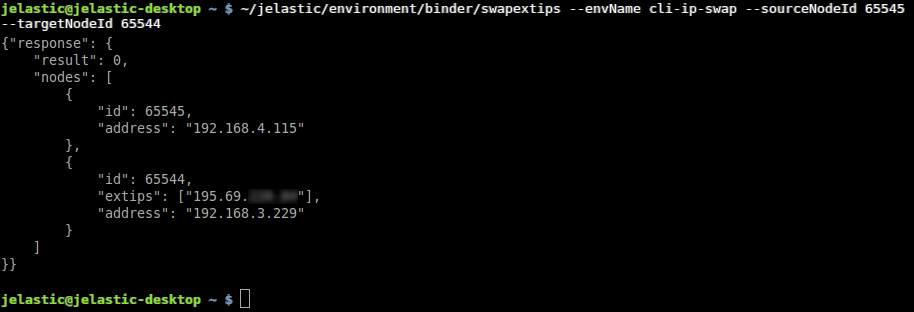

## CLI Tutorial: Public IPs (External Addresses) Swap

The operation of [public IPs]( /docs/ApplicationSetting/External%20Access%20To%20Applications/Public%20IP) swap can come in handy for routing of the incoming requests to the required environment or application. It may be especially useful when, for example, switching testing and production environments.

The appropriate **_SwapExtIps_** CLI method gives you the ability to exchange external IP addresses between two containers. In case only one node has a public IP, it will be moved (reassigned) to the second instance. The method can work with nodes of the same or different environments but only in the confines of a single account.

As usual, the operation requires just a single line of code for being executed:

```bash
~/jelastic/environment/binder/swapextips --envName {env_name} --sourceNodeId {source_node_id} --targetNodeId {target_node_id} [--sourceIp {source_ip}] [--targetIp {target_ip}]
```

Here, the following parameters should be specified:

- **_{env_name}_** - name of the environment, where the transferred external IP is currently attached
- **_{source_node_id}_** - identifier of the node from the stated environment, which IP should be swapped/moved
- **_{target_node_id}_** - ID of the target node (can belong to any environment on the account)
- **_{source_ip}_** and **_{target_ip}_** - optional parameters for two specific addresses to be swapped (if not specified, all external IPs from source node are transferred to the target and vice versa)

<div style={{
    display:'flex',
    justifyContent: 'center',
    margin: '0 0 1rem 0'
}}>



</div>

:::danger Notes:

- Before using the **_SwapExtIps_** CLI method, please make sure that the source and destination nodes (environments) are running and belong to the same [region](/docs/EnvironmentManagement/Environment%20Regions/Choosing%20a%20Region).
- <u>Before the PaaS 5.8 release</u>, this method does not support IPv6 and works with IPv4 only.
- <u>Before the PaaS 6.0 release</u>, IP swap fails if an environment has a [bound]( /docs/ApplicationSetting/Domain%20Name%20Management/Custom%20Domain%20Name#how-to-bind-domain-to-environment) custom domain.
- The process may cause short-term unavailability of the corresponding Public IP address(es) (up to 10 seconds).
- If you need to swap two specific addresses between nodes with [multiple IPs]( /docs/ApplicationSetting/External%20Access%20To%20Applications/Multiple%20Public%20IP) on each one, please contact the Support Team for assistance. Support of such cases is currently under development and will be implemented in future releases.
- The following node types will be automatically restarted to start listening on the new addresses after the operation: _GlassFish, Apache PHP, Apache Ruby, NGINX PHP, NGINX Ruby_.
- Based on the comprized services, a manual restart may be required for the [_Elastic VPS_]( /docs/Elastic%20VPS/Elastic%20VPS%20Overview/General%20Information) and custom [_Docker containers_]( /docs/Container/Container%20Deployment/Custom%20Containers%20Deployment) to adapt for the IP address change.
- We recommend rechecking the [_Access via SLB_]( /docs/ApplicationSetting/External%20Access%20To%20Applications/Shared%20Load%20Balancer#deny-access-via-shared-load-balancer) state for both nodes after swapping IPs.

:::

In a few minutes, your IPs will be exchanged between the specified nodes, and the details will be provided in the operation response.

Now, as you caught the idea on how to work with our CLI, you can proceed to the environment management automation. For example, by creating corresponding scripts for the frequently used operations' chains. The full information on all of the available commands and methods can be found within the [platform API](https://cloudmydc.com/) documentation.
