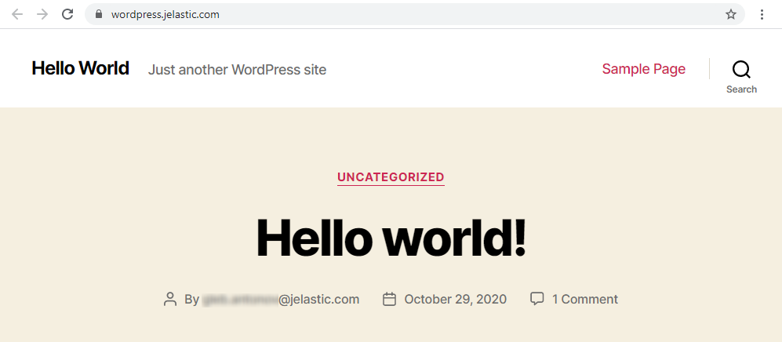

import obj from './Marketplace.json'

## Marketplace

Platform Marketplace is a library of the most popular and requested applications, which are configured and optimized in the most beneficial way via the platform [Packaging Standard](https://cloudmydc.com/). These packaged solutions can be installed automatically directly from the dashboard, skipping many steps of manual deployment and optimization.

You can access the **Marketplace** via the appropriate button at the top-left corner of the dashboard.

Within the opened section, you can find a list of categorized solutions to install new **Applications** from scratch and configuration **Add-Ons** to update your existing environments. Currently, the platform manages and maintains the following JPS packages, providing them for one-click installation at all platforms:

    

        

            

                Applications
            

        

         

            

                <ul>
                <li>Alfresco</li>
                <li>Ametys</li>
                <li>Auto-Scalable Couchbase CE Cluster</li>
                <li>Auto-Scalable GlassFish Cluster</li>
                <li>Auto-Scalable Magento Cluster v2</li>
                <li>Auto-Scalable Spring Boot Cluster</li>
                <li>Backup Storage</li>
                <li>Cyclos 4 PRO</li>
                <li>DevOps Lab - GitLab Server</li>
                <li>DjangoCMS</li>
                <li>Docker Engine CE</li>
                <li>Docker Swarm Cluster</li>
                <li>DokuWiki</li>
                <li>DropWizard Fat Jar Builder</li>
                <li>Drupal</li>
                <li>Eclipse Che</li>
                <li>Eclipse Mosquitto</li>
                <li>Eclipse Vert.x Fat Jar Builder</li>
                <li>Eclipse Vert.x Thin Jar Builder</li>
                <li>Ghost</li>
                <li>Gitblit</li>
                <li>IOTA Node</li>
                <li>Jenkins DevOps Pack</li>
                <li>Jira Software</li>
                </ul>
            

            

                <ul>
  <li>Jitsi Video Conferencing</li>
  <li>Joomla</li>
  <li>Kubernetes Cluster</li>
  <li>Laravel</li>
  <li>Liferay</li>
  <li>LimeSurvey</li>
  <li>Magento Standalone</li>
  <li>Magnolia CMS</li>
  <li>Maian Cart</li>
  <li>MariaDB Multi-Region Cluster</li>
  <li>MariaDB Multi-Region Galera Cluster</li>
  <li>Mattermost Chat Service</li>
  <li>Minio Cluster</li>
  <li>MODX</li>
  <li>MongoDB Replica Set</li>
  <li>Moodle</li>
  <li>Multi-Region Redis Cluster</li>
  <li>Multi-Region WordPress Cluster v1 (Alpha)</li>
  <li>Multi-Region WordPress Standalone</li>
  <li>MySQL/MariaDB/Percona Cluster</li>
  <li>Nexus Repository Manager</li>
  <li>Node-RED Dev</li>
  <li>Odoo Community Edition</li>
</ul>
            

            

            <ul>
  <li>Open Liberty in Kubernetes</li>
  <li>OpenCart</li>
  <li>OpenCMS</li>
  <li>OpenVPN Access Server</li>
  <li>osTicket</li>
  <li>ownCloud</li>
  <li>Plesk Hosting Platform</li>
  <li>PostgreSQL Multi-Region Cluster</li>
  <li>PostgreSQL Primary-Secondary Cluster</li>
  <li>PrestaShop</li>
  <li>qdPM</li>
  <li>Redis Cluster</li>
  <li>Redmine</li>
  <li>Spring Boot Fat Jar Builder</li>
  <li>Spring Boot Thin Jar Builder</li>
  <li>Tomcat/TomEE Cluster with High Availability</li>
  <li>Traffic Distributor</li>
  <li>WebMail Lite</li>
  <li>WildFly Continuous Deployment</li>
  <li>WildFly Managed Domain Cluster</li>
  <li>WordPress Cluster Kit v2</li>
  <li>WordPress Standalone Kit</li>
  <li>XWiki</li>
</ul>
            

        

    

    

        

            

                Add-Ons
            

        

         

            

            <ul>
  <li>Database Backup/Restore Add-On</li>
  <li>Database Cluster Recovery</li>
  <li>Database Corruption Diagnostic</li>
  <li>Env Start/Stop Scheduler</li>
  <li>File Synchronization</li>
  <li>Git-Push-Deploy Add-On</li>
</ul>
            

            
<ul>
  <li>HTTP/3 Premium CDN*</li>
  <li>ionCube Add-On</li>
  <li>Let's Encrypt Free SSL</li>
  <li>Load Alerts to Slack (BETA)</li>
  <li>MySQL-based SSL/TLS Encrypted Connection (MySQL/MariaDB/Percona)</li>
  <li>New Relic APM</li>
</ul>
            

            
<ul>
  <li>NGINX Amplify</li>
  <li>Postgres SSL/TLS Encrypted Connection</li>
  <li>Redis Encrypted Connection</li>
  <li>TimeZone Change</li>
  <li>WordPress Backup/Restore for the filesystem and the databases</li>
</ul>
            

        

    

:::tip Note

The provisioned set of JPS packages can vary on each particular platform as it depends on the hosting provider settings.

For example, the **_HTTP/3 Premium CDN_** add-on is supported on the following [platform installations](https://cloudmydc.com/) only.

:::

The PaaS team frequently implements new solutions to extend this list. The majority of such updates are highlighted within the [platform blog](https://cloudmydc.com/), so if you are interested, you can subscribe to be notified about all of the new utilities.

:::tip Tip

For more solution examples refer to the [JPS Collection](https://cloudmydc.com/) on GitHub, where you can find multiple packages to be used with the platform:

- [Enterprise WordPress Cluster for Auto Scaling, High Performance and High Availability](https://cloudmydc.com/)
- [Scalable MySQL Cluster with ProxySQL Load Balancer and Orchestrator](https://cloudmydc.com/)
- [Free Let’s Encrypt SSL Certificates Integration for the Most Popular Software Stacks](https://cloudmydc.com/)
- [Highly Available and Auto-Scalable Magento Cluster](https://cloudmydc.com/)
- C[yclos - a Payment Platform for Large Businesses and Organisations](https://cloudmydc.com/)
- [Cron-Based Scheduler for Automatic Environment Hibernation](https://cloudmydc.com/)
- [Minio Cluster - S3 Compatible Object Storage](https://cloudmydc.com/)
- [Auto-Scalable Docker Engine and Docker Swarm Cluster](https://cloudmydc.com/)
- [Simple Automated CI/CD Pipeline for GitHub and GitLab Projects](https://cloudmydc.com/)
- [Java Memory Agent for Container RAM Usage Optimization](https://cloudmydc.com/)

[Import](https://cloudmydc.com/) the appropriate manifest file via the dashboard to instantly get your solution. Also, you can explore the source code of any package, fork repository for yourself and customize it up to your particular needs before installation.

:::

## Subscription Products

_This feature availability depends on the particular hosting provider’s settings._

The **Subscription Plans** section of the Marketplace lists all the products that are offered on a subscription-based basis (i.e. for a fixed price). You can learn more in the dedicated [Subscription-Based Products](https://cloudmydc.com/) guide.

## Installing Solution from Marketplace

Below, we’ll provide an example of a packaged solution installation.

1. To find a particular application, use a special **Search** box at the top-left corner of the **_Marketplace_** section. Type a phrase, and it will be looked for within solutions' names and descriptions (both for applications and add-ons).

2. We’ll use the **WordPress Standalone Kit** as an example. Select it from the proposed search results to instantly open the installation frame. Alternatively, you can locate the required solution manually within the categorized list (_Content Management_ section in our case), hover over to unfold additional details, and click **Install**.

3. Based on the particular package, you may need to provide some additional data to customize the solution up to your needs. For example, it could be the preferable nodes count or specific option availability.

For a detailed overview of the [WordPress Standalone Hosting](https://cloudmydc.com/) peculiarities, refer to the linked article on our blog. In general, the basic settings (i.e. required by any application) are environment name, [alias](https://cloudmydc.com/), and, if available, [region](https://cloudmydc.com/).

Click **Install** to continue.

4. The installation process may require up to several minutes, based on the selected solution.

:::tip Tip

You can track the JPS package installation process in detail via the Cloud Scripting console. While logged into your dashboard account, add the **_/console_** suffix to URL:

_https://app._[**_{platformDomain}_**](https://cloudmydc.com/)_/console_

:::

5. After all the required configurations, you’ll see a success frame. In our case, it additionally provides the corresponding administration data (which is also sent via the appropriate email notification).

Click the **Open in Browser** button.

6. Your ready-to-work application will be opened in a new browser tab.

That’s all! Now, you can enjoy using your application.
