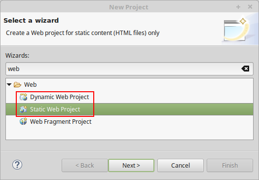
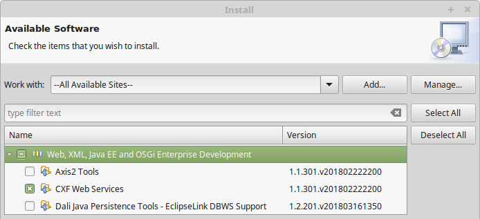
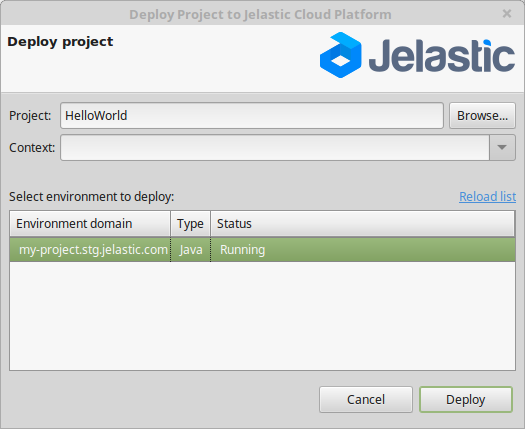
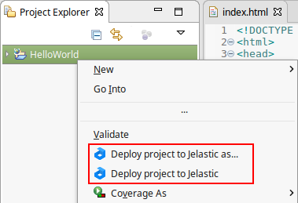

## Eclipse Plugin Application Deployment
To start with, you should notice that for getting the ability to deploy projects from Eclipse to the platform, they should be created as **Dynamic/Static Web Projects**.

A new one can be created through the **File > New > Project** wizard:

:::tip

In case you don’t have such option, install the appropriate ***Web, XML, Java EE and OSGi Enterprise Development*** plugin (can be accomplished by means of the ***Help > Install New Software*** menu).

After the plugin is installed, you may notice new platform-dedicated elements being added to your Eclipse development environment interface. They are intended to implement the possibility of a new project deployment to the remote environment.

:::

So, let’s consider the provided functionality in more details.

1. At the Eclipse panel, a new button with the platform logo appears, which contains the expandable drop-down menu with the **Deploy** and **Deploy as** options:

- Using the **Deploy** option, you can redeploy the current project to the environment under the same context, that was previously used for this project deployment.
- If the application hasn’t been deployed anywhere before, the **Deploy as** option should be used. In this case, window with the list of existing Java environments at your account will be opened for you to choose the project, environment and context for deployment.

2. Also, deployment of application can be initiated by selecting the corresponding Eclipse project within the **Project Explorer** section and choosing either the ***Deploy project to PaaS*** or ***Deploy project to PaaS as*** line from its context menu:

Herewith, the implemented functionality is the same as for the corresponding options, described above. Yes, that’s that simple! So do not lose the time and jump at the chance to use all the advantages of PaaS and **Eclipse** integration.