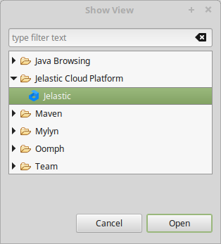
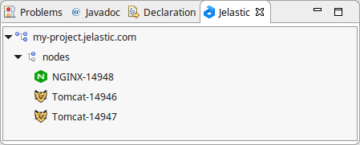
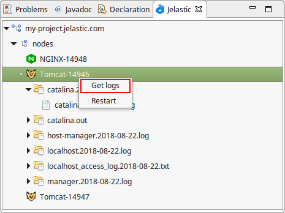

## Environment Management with Eclipse Plugin

Before proceeding further with the [new projects deployment](/docs/Deployment%20Tools/Plugins/Eclipse%20Plugin/Application%20Deployment#eclipse-plugin-application-deployment), let’s consider the basics of the remote environments management through Eclipse IDE.

1. Navigate to the **Window > Show View > Other** section. Here, you can notice that **Cloud Platform** category has been added to the list.

Expand this menu item and **Open** the _Jelastic view_.

2. In the opened tab, your current environments with the applications deployed can be viewed (obviously, only Java-based ones will be displayed).

Here, they can be quickly managed through context menu (called with the right mouse button click) by choosing the needed option: _Start, Stop_ or _Refresh_.

3. You can **Get logs** for a particular node and view them directly in Eclipse IDE.

Now, as you are aware with the key environment management operations the Eclipse Plugin provides, let’s consider how to [deploy a new project](/docs/Deployment%20Tools/Plugins/Eclipse%20Plugin/Application%20Deployment#eclipse-plugin-application-deployment) into the Cloud directly from your IDE.
