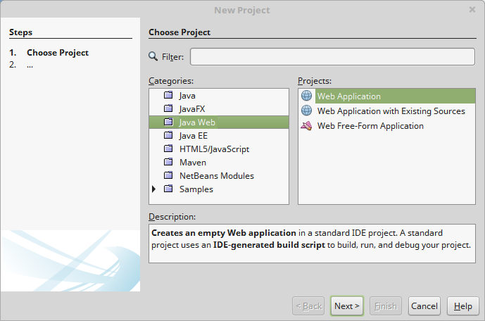
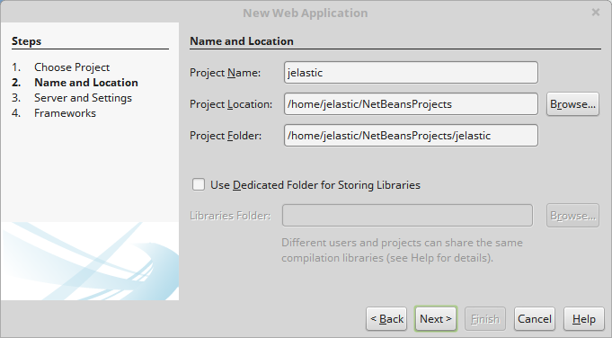
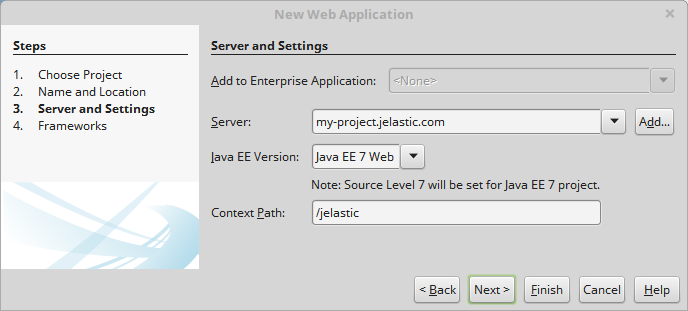
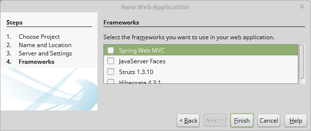
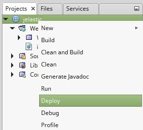
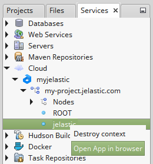

## NetBeans Plugin for Application Deploy
You can create own project in NetBeans IDE and deploy it right into your environment.

## Create New Project
1. Click the **New Project** button in the upper tools panel of NetBeans IDE.

2. Choose the **Java Web** category and the ***Web Application*** project. Click **Next**.

3. In the opened window, enter the desired **Project Name**, specify **Project Location** and **Project Folder**. Click **Next** to proceed.

4. Select one of your environments in the **Server** drop-down list. If needed, specify the context and click **Next** one more time.

5. If you want to use frameworks in your application, tick the required ones and click **Finish**.

6. Your new web project will be created in a moment.

## Deploy Project
1. Right-click the name of your project and choose the **Deploy** menu item.

2. Next, the **.war** archive of your project will be built and deployed to the platform.

3. To make sure everything works open your application URL in the browser manually or automatically by clicking **Open App in browser** in the **Services** tab.

As a result your application will be opened.

With the platform **NetBeans IDE plugin** installed you can easily manage, develop and deploy your applications without switching between the IDE and the browser.

