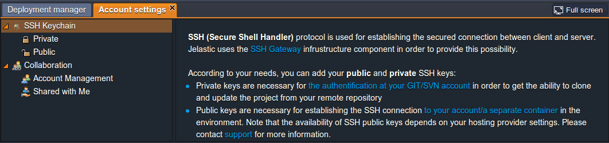
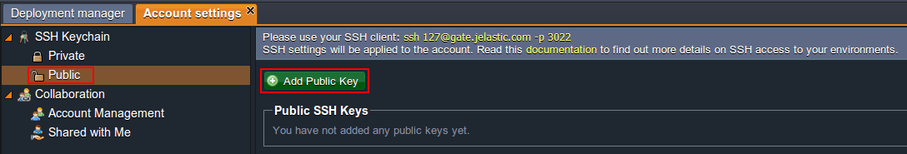
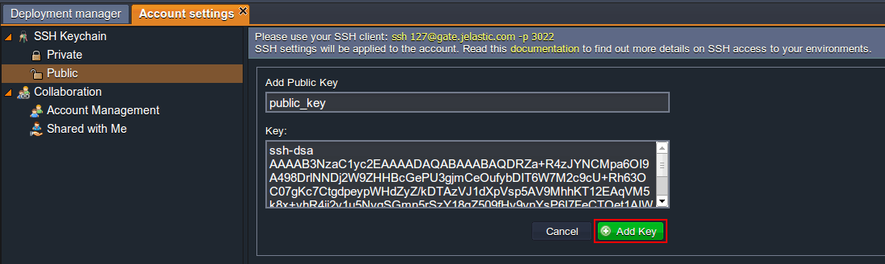
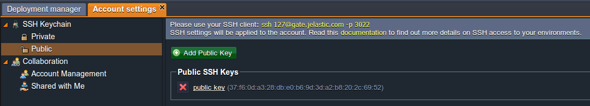

## Add SSH Key

When you have your [SSH key generated](/docs/Deployment%20Tools/SSH/Generate%20SSH%20Key), you can add it to your PaaS account.

:::tip

In order to manage private SSH keys intended for authentication at your GIT account, follow the corresponding instruction within the [SSH Access to GIT Repository](/docs/Deployment/SSH%20Access%20to%20GIT%20Repository) guide.

:::

For adding a public SSH key, which subsequently can be used for gaining [SSH access](/docs/Deployment%20Tools/SSH/SSH%20Access/Overview) to your PaaS account, proceed to the steps below:

1. Open the platform dashboard and navigate to the upper toolbar.

Click the **Settings** button.

2. The **Account setting** tab with the already selected **SSH Keychain** option will be opened.

Within this section you can find some information about the SSH protocol usage at the platform and the possibilities it provides with a few useful links to documentation.

3. Once you are acquainted with the details above, switch to the **Public** suboption and click the **Add Public Key** button.

4. Paste the previously generated public key to the **Key** input field. The **Add Public Key** field will be automatically populated if your key already contains this value (or you can specify your own one here). Click **Add Key**.

5. As a result, the added SSH key will appear in the list, while you’ll simultaneously receive an email with details on it (like title, fingerprint and connection string for your SSH client).

In this way, you can add several keys or delete the unnecessary ones using the red-cross button.

:::tip Note

The added SSH key is attached to your account, but not just to a separate environment.

:::
