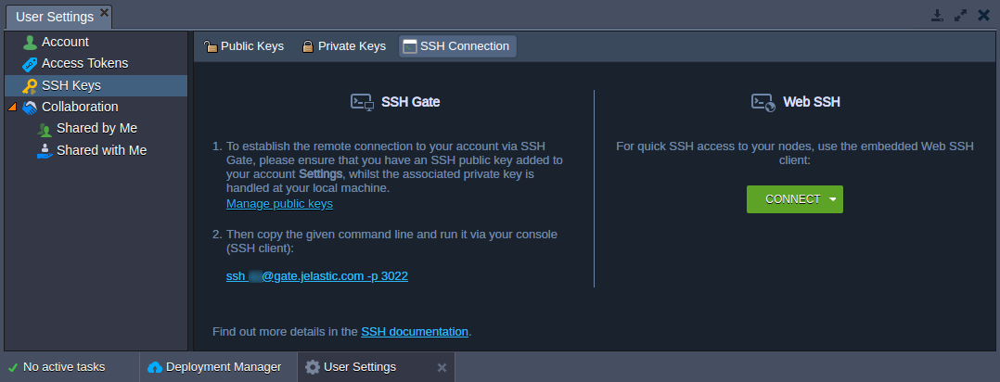

## SSH Access

The platform supports access via SSH in one of the following ways:

- [**_Web SSH_**](/docs/Deployment%20Tools/SSH/SSH%20Access/Web%20SSH) - An access to a separate node within your environment, which is based on the _user’s session_; connection is initiated upon clicking the **Web SSH** button next to the desired environment in dashboard (which allows to connect from anywhere over Internet, using just a browser).

- [**_SSH Gate_**](/docs/Deployment%20Tools/SSH/SSH%20Access/SSH%20Gate) - Such connection type is based on the _SSH key pair_ usage and allows access to either [whole PaaS account](/docs/Deployment%20Tools/SSH/SSH%20Access/SSH%20Gate#ssh-access-to-platform-account) or just a [particular container](/docs/Deployment%20Tools/SSH/SSH%20Access/SSH%20Gate#direct-access-to-container); it provides the substantial level of security, connecting only instances with **private SSH key** that matches the appropriate **public key**, stored within your Platform account settings.

After accessing node via SSH using any of the above-described methods, you can start managing your container.
