## SSH Access to Container: Manage Your Server Remotely

The Jelastic Platform allows establishing [SSH access](/docs/Deployment%20Tools/SSH/SSH%20Access/Overview) to any container on your account. In this guide, we’ll provide some of the most common commands that can come in handy when managing your server via SSH terminal.

There are two ways to connect your server inside Jelastic PaaS over SSH:

- **Web SSH** - click on the same-named option next to the required environment layer or particular container to quickly access and start managing it online directly through your browser, via the automatically opened terminal tab at the bottom of Jelastic dashboard

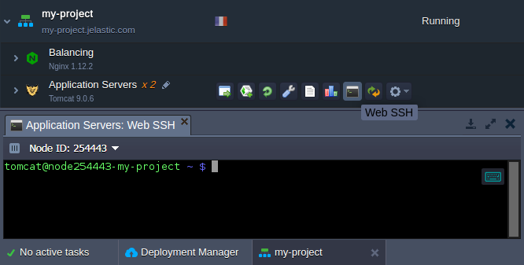

- **SSH Gate** - alternatively, you can connect to your server via any preferred local SSH client basing on preliminary [generated](/docs/Deployment%20Tools/SSH/Generate%20SSH%20Key) SSH keys pair (where the public key should be [added](/docs/Deployment%20Tools/SSH/Add%20SSH%20Key) to your Account Settings, and the corresponding private key - being handled at your local machine)

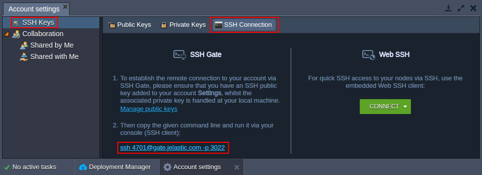

Once all the requirements are fulfilled, you can [establish an SSH connection](/docs/Deployment%20Tools/SSH/SSH%20Access/SSH%20Gate) by means of the corresponding command line (circled above) from the same-named tab of your account settings.

For the sake of simplicity and quick access, in this article we’ll leverage the inbuilt Web SSH tool; however, the described below commands can be used when working via remote local client absolutely similar.

:::tip Tips

- Within the majority of servers within Jelastic PaaS (including [custom Docker containers](/docs/Container/Container%20Deployment/Custom%20Containers%20Deployment)), you are automatically granted full root permissions while connected via SSH. For the rest, mostly legacy nodes, which were created upon Jelastic-managed certified stack templates, the sufficient level of controllability is ensured with a set of additional intentionally allowed commands.
- The full [list of terminal commands](https://www.linfo.org/command_index.html) with all the appropriate options description you can find at the dedicated websites, similar to the linked above. In this guide we’ll consider a number of the most common commands to give you insights on the basics of operating with containers via the SSH protocol.

:::

## Navigation through Remote Container File System

This section is rather for newbies than for an average developer, so the majority of you could probably skip it and proceed to more complex operations - however, we believe this is still worth to mention before proceeding further.

Once you’ve entered the required container via console, you get to the server home directory by default, which is commonly dedicated for storing your custom data and configs. For navigation between the folders, the **_cd_** command is used, with the following available arguments:

- **_{directory_path}_** - either name of the nested folder (where several slash-separated nesting levels can be specified) or a full path to the required directory relatively to the container root
- .. - to navigate one level up within the file tree
- ~ - to instantly switch to your working (server home) directory from any location
- / - to instantly switch to the container root directory

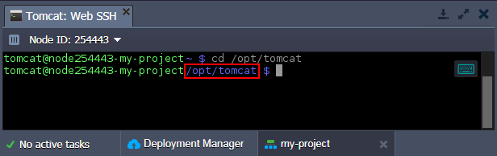

As a result, the violet string next to the container hostname will change, indicating your current location.

:::tip Tip

If you are new to a stack runtime that your instance runs, most likely you’d like to explore is its inner structure first (i.e. tree of files & directories, available configuration files, etc). The most convenient way to accomplish this is to use the inbuilt Jelastic [File Manager](/docs/ApplicationSetting/Configuration%20File%20Manager) GUI, available by clicking on the **Config** button next to the required server at your developer’s panel:

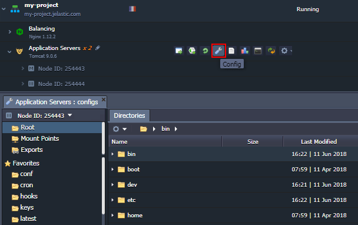

The appropriate file tree will be shown in a dedicated tab below.

:::

1. To create a new file or folder, execute the next commands:

- **_touch [path-to/]{file}_** - to create a new file
- **_mkdir [path-to/]{dir}_** - to create a new folder
  where

**_{file}_** and **_{dir}_** - the preferred file or folder name (if being created in the current directory)

**_[path-to/]_** - optional parameter for the case this new item should be placed in a different location.

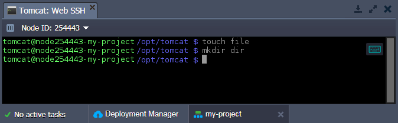

2. To make sure that the file and folder we’ve specified above have been actually created, let’s get the list of comprised files and directories at the current location with the next command:

**ls**

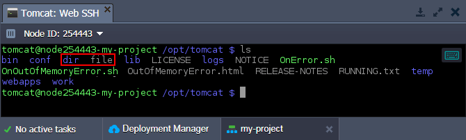

3. Among the rest of most common commands that are intended for file management, are:

- **_[cat](https://www.linfo.org/cat.html)_** - is used to operate with text files; depending on stated args, allows to view, merge and duplicate file content
- **_[cp](https://www.linfo.org/cp.html)_** - to copy files and directories
- **_[locate](https://www.linfo.org/locate.html)_** - to find the required file or directory within a server by its name (or part of it)
- **_[mv](https://www.linfo.org/mv.html)_** - to move and/or rename files and directories
- **_[pwd](https://www.linfo.org/pwd.html)_** - to output the full path to the current directory (relative to the container root)
- **_[rm](https://www.linfo.org/rm.html)_** - to remove specified file or directory

Now, let’s consider the default shell possibilities to monitor and manage your node’s metrics, its resource consumption, running inside processes, etc.

## Commands to View Server System Information

1. To get a short summary on the current container state and make sure that, for example, no malefactor affects its performance and/or operability, use the **_w_** command:

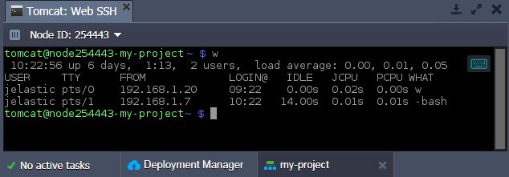

The received output will provide you with some general system information in a header (namely - current system timestamp, instance uptime, number of logged users and average amount of active processes for the last 1/5/15 minutes) and details on connected users below (their names, terminal type, source connection IP, login time, stats on the last activity and name of the currently active process(es), run on behalf).

:::tip Tip

Due to the native shell implementation specifics, the **_w_** command output does not include information on users, connected via terminal emulator.

:::

2. All statistics on server RAM usage is stored within the **_/proc/meminfo_** file. To review its content, use the mentioned above **_cat_** command:

**_cat /proc/meminfo_**

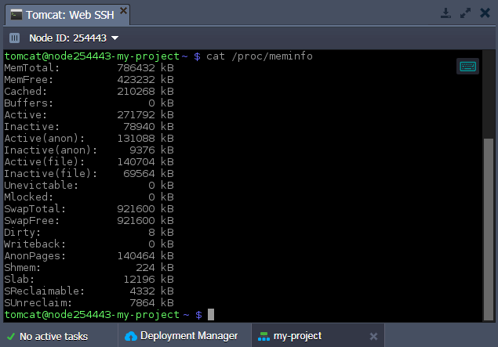

Here, you can check such data as total memory allocated (**_MemTotal_**), unused memory (**_MemFree_**), memory used as a cache (**_Cached_**), and more.

3. In order to display the basic software and hardware container data, execute the following line:

**_uname -a_**

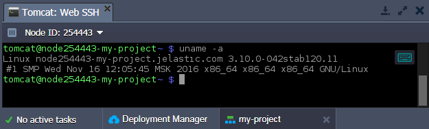

Here you can see info on a server kernel (name, version, release date), node hostname, CPU type, OS, etc.

## How to Manage Container Processes Remotely via Terminal

1. While connected over SSH, you can monitor all running processes inside a container with the **_top_** command:

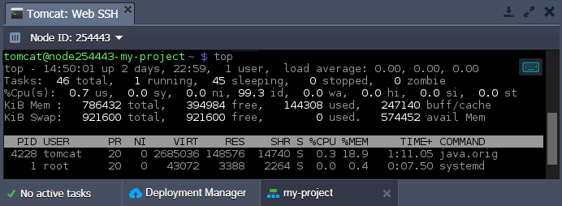

Herewith, information is constantly updated in a real-time mode, displaying info on all user’s processes (including system ones).

Press Ctrl + C to terminate the command execution and return to the console input mode.

2. To display only your user’s active processes, type in **_ps_** and run this command:

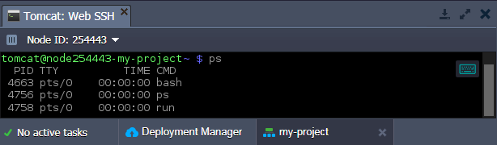

3. Another useful command is **_kill_**, which allows terminating any running process, designated by its **_{pid}_** as an argument (the required process identifier can be found in the previous command’s output):

**_kill {pid}_**

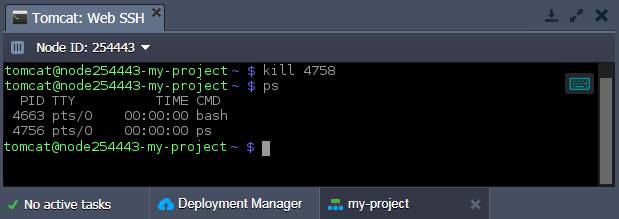

As you can see, the run process, shown on the screen within the 2nd step of this section, was stopped since it’s not listed among the active ones for now.

## Operating Application Archives via SSH Console

You are able to fetch the necessary files from Internet (for example, your application archive) directly through the console, to store and/or subsequently deploy them within your server.

1. The **_wget_** command allows to download files by the specified **_{link}:_**

**_wget {link}_**

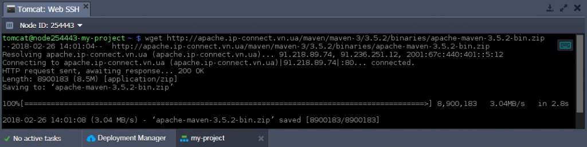

2. Then, you can **_unzip_** the downloaded archive with the same-named command:

**_unzip {archive}_**

where **_{archive}_** is a path to your compressed package.

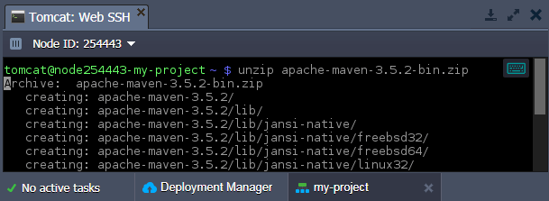

As a result, all extracted files will be placed to a same-named (after the archive) folder inside the current directory.

## Setting Custom Server Variables via SSH

1. The list of default environment variables for any container can be viewed within the **_.bash_profile_** file, which is located in the container’s home directory. So to check them, make sure you’ve got to the proper container directory and execute the next command:

**_cat .bash_profile_**

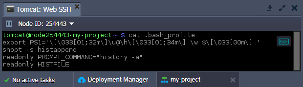

2. The **_.bash_profile_** file is not editable, so in case you need to additionally set your own variables, write them down to the **_.bashrc_** file within the same folder (just create it, if missing). To accomplish this, use any preferable text editor (for example, **_vi_**):

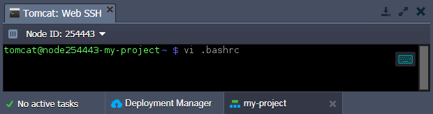

3. Here, new variables should be defined in the following format:

**_export {VAR_NAME}={VAR_VALUE}_**
where:

- **_{VAR_NAME}_** - the name of the variable you would like to create
- **_{VAR_VALUE}_** - value for the appropriate variable

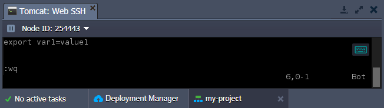

:::tip Note

The .bashrc file is read during the bash initiation so the changes will be automatically applied when starting all further user session. But in case you need to apply the made changes immediately, run the **_bash_** command to restart the shell.

:::

4. To check whether your custom variable was successfully applied, execute the following command:

**_echo ${VAR_NAME}_**

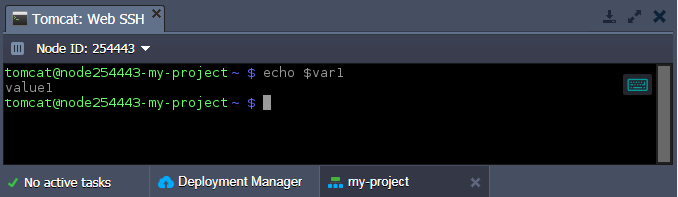

Within the console response, you should see the **_{VAR_VALUE}_** string similar to the value you’ve just assigned to **_${VAR_NAME}_** variable in the **_.bashrc_** file.

## Specifics of Certified Jelastic Containers Remote Management

At Jelastic PaaS, there are 2 types of [software stack](/docs/QuickStart/Software%20Stack%20Versions) templates, which are used as a base when creating each of containers:

- **_dockerized_** - unified template model based on [native Docker standard support](/docs/Container/Container%20Types) with the generality of container management principles and functionality for all server types (i.e. regardless of whether it computes node, or database server, or caching instance, etc).
  When connecting to such server via SSH, you automatically get full control over the instance with root privileges granted and can perform any required operations inside a container.
- **_certified_** software templates are based on native stack implementation, adapted by our team according to platform specifics.
  Upon entering such server via SSH, you are logged in as a default server user. To provide enough possibilities for effective container management, we’ve made some additional options available to be executed under a regular user account:

- **_sudo sbin/service {service_name} {start|stop|restart|condrestart|status|reload|upgrade|help}_** - a set of commands to operate the main server process, defined with the {service_name} placeholder (where, depending on a server used, the possible values are: jetty, mysql, tomcat, memcached, mongod, postgresql, couchdb, glassfish-domain1, nginx, php-fpm and httpd)
- **_sudo usr/bin/jem firewall {fwstart|fwstop}_** - to run/stop container firewall respectively
- **_sudo usr/bin/jem nscd_** - to control the [name-service caching daemon](https://linux.die.net/man/8/nscd), which stores records for the most common name server requests (like passwd, hosts, group, etc)
- **_sudo sbin/service rpcbind.service_** - to operate with the [RPC bind](https://linux.die.net/man/8/rpcbind) service, used to map user-readable names to program numbers that handle incoming RPC calls

Any of the commands above, despite being run in a sudo mode, does not require entering server admin root password. This allows you to take advantage of all the required container functionality, essential for your application proper work, even with regular account permissions.
