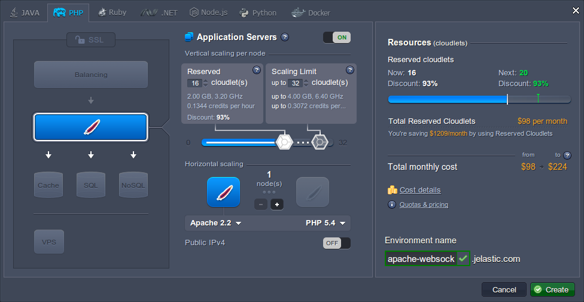
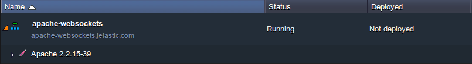
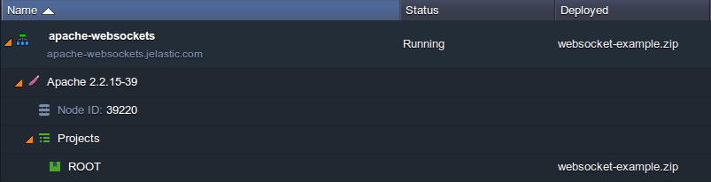
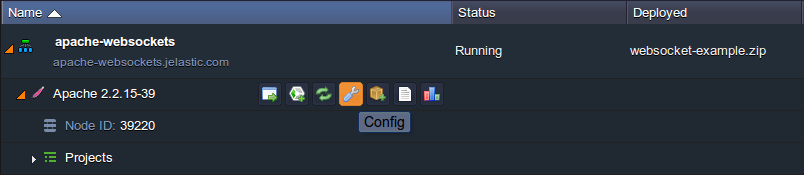
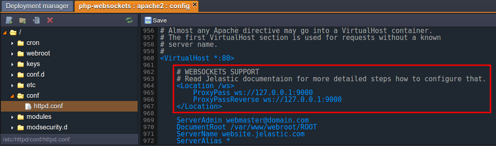
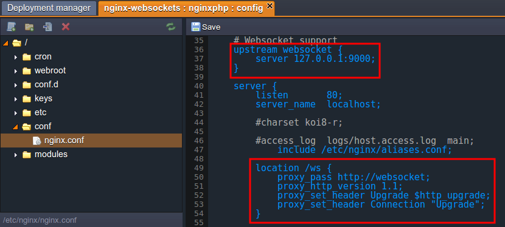
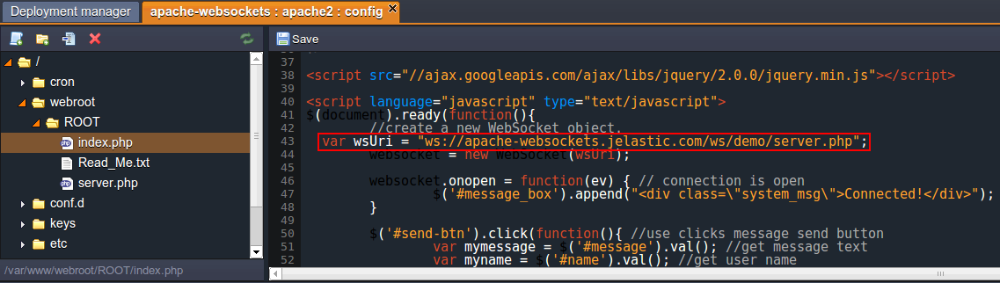
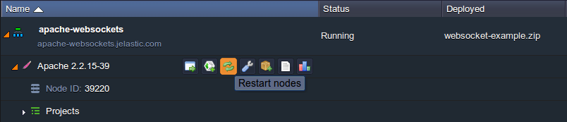
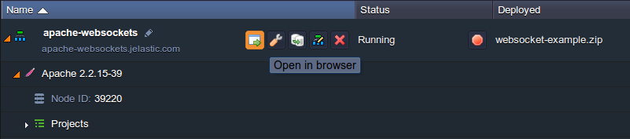
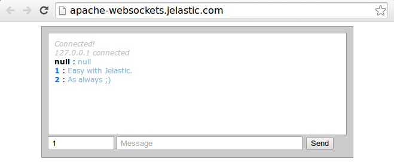

## Websockets Support for Apache & NGINX

**WebSockets** is a widely spread client-server technology, which allows you to implement the instant messages exchanging within your application. This is achieved through establishing the continuous full-duplex TCP-based connection between server and client’s browser. Using such communication channels results in a very low connection latency and rapid interaction, simultaneously ensuring streaming through proxies and firewalls, both upstream and downstream at once.

The platform provides you with an advanced and complemented WebSockets support by means of integrating this technology to the [Shared Load Balancer](https://cloudmydc.com/) and [NGINX-balancer node](https://cloudmydc.com/), so you can use it even without external IP address attached to your server. This is gained by proxying the variety of ports, used by your WebSockets apps, to a single one - 80 for HTTP and 443 for HTTPS.

The easiest way to configure the WebSockets support for your app is to place an **NGINX balancer** in front of it (the detailed instruction can be found in the corresponding [document](https://cloudmydc.com/)). Nevertheless, sometimes such a method may contradict your requirements for some reason, while an application still needs this technology to be implemented. For such cases, the platform ensures the full WebSockets support within the available application servers, including both **Apache** (intended to serve PHP, Ruby and Python apps) and **NGINX** (for PHP and Ruby apps).

The process of WebSocket’s integration can vary from application to application, but as for the server-side settings, the platform provides you with a configuration sample for each of the abovementioned nodes, thus you only need to uncomment it and add a few minor edits according to your app’s specifications (e.g. listener port number).

So, in the step-by-step tutorial below, we’ll show you an example of such configurations for a simple PHP chat project, which is deployed within the environment without the balancer server and uses the WebSockets technology. Let’s get started from the very beginning.

## Create Environment and Deploy Application

With the platform you can create the required environment in several clicks - just log into your PaaS account and follow the steps below:

1. Click on the **New environment** button at the top left dashboard corner.

<div style={{
    display:'flex',
    justifyContent: 'center',
    margin: '0 0 1rem 0'
}}>


</div>

2. Within the appeared **Environment Wizard** window, switch to the necessary programming language tab and choose the desired application server (we’ll use the **Apache** one for serving our PHP application). Then set the amount of allocated resources for it by means of cloudlet sliders, type name for your environment (_apache-websockets_ in our case) and click **Create**.

<div style={{
    display:'flex',
    justifyContent: 'center',
    margin: '0 0 1rem 0'
}}>



</div>

3. In a few minutes, your new environment will appear at the dashboard.

<div style={{
    display:'flex',
    justifyContent: 'center',
    margin: '0 0 1rem 0'
}}>



</div>

4. Upload and deploy your application using the platform Deployment Manager or via the remote GIT/SVN repository (the required instruction, according to the chosen engine, can be found in our [Deployment Guide](https://cloudmydc.com/)).

<div style={{
    display:'flex',
    justifyContent: 'center',
    margin: '0 0 1rem 0'
}}>



</div>

As a result, your deployed project will be listed inside the appropriate section at the environment’s panel.

## Server and Application Configurations

The WebSockets support within the Apache server is provided by means of the **_proxy_wstunnel_module_** module, added to the default server’s build. As for the NGINX application server, it uses the embedded ability to proxy the WebSockets connection similarly to the way the [NGINX-balancer](https://cloudmydc.com/) does.

So it’s time to configure your application server.

1. Click on the **Config** button next to your app server node:

<div style={{
    display:'flex',
    justifyContent: 'center',
    margin: '0 0 1rem 0'
}}>



</div>

2. In the opened **Configuration Manager** tab, perform the steps within one of the following instruction sections, according to the chosen server:

- for Apache app server

Find the **_httpd.conf_** file inside the **_conf_** directory and uncomment the next strings at the very end of it (approximately at the 962nd line).

```bash
<Location /ws>  
   ProxyPass ws://127.0.0.1:<PORT>  
   ProxyPassReverse ws://127.0.0.1:<PORT>  
</Location>
```

Now change both parameters to the port number, which is listened by your WebSockets application (e.g. our uses the _9000_ one).

Make sure it appears the same as the image below.

<div style={{
    display:'flex',
    justifyContent: 'center',
    margin: '0 0 1rem 0'
}}>



</div>

**Save** the made changes using the same-named button above the editor.

- **for NGINX app server**

Find the _#Websocket support_ section inside the **_nginx.conf_** file (located within the **conf** directory) and uncomment the following lines:

```bash
upstream websocket {  
    server 127.0.0.1:<PORT>;  
 }  
&hellip;  
location /ws {  
        proxy_pass http://websocket;  
        proxy_http_version 1.1;  
        proxy_set_header Upgrade $http_upgrade;  
        proxy_set_header Connection "Upgrade";  
    }
```


Then substitute the <b>< PORT ></b> value with the corresponding port number (i.e. which is listened by your WebSockets application) and **Save** the performed changes.

<div style={{
    display:'flex',
    justifyContent: 'center',
    margin: '0 0 1rem 0'
}}>



</div>

3. That’s all the server configurations you need to do, so the only thing left is to configure your deployed application. For that, access your application’s configuration file, which is responsible for WebSockets settings, and adjust the **ws** path it contains according to the next format:

***ws://{env_domain}{path_to_ws_file}***

where

- ***{env_url}*** should be substituted with your environment domain (can be seen under the environment name at the dashboard, apache-websockets.jelastic.com in our case)
- ***{path_to_ws_file}*** needs to be changed according to the path to the file, that should be accessed upon establishing the WebSockets connection.
It should look similar to the image below:

<div style={{
    display:'flex',
    justifyContent: 'center',
    margin: '0 0 1rem 0'
}}>



</div>

4. **Save** the changes and **Restart** your application server with the corresponding button.

<div style={{
    display:'flex',
    justifyContent: 'center',
    margin: '0 0 1rem 0'
}}>



</div>

5. Great, now it’s done! Click on **Open in Browser** to run your application in a new browser tab.

<div style={{
    display:'flex',
    justifyContent: 'center',
    margin: '0 0 1rem 0'
}}>



</div>

6. As you can see, our example chat app is working like a charm.

<div style={{
    display:'flex',
    justifyContent: 'center',
    margin: '0 0 1rem 0'
}}>



</div>

Even running such a simple chat application, you will still experience the benefits of blazingly fast transferring of messages, available due to the WebSockets protocol usage. Enjoy!