import obj from './DeployingAppsViaGitblit.json'

!incomplete

## Storing and Deploying Apps via Gitblit

<div style={{
    display: 'grid',
    gridTemplateColumns: '0.15fr 1fr'
}}>
<div>


</div>

<div>

[Gitblit](https://www.gitblit.com/) is one of the most popular tools for managing, viewing and serving your repositories within Git - a widely spread VCS (version control system) for software elaboration. Mainly, Gitblit is designed for small workgroups, which work with centralized repositories, and supports the variety of remarkable features, such as access control, repository’s content displayment via web, multiple repositories management, ability to be integrated with other Git-management solutions etc.

</div>

</div>

So, let’s find out how to host Gitblit at the platform and, subsequently, simplify your apps management with its help. You can automatically get a preconfigured ready-to-work **Gitblit** instance up and running within minutes using our one-click installation widget:

Just click **Get it hosted now** and type your email address in order to launch Gitblit and get the ability to proceed directly to the [repository creation](/docs/Deployment/Deploying%20Apps%20via%20Gitblit#create-a-gitblit-repository) guide section, skipping the steps of manual installation.

:::tip Note

The full list of applications, available for one-click installation, can be found at our [Marketplace page](https://cloudmydc.com/pricing) or within the [corresponding](/docs/Deployment%20Tools/Cloud%20Scripting%20&%20JPS/Marketplace) section at the dashboard.

:::

Or, if your prefer to take the complete control over the process, you can deploy it manually by following the step-by-step instruction below.

## Create an Environment

1. Log in to the platform dashboard with your credentials and click the **New Environment** button to open the **Environment Wizard** frame.

<div style={{
    display:'flex',
    justifyContent: 'center',
    margin: '0 0 1rem 0'
}}>


</div>

2. Choose the **_Java_** language tab and select **Tomcat 7** as an application server.

<div style={{
    display:'flex',
    justifyContent: 'center',
    margin: '0 0 1rem 0'
}}>

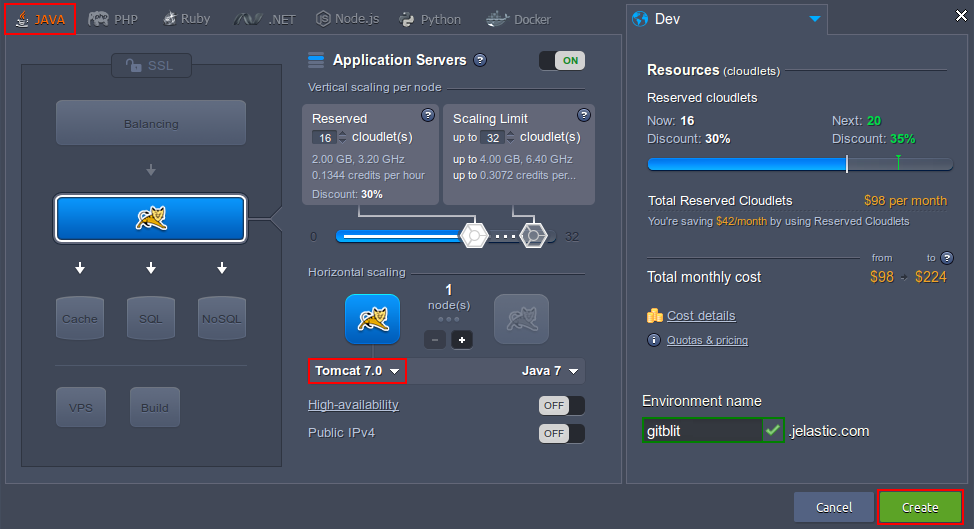

</div>

Set the rest of configurations according to your requirements, name your environment (e.g. gitblit) and click **Create** to initiate the process.

After a while, the designated environment will appear at the dashboard.

<div style={{
    display:'flex',
    justifyContent: 'center',
    margin: '0 0 1rem 0'
}}>

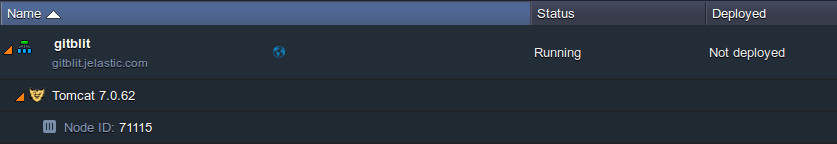

</div>

## Deploy Gitblit

1. Now, navigate to the [Gitblit](https://cloudmydc.com/) official website and download its latest release in a view of a wrapped **_.war_** archive (the appropriate link is circled on the image below).

<div style={{
    display:'flex',
    justifyContent: 'center',
    margin: '0 0 1rem 0'
}}>

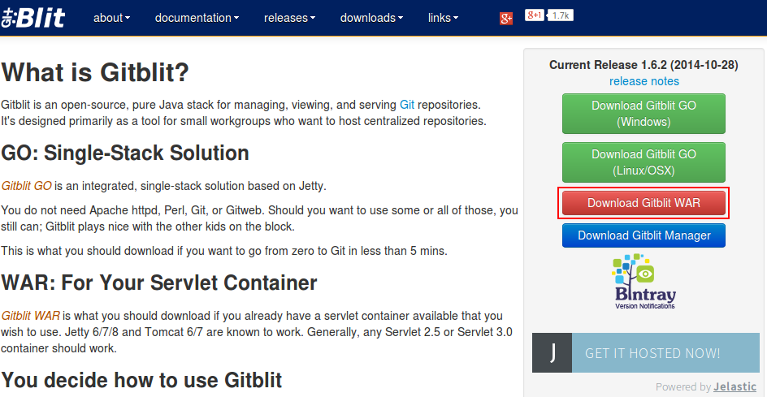

</div>

2. Go back to the platform dashboard and use the **Deployment Manager** to upload the archive you’ve just downloaded - i.e. choose the **Local file** tab, click **Browse** and select the Gitblit .war file within your local machine.

<div style={{
    display:'flex',
    justifyContent: 'center',
    margin: '0 0 1rem 0'
}}>

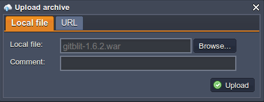

</div>

Click on the **Upload** button to proceed.

3. After the package appears at manager, deploy it to your environment using the corresponding **Deploy to** option.

<div style={{
    display:'flex',
    justifyContent: 'center',
    margin: '0 0 1rem 0'
}}>

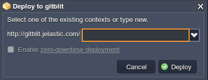

</div>

Within the opened frame, you may specify the desired custom context within the input field or just leave it blank to deploy your application to the default **_ROOT_** context.

4. Once the process is completed, you can click the **Open in browser** button to ensure the application is actually working fine.

<div style={{
    display:'flex',
    justifyContent: 'center',
    margin: '0 0 1rem 0'
}}>

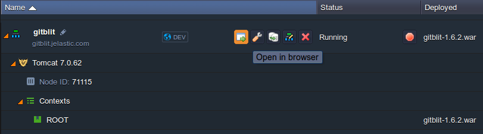

</div>

## Create a Gitblit Repository

1. To start working with Gitblit, you need to **login** within its main page with the default admin/admin credentials

:::tip Tip
We recommend to change the password to your custom one as soon as possible for the security ensurance

:::

<div style={{
    display:'flex',
    justifyContent: 'center',
    margin: '0 0 1rem 0'
}}>

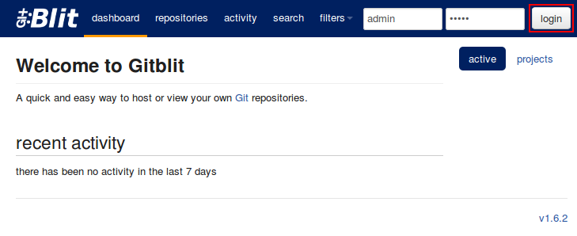

</div>

2. Once inside, switch to the **repositories** tab at the top pane. Here, you will see the list of your repos (if there are any) and will have the ability to manage them.

<div style={{
    display:'flex',
    justifyContent: 'center',
    margin: '0 0 1rem 0'
}}>

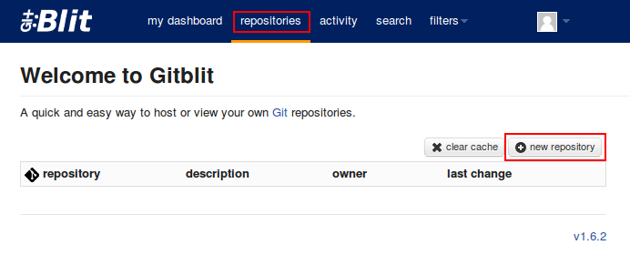

</div>

create repo 1Let’s create a **new repository** by clicking the same-named button to the right.

3. Set the name for your new repo (for example, GitBlitRepo) are adjust all the rest configurations according to your preferences (or just leave the default values).

<div style={{
    display:'flex',
    justifyContent: 'center',
    margin: '0 0 1rem 0'
}}>

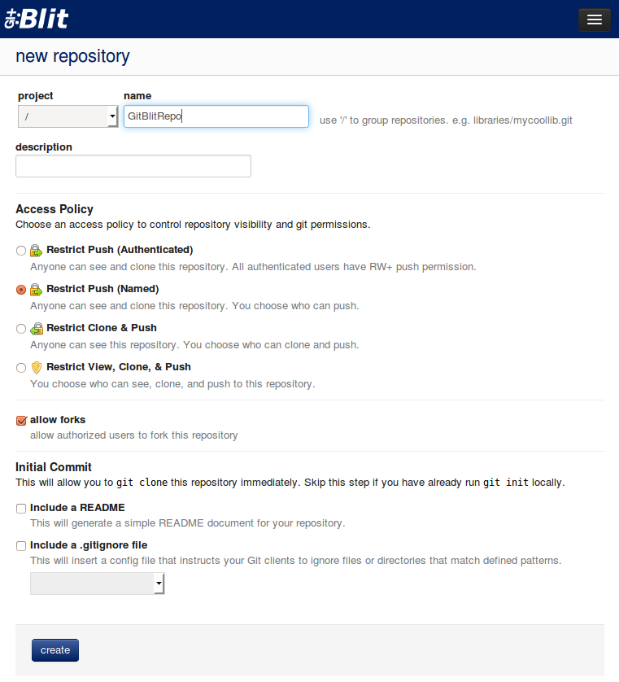

</div>

Click **create** at the bottom of a page when ready.

4. The specified empty repository will be shown in a moment.

<div style={{
    display:'flex',
    justifyContent: 'center',
    margin: '0 0 1rem 0'
}}>

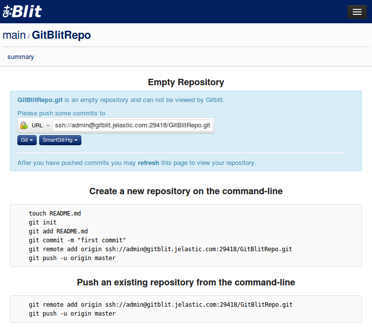

</div>

5. Now you should push (add) your project to this repo. The simple steps below will help you with this:

- first, initialize your local repository (i.e. create a folder to store your projects' files locally):

```bash
git init
```

define the files your project should consists of (just as an example, we’ll add the **_README_** file to it)

```bash
git add README.md
```

save these changes at the local repo with a commit message (e.g. mark it as a _first commit_)

```bash
git commit -m "first commit"
```

specify the previously created GitBlit repository as a remote one for your local Git repo

```bash
git remote add  {name}  {repo_url}
```

where:

- **{name}** - appellation for your remote repository
- **{repo_url}** - link to your GItblit repository, which can be found within the drop-down list on the top of the page from the previous step. The appropriate http:// link can be copied with the button to the right, as it is shown below:

<div style={{
    display:'flex',
    justifyContent: 'center',
    margin: '0 0 1rem 0'
}}>

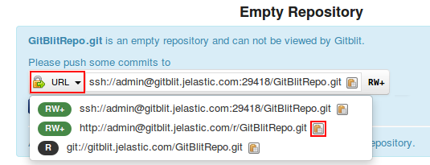

</div>

- finally, push your local project to the **Gitblit** repository:

```bash
git push -u  {name}  {branch}
```

where:

- **{name}** - name of the remote Gitblit repository your project should be copied to (state it the same as above)
- **{branch}** - projects' branch, that should be updated with this new data

<div style={{
    display:'flex',
    justifyContent: 'center',
    margin: '0 0 1rem 0'
}}>

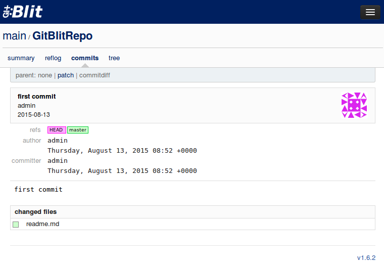

</div>

After this is done, refresh the Gitblit page to view your repository with a full data on it (here, you can also switch to the **commits** section to see the information on the latter changes applied, such as author, time and date of a commit, list of changed files, etc.).

## Deploy Project via Gitblit

Now, let’s discover how to deploy your project from a Gitblit repository into the platform.

1. At first, create a separate environment for your application hosting. Let’s consider a case with a **Java** project, where, in addition to the application server node, you’ll need to use a build tool (i.e. Maven).

<div style={{
    display:'flex',
    justifyContent: 'center',
    margin: '0 0 1rem 0'
}}>

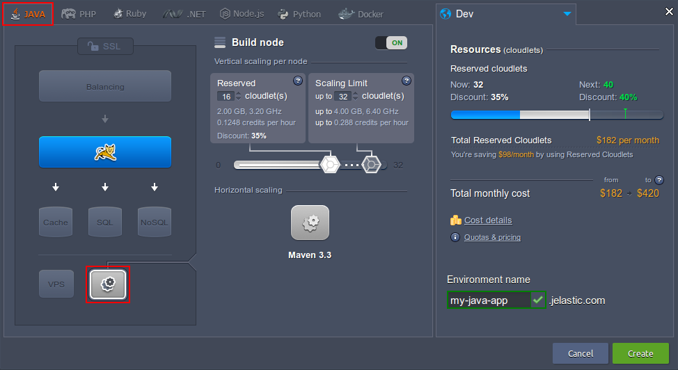

</div>

:::tip Note

that the extra Maven node is required for Java projects only, while for the rest of engines build is performed automatically, while adding a project to application server. Refer to the appropriate document below in case you need details on how to accomplish this:

- [Maven for Deploy via Git/SVN](/docs/Java/Build%20Node/Java%20VCS%20Deployment%20with%20Maven)
- [Deploy PHP Projects via Git/SVN](/docs/Deployment/Deployment%20Guide)
- [Deploy Ruby Project via Git/SVN](/docs/Deployment/Deployment%20Guide)
- [Deploy Python Projects via Git/SVN](/docs/Deployment/Deployment%20Guide)
- [Deploy Node.js Project via Git/SVN ](/docs/Deployment/Deployment%20Guide)

:::

2. Click the **Add project** button next to the Maven node after your environment is successfully created

<div style={{
    display:'flex',
    justifyContent: 'center',
    margin: '0 0 1rem 0'
}}>

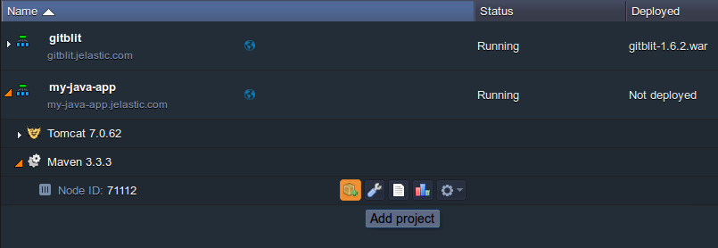

</div>

3. In the appeared **_Add project_** frame, choose the **Git** tab and fill in the required fields:

- enter the **_Name_** of project (for Maven only)
- specify **_URL_** and **_Branch_** of the repository you’ve previously created
- in the **_Use authentication_** block, fill in the following fields:
  - **_Login_** used to enter your repo
  - **_Password_** for the above specified login
- choose your **_Environment_** Name from the drop-down menu
- type the **_Context_** you would like to deploy your project to

<div style={{
    display:'flex',
    justifyContent: 'center',
    margin: '0 0 1rem 0'
}}>

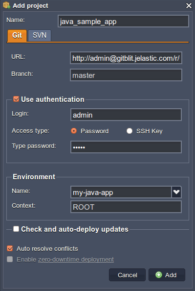

</div>

Confirm the project addition with the **Add** button. 4. Next, click the **Build and deploy** option next to the just added project.

<div style={{
    display:'flex',
    justifyContent: 'center',
    margin: '0 0 1rem 0'
}}>

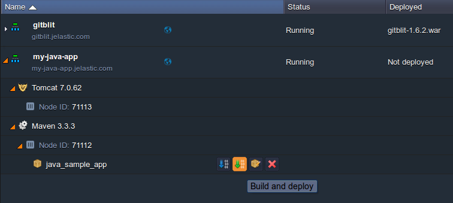

</div>

5. Once your application is deployed, you can open it (by pressing the **Open in browser** button for the environment) and ensure everything works fine.

<div style={{
    display:'flex',
    justifyContent: 'center',
    margin: '0 0 1rem 0'
}}>

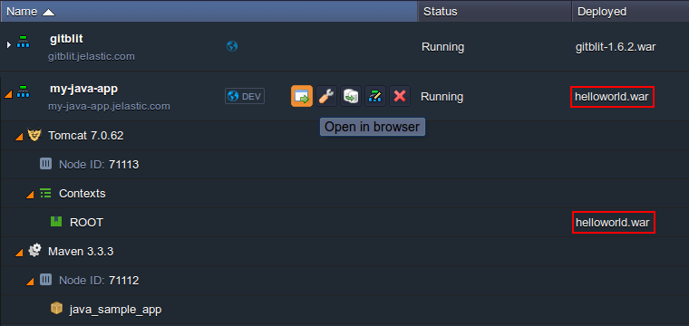

</div>

:::tip Tip

Subsequently, all the newly performed at the remote repository changes can be easily applied to your hosted app with just a single click - simply select the same **Build and deploy** button (or **Update from GIT** in case of working with another engine) next to your project and wait for the redeployment to be completed.

:::

That’s it! Now, your own Gitblit repository and project within it are both hosted hand by hand at the platform. Enjoy!
