<div style={{
    display: 'grid',
    gridTemplateColumns: '0.15fr 1fr',
    gap: '10px'
}}>
<div>


</div>

<div>

[Gitblit](https://cloudmydc.com/) is one of the most popular tools for managing, viewing and serving your repositories within Git - a widely spread VCS (version control system) for software elaboration. Mainly, Gitblit is designed for small workgroups, which work with centralized repositories, and supports the variety of remarkable features, such as access control, repository’s content displayment via web, multiple repositories management, ability to be integrated with other Git-management solutions etc.

</div>

</div>

**Hook** (or [webhook](https://cloudmydc.com/)) is a procedure of code insertion into some standard operation to apply some customization. In confines of the platform, this functionality allows you to execute your custom scripts before and/or after the application deployment operation. Herewith, for [Maven](/docs/Java/Build%20Node/Java%20VCS%20Deployment%20with%20Maven) build node and Golang application server, the pre- and post- project build hooks can be additionally set up.

So below we’ll examine how to operate with hooks at the platform and will overview several common use cases with step-by-step instructions this functionality can come in handy for:

- [Hooks Management](https://cloudmydc.com/)
- [Hooks Use Cases](https://cloudmydc.com/)

## Hooks Management

Being a part of the deployment process, **Hooks** are available within an expandable section of the appropriate dashboard form. So, in order to manage hooks, access the application deployment dialog using one of the following options:

- _Deployment Manager_

<div style={{
    display:'flex',
    justifyContent: 'center',
    margin: '0 0 1rem 0'
}}>

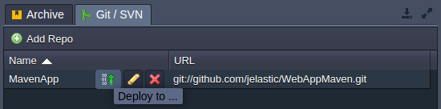

</div>

- Deployment buttons for an application server

<div style={{
    display:'flex',
    justifyContent: 'center',
    margin: '0 0 1rem 0'
}}>

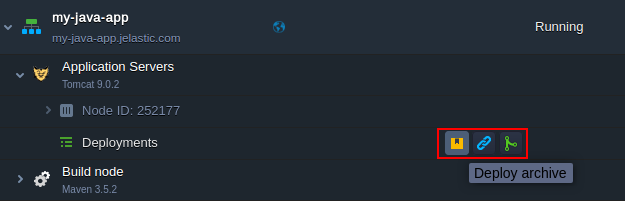

</div>

1. Within the opened frame, choose the preferred deployment source type and expand the **Hooks** section.

<div style={{
    display:'flex',
    justifyContent: 'center',
    margin: '0 0 1rem 0'
}}>

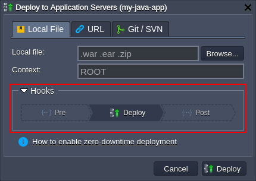

</div>

Here, click on either **Pre** or **Post** button to provide your code, which will be executed respectively just before/immediately after the deployment (according to the chosen option).

2. Enter the required hook code within the opened editor window. Here, you can use any preferable programming language - just ensure that the appropriate code interpretator is already installed at the target container (being either preliminary installed by yourself or included to the default stack build).

<div style={{
    display:'flex',
    justifyContent: 'center',
    margin: '0 0 1rem 0'
}}>

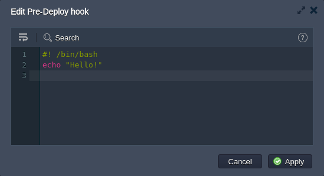

</div>

:::tip Tip

Within the top pane, you have an access to the following tools to help you during code editing:

- **_Wrap lines_** - brakes text to continue it in the line below if it reaches the frame border
- **_Search_** - allows to easily find the needed information; is supplied with the additional Match case and Regex search options
- **_Help_** - redirects to the current document to get the details on proper hooks usage

<div style={{
    display:'flex',
    justifyContent: 'center',
    margin: '0 0 1rem 0'
}}>

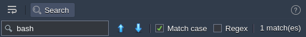

</div>

:::

Click **Apply** when ready. Now you can deploy your application.

3. After the successful deployment, you can click the **Show Logs** button within the appeared dashboard notification to view the detailed response on performed operations:

<div style={{
    display:'flex',
    justifyContent: 'center',
    margin: '0 0 1rem 0'
}}>

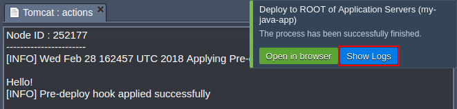

</div>

:::tip Note

In case something goes wrong during the hook execution, you’ll get the appropriate notification, whilst the deployment process will be aborted:

<div style={{
    display:'flex',
    justifyContent: 'center',
    margin: '0 0 1rem 0'
}}>

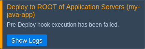

</div>

Click the **Show Logs** button in order to get the details on the occurred error by viewing the deployment action log (which corresponds to the **_hooks.log_** file, which can be accessed through the [Logs](https://cloudmydc.com/) section for the appropriate server).

:::

## Hooks Use Cases

Hooks provide a broad range of opportunities for developers, allowing to automate the majority of routine processes to get a ready-to-work application just after the deployment.

As an example, below we’ve gathered a number of the most common tasks that could be programmed to be automatically accomplished by hooks:

- Pre-deploy hooks (i.e. performed before the actual application deployment)
  - to check whether all of the requirements are met
  - to pre-install the required software
  - to clear or prepare a dedicated folder for application files
  - to log data
- Post deploy (after deployment is finished)
  - to restart your application server after deployment
  - to install project dependencies
  - to apply any other preferred customization
  - to log data
    Below, we’ve provided a simple example of your own log file creation with the help of hooks.

1. Initiate deployment of your project using any preferable way. We’ll use the default **_HelloWorld.zip_** archive from a deployment manager.

<div style={{
    display:'flex',
    justifyContent: 'center',
    margin: '0 0 1rem 0'
}}>

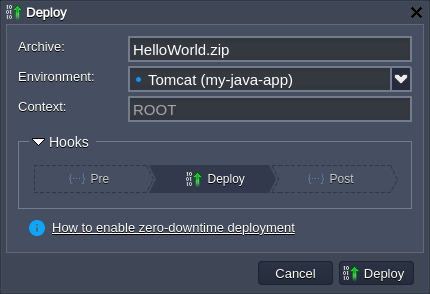

</div>

2. Expand the **_Hooks_** section, click on the **Pre** hook and provide the following code within the opened editor:

```bash
echo "$(date) - deployment start" >> ~/mylog
if ! grep -q "$(pwd)/mylog" /etc/jelastic/redeploy.conf; then
    echo "$(pwd)/mylog" >> /etc/jelastic/redeploy.conf
fi
```

<div style={{
    display:'flex',
    justifyContent: 'center',
    margin: '0 0 1rem 0'
}}>

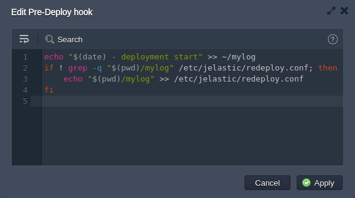

</div>

This will add a string into the **_mylog_** file (will be automatically created in the home directory, if not exists), which will identify deployment start and provide the appropriate time stamp. Also, we check if the **_redeploy.conf_** file includes our custom log file and, if not, add the appropriate line - in such a way it will be kept after [container redeploy](/docs/Container/Container%20Redeploy) operation.

3. For the **_Post_** hook add the next code:

```bash
echo "$(date) - deployment end" >> ~/mylog
```

:::tip Tip

If needed, you can use the exit command, which allows to break your hook and the appropriate deployment/build operation execution at any point. Herewith, the 0 value (i.e. exit 0) is used to indicate success, while any other value assumes an error (e.g. exit 1).

:::

<div style={{
    display:'flex',
    justifyContent: 'center',
    margin: '0 0 1rem 0'
}}>

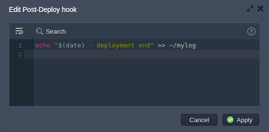

</div>

Here, we just log the end of our deployment.

4. Finally, deploy your application and check both **_mylog_** and **_redeploy.conf_** file to verify hooks successful execution.

<div style={{
    display:'flex',
    justifyContent: 'center',
    margin: '0 0 1rem 0'
}}>

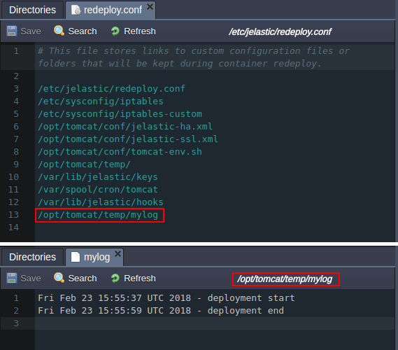

</div>

As you can see, our scripts have worked as intended, providing the deployment start / end time and ensuring it is protected during redeploy operation.

:::tip
If you face any issues while working with hooks, feel free to appeal for our technical experts' assistance at [Stackoverflow](https://stackoverflow.com/questions/tagged/jelastic).
:::
