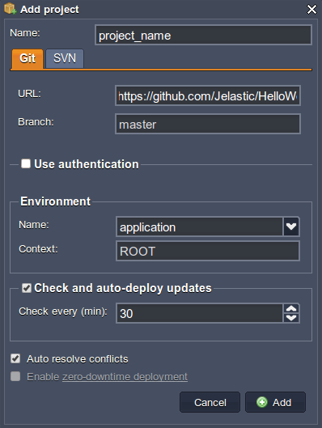
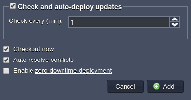
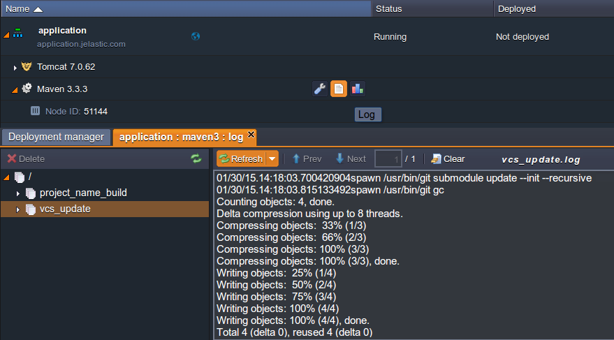

## Auto-Deploy of Git/SVN Updates

  To greatly increase your productivity as a developer, the platform provides you with the possibility to set periodical **automatic deployment** of your project and, in such a way, ensure its continuous integration to the corresponding application server. Such re-deploys take place based on the changes that were applied to the appropriate remote repository, thus you can simply work via the preferred Git/SVN service, without ever leaving it.

Just update your code, make a commit and all the changes in your VCS project will be automatically pushed to your production environment, after the stated time interval. And as a distinction from Git hooks, the platform auto-deploy feature does not require any additional configurations on the Git repository side and works with SVN. So, let’s discover how to get it!

## Preparing a Project

1. First of all, prepare an [environment](/docs/PlatformOverview/Basics%20&%20Terminology#environment) for further addition of the intended project with the code from Git/SVN.

:::tip Note

that Java environments require an additional Maven node for building and pushing the code to the appropriate application server, while for the rest of the languages this mechanism is handled by the corresponding compute nodes themselves.

:::

We’ll consider this on the example of Maven build node for Java - however, any other application server can be configured similarly.

2. Once your environment is created, click the **Add project** button next to the appropriate node (i.e. Maven for Java or your application server for any other language)

3. In the opened window, switch to the tab with the type of VCS used and fill in the required fields: insert the **URL** to the necessary repository, specify the authentication details and designate the name for the **Context** your application should be placed at.

Also, in case of a Maven build node usage, you need to additionally specify the **Name** for your project and **Environment** it is intended to be deployed to.

:::tip Tip

If you need more detailed information on these options, refer to the relevant [Deployment Guide](https://cloudmydc.com/) instruction and [Maven for Deploy via Git/SVN](https://cloudmydc.com/) for Java engine specifics.

:::

## Setting Automatic Project Update

Now, as all the crucial for deployment information is stated, you may proceed to configuring the automatic updating of your project.

1. Tick the **_Check and auto-deploy updates_** line to enable it and get the corresponding section expanded.

The **Check every (min)** option will be revealed, which is used to define the frequency of checking the repository for new commits, pushed since the last verification.

As you can easily guess from the option name, it is stated in minutes. Thus, if you set, for example, a 1 minute interval, the check will be done every minute, and if you specify a 1440 minute interval - the check will be done once per day.

:::danger Notes

- if the verification interval is smaller than the time needed to build and deploy the project, the next task will wait in a queue until these operations are completed
- in case your application server layer contains several nodes, please also consider the details on their update sequence

:::

2. As a result of these configurations (which, despite of a long description, take less than a minute to specify), if there were any changes made at the application sources, they will be automatically built and deployed (for Java projects) or just applied through updating the project (for the rest of the languages) once per the specified period of time.

Click **Add** for confirmation.

:::tip Tip

This frame also includes a number of additional settings, which may come in handy for organizing a proper interaction of the platform system with your remote repository:

- **Checkout now** option (present for non-Java languages) is used to indicate whether you’d like to deploy your project immediately after its addition or postpone this operation (for being either initiated manually later or performed automatically during the first further checkout by the enabled auto deploy feature).
- The **Auto resolve conflict** option is also active by default and represents an analogue of the git reset –hard command. It is used to prevent the occurrence of merge conflicts during subsequent project updates, which can take place if the same file was modified in both the remote repository and your project, hosted at the platform. If such an issue arises, this contradictory file will be updated according to its repository version (which is considered as the correct one), discarding the locally made changes. We recommend not to disable this option unless you know exactly what you are doing.
- The **Enable [zero-downtime deployment](https://cloudmydc.com/)** option (currently available for PHP only) allows to continuously deploy the updates of applications, located at the ROOT context, without any interruptions in application work. Herewith, if enabled, your choice will be remembered and used during all the ensuing auto-updates.

:::

## Tracking Auto-Updates

In order to monitor the auto-deployment processing and its results, you can look through the appropriate log file (named **vcs_update**) for the corresponding app server or Maven node.

:::tip Note

You are also able to re-configure your deployed via Git/SVN app’s settings by navigating to your environment and selecting the **Edit** button next to the appropriate project. You’ll see the frame opened, similar to the one that was used for the project addition, where you can change the state for any of the options, described above (just click on **Apply** to confirm the new settings).

:::

That’s all! Just make these simple configurations while adding your project to the platform and feel free to continue working with your code through Git/SVN repository, without having to come back to our dashboard again. Rest assured that everything will stay up-to-date on your production, automatically!
