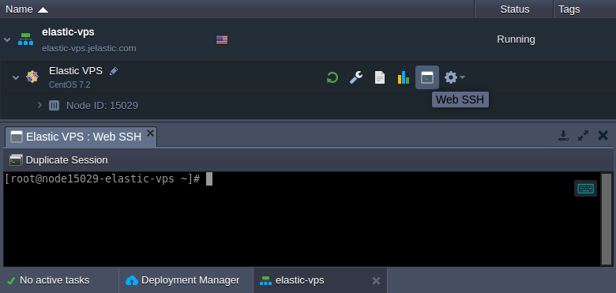

In order to manage the required software inside your Elastic VPS container, you need to connect to it via SSH protocol. A connection can be performed through the dedicated [SSH Gate](https://cloudmydc.com/), which provides a single access point to configure all environments and servers within your account remotely.

:::tip Note

For the Windows VPS management, utilize the [remote desktop protocol](https://cloudmydc.com/) (RDP) support.

:::

The process of [SSH access](https://cloudmydc.com/) to the Elastic VPS nodes is the same as for any other container on the platform but provides full root access.

- [Web SSH](http://localhost:3000/docs/Deployment%20Tools/SSH/SSH%20Access/Web%20SSH)

A one-click connection to your VPS container from the platform dashboard without any configuration required.

- **_[SSH Gate](https://cloudmydc.com/)_**

An SSH connection to VPS from the console on your local machine. Access is based on your custom SSH key pair.

:::tip Note

If you haven’t established a connection via SSH Gate before, you’ll need to perform the following steps beforehand:

- [generate](http://localhost:3000/docs/Deployment%20Tools/SSH/Generate%20SSH%20Key) an SSH key pair
- [add your public SSH key](http://localhost:3000/docs/Deployment%20Tools/SSH/Add%20SSH%20Key) to the dashboard

In case you prefer to operate your VPS container with the help of external SSH tools, consider establishing [access via Public IP](https://cloudmydc.com/) address. Regardless of the chosen approach, the provided functionality and management capabilities are the same.
