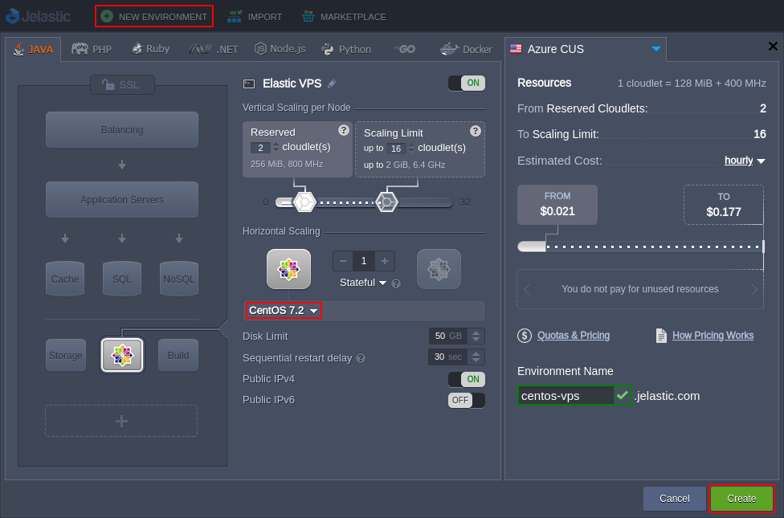

## Elastic CentOS VPS

**[CentOS](https://cloudmydc.com/)** (Community ENTerprise Operating System) is a free community-driven project, with open source code delivered from RHEL Linux distribution.

Due to continuous community contribution, CentOS offers enterprise-level stability strengthened by robust performance and represents a reliable, low-maintenance, secure option for running virtual private servers.

## CentOS VPS Hosting

So, to effortlessly set up your own CentOS [Elastic VPS](https://cloudmydc.com/) inside the platform, log in to your PaaS account and access environment topology wizard.

The appropriate instance (i.e. **_CentOS 6.8_** or **_CentOS 7.2_**) can be found within the appropriate VPS section at the bottom left wizard corner (for the detailed installation guidance, refer to the [VPS Configuration](https://cloudmydc.com/) page).

:::danger Note

By default, the VPS node is delivered with the automatically attached Public IP address (one per instance).

:::

The platform provides a set of [inbuilt tools](https://cloudmydc.com/) for applying some basic settings to your VPS instance right via the dashboard UI. For more complicated configs, you’ll need to access it via SSH - this can be accomplished through the SSH Gate or via any [3d-party software](https://cloudmydc.com/) (i.e. external SSH client) using Public IP address.

Once your virtual private server on top of CentOS is set up and properly configured, consider exploring the following example tutorials:

- [How to Run Java Console Application](https://cloudmydc.com/)
- [How to Set Up Mail Server Inside VPS](https://cloudmydc.com/)
