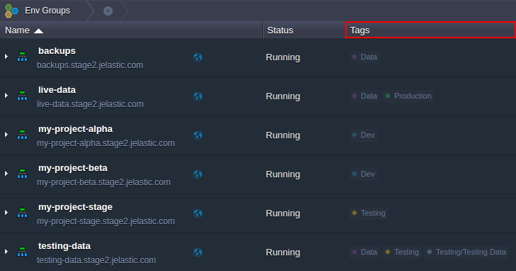
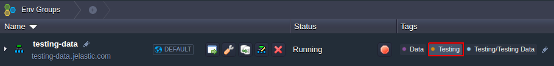
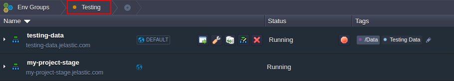
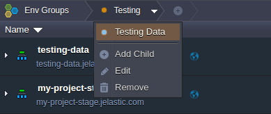
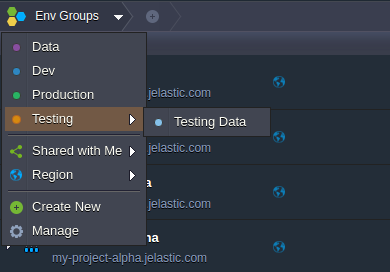
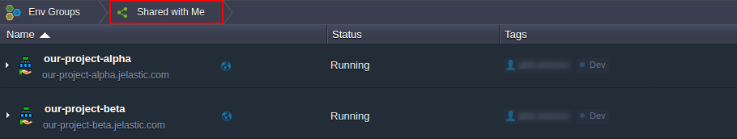
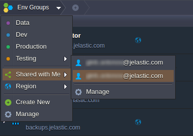
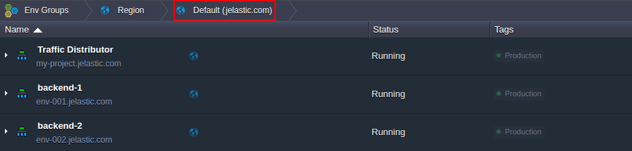

## Navigation Across Environment Groups

Organizing applications into [environment groups](/docs/EnvironmentManagement/Environment%20Groups/Overview) allows to make your working process much more comfortable. This is achieved through setting special **Tags**, which are used for environment filtering and are displayed within the same-named column in the main user dashboard screen.

You can switch and navigate between your environment groups with the following UI elements:

- [via the Tags column](/docs/EnvironmentManagement/Environment%20Groups/Navigation%20Across%20Groups#navigation-via-tags)
- [via the Env Groups menu](/docs/EnvironmentManagement/Environment%20Groups/Navigation%20Across%20Groups#navigation-via-env-groups-panel)

## Navigation via Tags

The **Tags** column lists all of the groups an environment belongs to - click on a particular tag in order to refer to the appropriate group.

The required filtering will be applied automatically, whilst the selected group label will be displayed as a nesting element in the **Env Groups** navigation panel at the top.

Herewith, the appropriate group name will be temporarily hidden within the **Tags** column (as you are inside already).

:::tip Note

In case the currently selected group contains further child items (i.e. [subgroups](/docs/EnvironmentManagement/Environment%20Groups/Group%20Management#add-subgroups)), their list can viewed at the chosen group’s [management menu](/docs/EnvironmentManagement/Environment%20Groups/Group%20Management) within the top navigation panel.

Just click on the string with such child group to open it.

:::

In order to cancel filtering and return back to the overall list of available environments, click on **Env Groups**.

## Navigation via Env Groups Panel

Upon expanding the main **Env Groups** menu at the top, you’ll be shown the list of all environment groups within your account, including the comprised [subgroups](/docs/EnvironmentManagement/Environment%20Groups/Group%20Management#add-subgroups) (if are any).

Clicking on a particular one will apply the corresponding filtering to your environment list.
Additionally, here you are provided with two predefined sorting options which are based on the following parameters:

- **Shared with Me** - select this option to access the list of environments [shared](/docs/EnvironmentManagement/Share%20Environment) with your account

:::tip Note
When hovering over **Shared with Me**, you’ll see the list of collaboration owners you belong to; choosing a particular record here will display the environments that were shared to you by this person.

And if selecting **Manage** at this submenu bottom, the **Account settings > [Shared with Me](/docs/EnvironmentManagement/Share%20Environment)** tab will be opened.

:::

- **Region** - use this option to filter environments based on the list of [environment regions](/docs/EnvironmentManagement/Environment%20Regions/Choosing%20a%20Region), available for your account

Now, when you know how to easily navigate between different environment groups, check some additional possibilities provided for [group management](/docs/EnvironmentManagement/Environment%20Groups/Group%20Management) at the platform dashboard.
