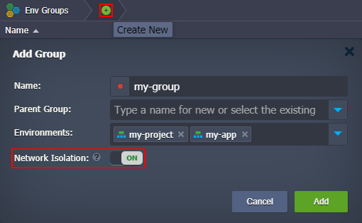

## Environment Network Isolation

:::danger

This feature availability depends on the particular hosting provider settings.

:::

The **Network Isolation** feature manages the default access rules between environments inside a single PaaS installation (i.e. connectivity over the internal network).

This way, each internal connection between nodes on the platform needs to pass the proper check-up before being allowed. Namely, it is verified that the requesting and requested environments belong to the same isolated group.

:::tip Tip

Additionally, the connectivity of nodes can be restricted by the [container firewall](/docs/ApplicationSetting/External%20Access%20To%20Applications/Container%20Firewall) rules, which represent a more flexible solution that is suitable for both internal and external access management.

:::

## Private Network Isolation

If the **Network Isolation** feature is enabled on the platform, all accounts are isolated from each other by default. In such a case, the connection between environments on different user accounts can be established only if configured explicitly on both ends.

Additionally, the feature allows developers to isolate [groups of environments](/docs/EnvironmentManagement/Environment%20Groups/Overview) within a particular account. Just turn on the **_Network Isolation_** switcher in the **Add/Edit Group** frame.

The platform automatically unites the containers' internal addresses into a dedicated IP set for each isolated group. This allows controlling access between nodes (i.e. if IPs are within the same set - interconnection is permitted, and if not - denied). The platform automatically detects all the related changes under your account (e.g. environment removal, [nodes scaling](/docs/ApplicationSetting/Scaling%20And%20Clustering/Horizontal%20Scaling), etc.) to keep IP sets up-to-date.

While managing Network Isolation, you should consider the following peculiarities:

- isolation can be enabled for the top-level group only (i.e. not for [subgroups](/docs/EnvironmentManagement/Environment%20Groups/Group%20Management#add-subgroups))
- environment groups with enabled isolation are provided with a custom shield icon ( ) for better recognition
- [shared environments](/docs/EnvironmentManagement/Share%20Environment) can not be included into isolated groups by collaborators
- this feature is not suitable to limit the access to your containers from outside of the platform (e.g. via [public IP](/docs/ApplicationSetting/External%20Access%20To%20Applications/Public%20IP))

## Using Network Isolation

Summing all this up, _Network Isolation_ is a useful and user-oriented feature aimed to prevent undesired access to your environments. Commonly, it’s a good practice to isolate your [applications](/docs/PlatformOverview/Basics%20&%20Terminology#application) from each other. For example:

- If you need to share access to your application or database with a third-party employee or company, you’ll be sure that containers inside the isolated group won’t be accessible via the platform’s internal network

- If you are [cloning](/docs/EnvironmentManagement/Cloning%20Environment) an initially isolated project, it will be protected from the clone’s influence (e.g. if your copied project inherited a “hardcoded” database access, it will be disabled by the network Isolation feature so that the actual production data could not be changed)

This way, the _Network Isolation_ feature can separate projects on a single account and prevent undesired interconnections between them.
