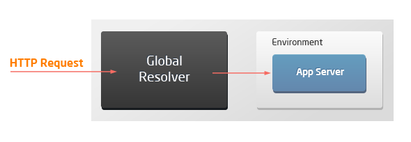
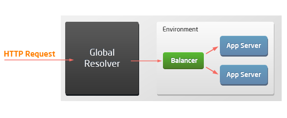
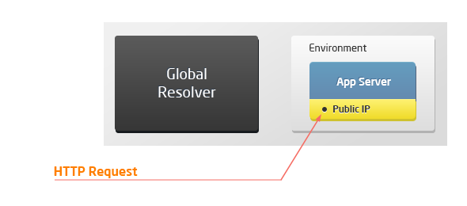
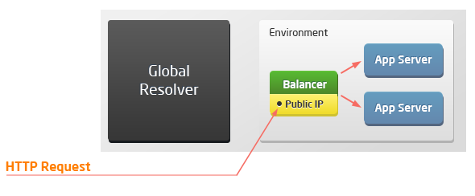
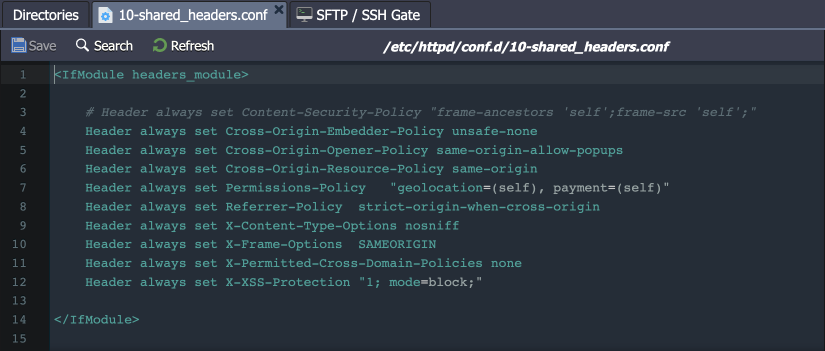

import obj from './HTTPHeaders.json'

**[HTTP headers](https://cloudmydc.com/)** are the core part of the HTTP requests and responses. They pass additional information with an HTTP request or response (e.g. the client browser, requested page, server, and more).

The main headers used with environments for deploying your applications:

    

        

            

                Header
            

            

               Description
            

            

                Value
            
 
        

        {obj.data1.map((item, idx) => {
            return 

            

                {item.required ? <a href="#">
                    {item.field}
                </a> : 
                item.field
                }
            

            

                {item.description}
            

            

                {item.value}
            

        
 
        })}
    
 

:::tip Tip

Additional security headers are used for some specific stacks.

:::

The list of supported HTTP headers can vary based on the topology of the connected environment. Due to external access specifics (via [resolver/SLB](https://cloudmydc.com/) or [public IP](https://cloudmydc.com/)), there are four possible scenarios when working with the platform:

    

        

            

                Header
            

            

               Description
            

            

                Value
            
 
        

        

            

Single application server	
            

            

host x-forwarded-proto x-real-ip x-forwarded-for x-host
            

        
 
        

            

Load balancer with application servers
            

            

host x-real-ip x-host x-forwarded-for x-uri x-forwarded-proto
            

        
 
        

            

Application server with public IP	
            

            

host
            

        
 
        

            

Load balancer with public IP and application servers	
            

            

host x-real-ip x-host x-forwarded-for x-uri x-forwarded-proto
            

        
 
    
 

## Security Headers

You can easily manage security headers by managing the appropriate configuration file. The path is different for different servers:

- _Apache (PHP, Ruby, Python), MySQL, MariaDB_: **_/etc/httpd/conf.d/10-shared_headers.conf_**
- _NGINX (PHP, Ruby) and LEMP_: **_/etc/nginx/conf.d/headers/10-shared_headers.conf_**
- _LiteSpeed, LLSMP_: **_/var/www/conf/vhconf.xml_** (adjust via the admin panel only)
- _Tomcat, TomEE_: **_/opt/tomcat/conf/web.xml_**

:::danger Notes

- The headers processing for the Node.js, Golang, .NET, JavaEngine, and Springboot servers must be implemented manually in the user application.
- For the Tomcat and TomEE stacks, only the following headers are enabled by default: **X-Content-Type-Options, X-Frame-Options, X-XSS-Protection**, and **Strict-Transport-Security** (for SSL). Other headers can be enabled manually, if needed.

:::

Don’t forget to <u>restart</u> your server to apply any changes made to the configuration file.

The following additional HTTP headers are used on the above-listed stacks by default:

    

        

            

                Header
            

            

               Description
            

            

                Value
            
 
        

        {obj.data3.map((item, idx) => {
          return 

            

                {item.Header}
            

            

                {item.Description}
            

            

                {item.Value}
            

        
 
        })}
    
 

