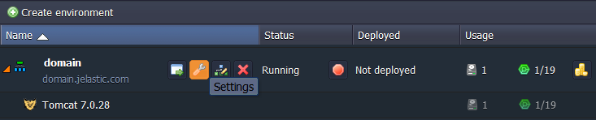
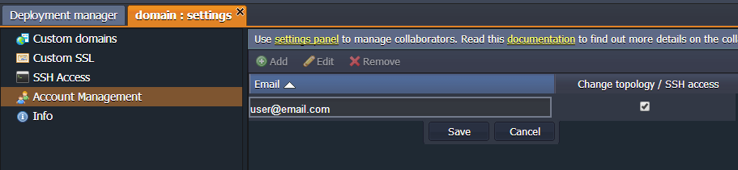
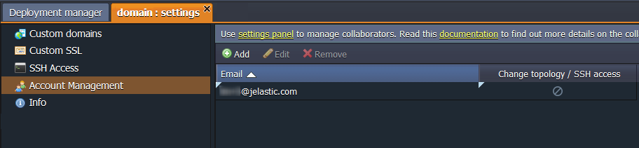
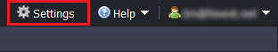
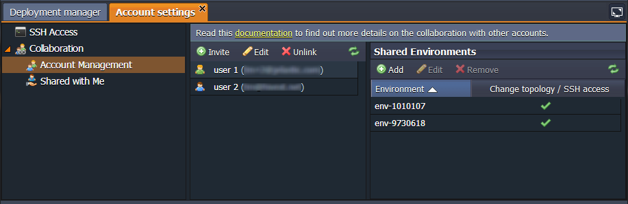
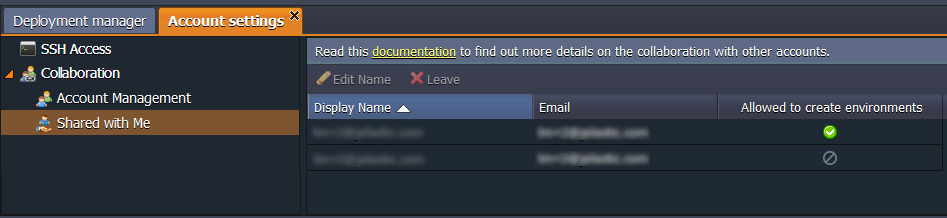

_This information is relevant for the platforms prior the 7.0 release. See the up-to-date [account collaboration](/docs/Account&Pricing/Accounts%20Collaboration/Collaboration%20Overview) feature description_.

A customer who originally created an environment becomes its **Owner** and can share it with other **Users**, specifying corresponding access rights for each of them.

**Owners** have full control over the environment.

**Users** can perform a wide range of actions within a shared environment: deploy applications, change configurations, read log files, view statistics, etc. The only exception, is that they cannot clone an environment.

Additionally, the Owner of the environment can permit a User to change its topology and to access it via SSH.

The charges for the environment are applied only to the Owner (the other users of the shared environment are not charged).

Environments can be shared with:

- registered PaaS accounts
- unregistered emails which will be signed up automatically
  Based on this division, the process of sharing can differ slightly. Let’s review the steps of the two sharing types.

## Environment Sharing with a Registered Account

To share any of your environments with more platform users and delegate them appropriate permissions, follow this instruction:

1. Open the environment’s **Settings**.

share environment a375d2047848941da72832ea4018c58csettings button

2. In the **Account management** section, add another platform user account (**Email**) and tick the **Change topology / SSH access** option (in the case you would like to permit these activities for the specified user).

3. After clicking the **Save** button, this user will receive an email notification about environment sharing and can proceed to [managing](/docs/EnvironmentManagement/Share%20Environment%20Deprecated#manage-a-shared-environment) it.

## Environment Sharing with an Unregistered Account

To share your environment with a user who is not registered with the platform, follow these steps:

1. Open the environment’s **Settings**.

2. In the **Account management** section, add the **Email** of the user that you want to share the environment with.

3. Click the **Save** button. Firstly, you will see this user in the list with custom triangle signs  which means that the invitation was sent. Then, this user will disappear from the list, as technically the environment is not shared with him yet.

4. As a result, a user will get an email notification with an invitation to join your collaboration. When the invitation is confirmed, a user will be automatically registered and will receive an email notification with credentials to the PaaS account. You will be informed about this confirmation via email.

:::tip Note

at this stage, the user is only registered and added to your collaboration, but no environments are shared yet. You will need to perform sharing steps one more time:

- Navigate to **Settings > Account Management**
- Add the same **Email** of a user
- State the permissions by ticking the **Change topology/SSH access** option
- **Save** the settings
  A user will receive a notification about the shared environment.

:::

Newly registered users will have **trial** status by default. As a result, the usual trial limitations set by the hosting provider will be applied, and a user will be deactivated after the trial period, unless the account is converted to a paid one.

Detailed info on your account limitations can be found at the **Balance > Quotas & Pricing > Account Limits** tab.

Note: that these quotas can be customized by the hosting provider, e.g. such users can be provided with an “eternal” trial period and, in exchange, forbidden to create their own environments. Such environment sharing can be also performed via the **[account collaboration](/docs/Account&Pricing/Accounts%20Collaboration/Collaboration%20Overview)** setting (follow the link to get more details).

## Manage a Shared Environment

To manage the environments shared by/with you, click the Settings button in the top right corner of the platform’s dashboard.

Navigate to the **Account Management** or **Shared with Me** option (depending on your requirements) and manage the desired settings.

- if you are the owner of the environment
  In the **Account Management** option, you can remove access to your environment for any user or limit the permissions by unticking the Change topology/SSH access option.share environment

- if you are the user of someone’s environment
  In the **Shared with Me** option, you can decline from using the shared environment.

So now, you can work together with other members of your team on your cloud environment. Enjoy!
