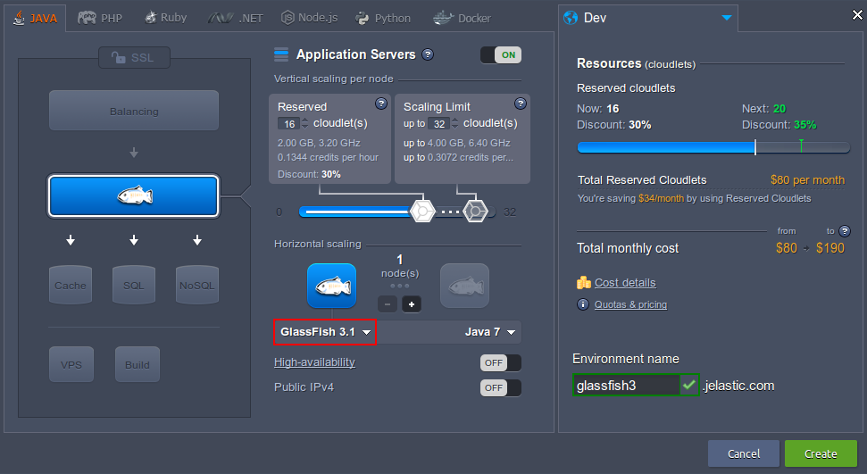
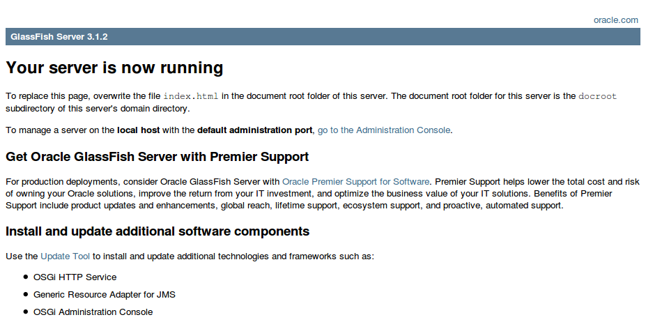
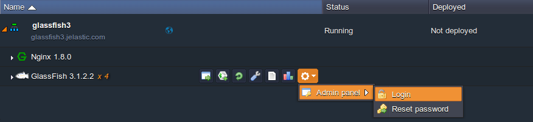
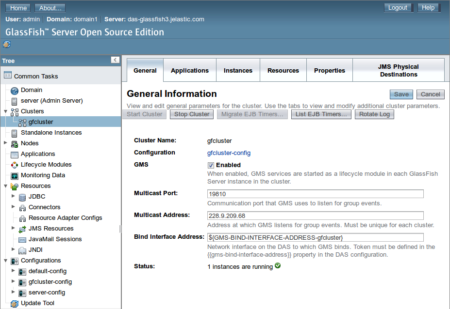
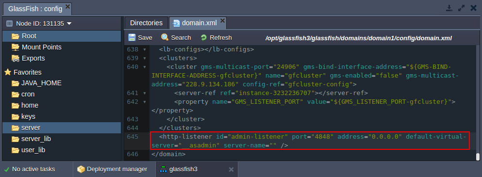

import obj from './GlassFishServer.json'

## GlassFish

[**GlassFish**](https://cloudmydc.com/) is an open source application server project started by Sun Microsystems for the Java EE platform and now sponsored by Oracle Corporation. The supported version is called Oracle GlassFish Server. GlassFish is free software, dual-licensed under two free software licences: the Common Development and Distribution License (CDDL) and the GNU General Public License (GPL) with the classpath exception.

GlassFish provides the enterprise level reliability and performance with full clustering and has a wide functionality range. It is quite cool in that it allows you to manage the central repository via the admin panel, which supports all features available in GlassFish. However, as you know, more functions = more resources.

## GlassFish Installation

To get your GlassFish server in the platform, simply:

1. Log into your PaaS dashboard and click **New Environment**.

2. Switch to the **Java** tab and pick **GlassFish** within the application servers section as shown in the picture below:

<div style={{
    display:'flex',
    justifyContent: 'center',
    margin: '0 0 1rem 0'
}}>



</div>

3. Once the environment is created, you can click **Open in browser** button next to the GlassFish server it comprises (expand the environment in the _Environments_ pane at the top of the screen):

<div style={{
    display:'flex',
    justifyContent: 'center',
    margin: '0 0 1rem 0'
}}>



</div>

4. Now you can upload the Java application WAR package and [deploy](https://cloudmydc.com/) it to the environment.

5. The Glassfish administration panel can be accessed directly from the platform dashboard:

<div style={{
    display:'flex',
    justifyContent: 'center',
    margin: '0 0 1rem 0'
}}>



</div>

Admin page will be available in a new tab.

:::tip Note

- The platform uses _gfcluster_ as a cluster, so if you want to modify something, please apply changes to _gfcluster_.

<div style={{
    display:'flex',
    justifyContent: 'center',
    margin: '0 0 1rem 0'
}}>



</div>

- If you have [public IP](/docs/ApplicationSetting/External%20Access%20To%20Applications/Public%20IP) attached to application server node, the default GlassFish admin panel port (_4848_) can be changed in **/opt/glassfish3/glassfish/domains/domain1/config/domain.xml** configuration file (a **server** shortcut in _Favorites_) by adding the following string:

```bash
<http-listener id="admin-listener" port="4848" address="0.0.0.0" default-virtual-server="__asadmin"
server-name="" />
```

<div style={{
    display:'flex',
    justifyContent: 'center',
    margin: '0 0 1rem 0'
}}>



</div>

- **Glassfish Derby Internal** database is switched off by default in order to decrease the resource consumption.

:::

## Resource Consumption

If we compare different application servers, GlassFish starts looking a little like a resource hog, but its greediness is offset by its functionality, reliability and numerous other advantages provided.

!Table incomplete

<div style={{
        width: '100%',
        margin: '0 0 5rem 0',
        borderRadius: '7px',
        overflow: 'hidden',
    }} >
    <div>
        <div style={{
            width: '100%',
            height: 'auto',
            border: '1px solid var(--ifm-toc-border-color)',
            display: 'grid', 
            fontWeight: '500',
            color: 'var(--table-color-primary)',
            background: 'var(--table-bg-primary-t2)', 
            gridTemplateColumns: '1fr 3fr',
            overflow: 'hidden',
        }}>
            <div style={{
                display: 'flex', 
                alignItems: 'center', 
                justifyContent: 'center',
                padding: '20px',
                wordBreak: 'break-word',
                borderRight: '1px solid var(--ifm-toc-border-color)',
            }}>
                Servlet Containers Configuration
            </div>
            <div style={{
                    width: '100%',
                    height: 'auto',
                    border: '1px solid var(--ifm-toc-border-color)',
                    display: 'grid', 
                    fontWeight: '500',
                    color: 'var(--table-color-primary)',
                    background: 'var(--table-bg-primary-t2)', 
                    gridTemplateColumns: '1fr',
                    overflow: 'hidden',
                }}>
                <div style={{
                    display: 'flex', 
                    alignItems: 'center', 
                    justifyContent: 'center',
                    padding: '20px',
                    borderRight: '1px solid var(--ifm-toc-border-color)',
                    wordBreak: 'break-word'
                }}>
                    Resources being consumed by environment
                </div>
                <div style={{
                    width: '100%',
                    height: 'auto',
                    border: '1px solid var(--ifm-toc-border-color)',
                    display: 'grid', 
                    fontWeight: '500',
                    color: 'var(--table-color-primary)',
                    background: 'var(--table-bg-primary-t2)', 
                    gridTemplateColumns: '1fr 1fr',
                    overflow: 'hidden',
                }}> 
                <div style={{
                    display: 'flex', 
                    alignItems: 'center', 
                    justifyContent: 'center',
                    padding: '20px',
                    borderRight: '1px solid var(--ifm-toc-border-color)',
                    wordBreak: 'break-word'
                }}>
                Idle
                </div>
                <div style={{
                    display: 'flex', 
                    alignItems: 'center', 
                    justifyContent: 'center',
                    padding: '20px',
                    borderRight: '1px solid var(--ifm-toc-border-color)',
                    wordBreak: 'break-word'
                }}>
                    With launched Admin Panel
                </div> 
                </div>
            </div>
        </div>
        {obj.data1.map((item, idx) => {
          return <div key={idx} style={{
            width: '100%',
            height: 'auto',
            border: '1px solid var(--ifm-toc-border-color)',
            display: 'grid', 
            gridTemplateColumns: '1fr 2fr 1fr',
            fontWeight: '400',
        }}>
            <div style={{
                padding: '20px',
                borderRight: '1px solid var(--ifm-toc-border-color)',
                background: 'var(--table-bg-primary-t1)',
                display: 'flex', 
                alignItems: 'center', 
                justifyContent: 'flex-start',
                wordBreak: 'break-all',
                padding: '20px',
            }}>
                {item.ServletContainersConfiguration}
            </div>
            <div style={{
                padding: '20px',
                wordBreak: 'break-all'
            }}>
                {item.Idle}
            </div>
            <div style={{
                wordBreak: 'break-all',
                 padding: '20px',
            }}>
                {item.WithlaunchedAdminPanel}
            </div>
        </div> 
        })}
    </div> 
</div>
