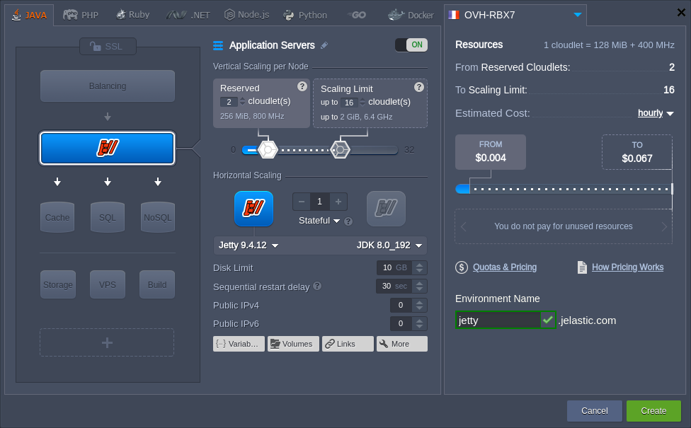
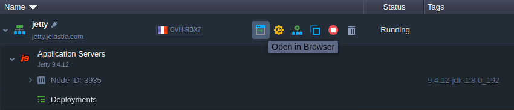
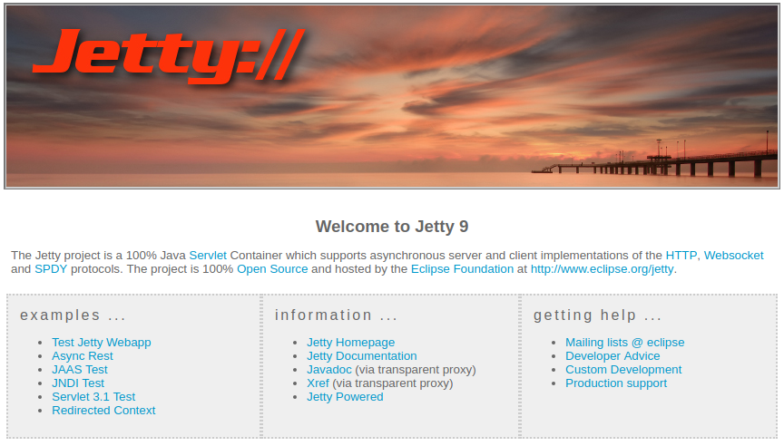

## Eclipse Jetty

[**Eclipse Jetty**](https://cloudmydc.com/) is an open source Java-based HTTP (web) server, which provides the latest Java Servlet API, HTTP/2 protocol, WebSocket support and more. Jetty is widely used within various projects and products (both in development and production) due to the following features:

- _open source and commercially usable_
- _flexible and extensible_
- _asynchronous_
- s*mall footprint*
- _enterprise scalable_

:::tip Note

This template utilizes a modern **_systemd_** initialization daemon.

:::

To get an Eclipse Jetty application server at the platform, you need to:

1. Access your PaaS account and click **New Environment** button at the top.

2. Within the opened topology wizard, switch to the **_Java_** tab and pick **Jetty** as your application servers:

Adjust other settings up to your needs (e.g. [vertical](https://cloudmydc.com/) and [horizontal](https://cloudmydc.com/) scaling or [public IPs](https://cloudmydc.com/)) and click **Create**.

3. Once the environment is created, you can click the **Open in Browser** button next to it.

A Jetty server home page will be opened in a new browser page:

As you can see the Eclipse Jetty server is up and running, so you can proceed to the [application deployment](/docs/Deployment/Deployment%20Guide).
