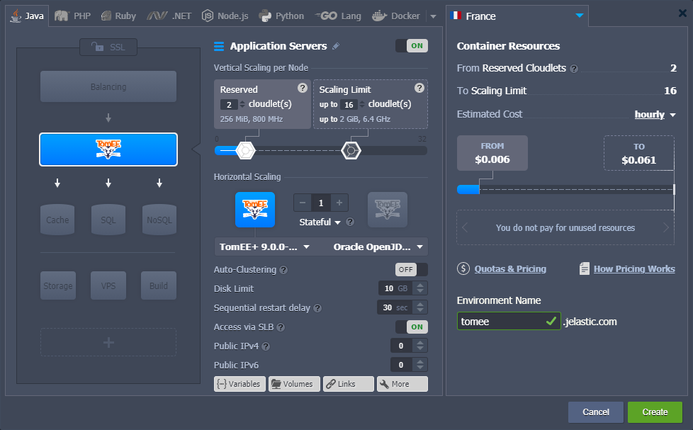
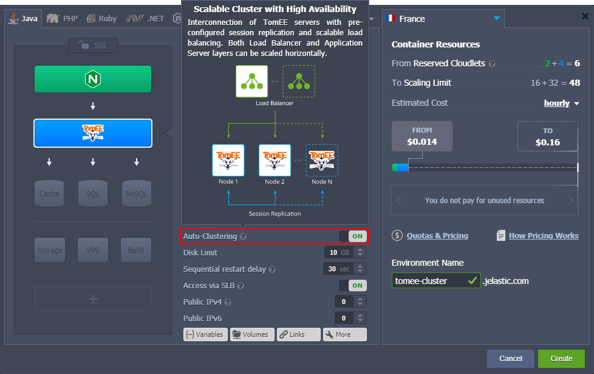
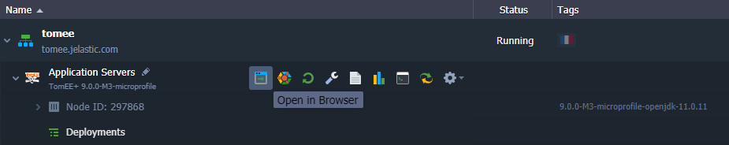
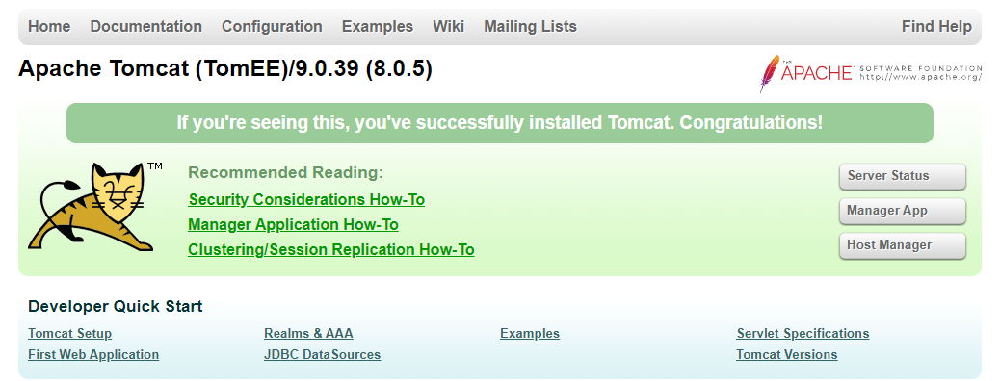
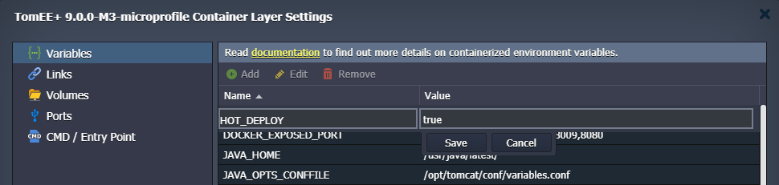

## Apache TomEE

[**Apache TomEE**](https://cloudmydc.com/) is an enterprise-ready Java server, created based on Apache Tomcat with the implementation of the _MicroProfile_ and Jakarta EE features. The extended [comparison](https://cloudmydc.com/) of the supported functionality is provided on the official documentation page.

The platform provides four different distributions of TomEE:

- **WebProfile** - delivers the [Jakarta EE](https://cloudmydc.com/) implementation, including Servlets, JSP, JSF, JTA, JPA, CDI, Bean Validation and EJB Lite
- **MicroProfile** - extends WebProfile options with full support for [MicroProfile](https://cloudmydc.com/)
- **Plus** - contains all technologies in the _MicroProfile_ with addition of JAX-WS, JEE Connectors, and JMS
- **PluME** - supports all in the _Plus_ profile, includes Eclipse Mojarra and EclipseLink (this distribution is needed for organizations that are migrating from Eclipse Glassfish to the Apache TomEE project)

:::tip Note

This template utilizes a modern **_systemd_** initialization daemon.

:::

TomEE application server runs without any additional runtime requirements or startup time for larger applications and is compatible with most of the Tomcat-aware and Tomcat-tested tools. Below, we’ll describe how to get Apache TomEE up and running on the platform.

1. Log into the PaaS dashboard and click the **New Environment** button.

2. In the topology wizard dialog, select **TomEE** as your application server (on the **_Java_** tab). If needed, configure node scaling ([vertical](https://cloudmydc.com/) and [horizontal](https://cloudmydc.com/)), [public IPs](https://cloudmydc.com/), environment name, etc. Click **Create** when ready.

:::tip

The platform provides a one-click [**Auto-Clustering**](https://cloudmydc.com/) option that automatically configures a highly available TomEE cluster.

As a result, you’ll get a ready-to-go Java cluster with the scalable number of the interconnected TomEE servers with pre-configured session replication and load balancing.

:::

3. Your new environment with the Apache TomEE Java application server will be created in a minute.

Click the **Open in Browser** button to access the server’s default page.

Now, you can proceed to the [application deployment](https://cloudmydc.com/).

:::tip

Tomcat and TomEE servers are provided with a special **_HOT_DEPLOY_** variable (not set by default) that defines whether the server should be restarted (_false, disabled, 0_) or not (_true, enabled, 1_) during the application deployment.

**Hot deploy** (without restart) is relatively faster and allows avoiding downtime during the deployment process. However, it is not supported by some applications and thus is disabled by default.

:::
