## Tomcat Server Cloud Hosting

Apache Tomcat occupies the leading positions among Java servers for running web applications. Considering the demand, we compiled the main details on the Tomcat web server management on the platform - installation, configuration, load balancing, application deployment, and security enhancement.

:::tip Note

This template utilizes a modern **_systemd_** initialization daemon.

:::

## Create Tomcat Server

The Platform-as-a-Service provides easy steps for Tomcat installation.

1. Log in to the PaaS dashboard at the chosen hosting service provider and click the **New Environment** button.

2. Pick a desirable **Tomcat** version for your application server, as shown in the picture below. The cloud platform allows you to use Apache Tomcat versions starting from 7 up to the latest Tomcat 10, depending on your application requirements. All you need is to choose from the versions available in the drop-down list:

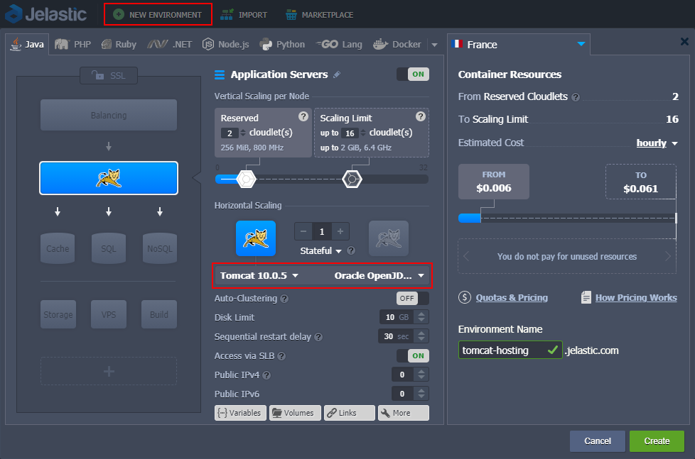

Once the environment is created, you have ready to use the Tomcat application server installed there. To check if Tomcat is running, click the **Open in Browser** button next to the application server.

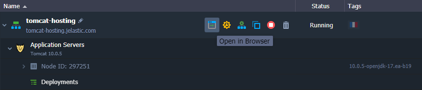

If you can see a Tomcat’s welcome page in your browser, the server is installed correctly.

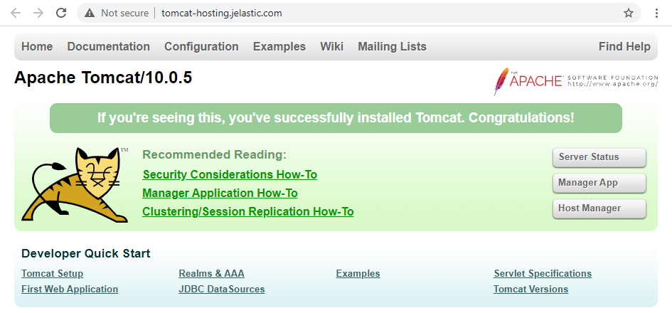

The application server operates in a separate container (node), an isolated virtualized instance. Each Tomcat container has its own private IP and unique DNS record.

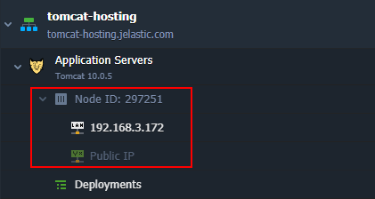

## Change Tomcat Version

If you need to change (update) the server’s version, you can do this any time [without losing data or configurations](https://cloudmydc.com/).

Just click the **Redeploy Containers** button next to the Apache Tomcat server nodes.

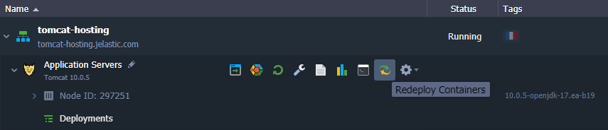

Select new Tomcat and JDK engine versions in the appeared dialog and confirm the change.

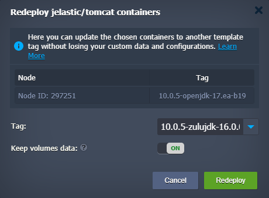

## Tomcat Clustering and Scaling

The platform makes Tomcat hosting truly flexible due to automatic scaling (both vertical and horizontal) and clustering.

For the manual adjustment of the existing Tomcat server(s), click **Change Environment Topology**:

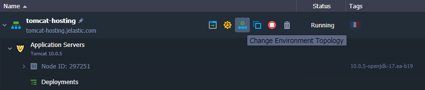

## Automatic Vertical Scaling

Automatic vertical scaling is possible due to the platform’s ability to dynamically change allocated resources (RAM and CPU) for a server. Adjustment is performed automatically, according to the Tomcat server’s current demands. This feature guarantees you [never overpay for unused resources](https://cloudmydc.com/) and saves your time by eliminating the necessity of manual handling of the load-related adjustments.

In order to set up automatic resource provisioning for your Tomcat server, open the environment topology wizard and specify the upper scaling limit in [cloudlets](/docs/PlatformOverview/Cloudlet) (128 MiB and 400 MHz each):

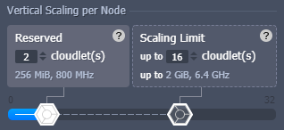

Your application will work within these limits reducing resource allocation when the load goes down and increasing when it goes up. Thus, you only pay for the resources that are actually consumed. For more information, please refer to the documentation about [automatic vertical scaling](/docs/ApplicationSetting/Scaling%20And%20Clustering/Automatic%20Vertical%20Scaling).

## Manual Horizontal Scaling

You can adjust the number of Tomcat nodes via the dedicated Horizontal Scaling section in the topology wizard. Use the **+/-** buttons or provide the required number via the central part. Click the **gear** icon next to the slider to access the advanced management options.

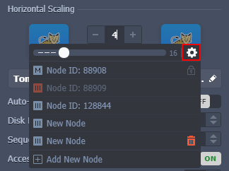

Also, based on your needs, you can select one of the two scaling modes for the layer:

- **_Stateless_** - simultaneously creates all the new nodes from the base image template
- **_Stateful_** - sequentially copies file system of the master container into the new nodes

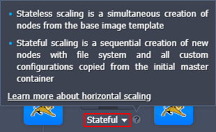

The maximum number of the same-type servers within a single environment layer depends on a particular hosting provider settings (usually, this limit stands for 16 nodes and can be adjusted by sending a request to support). You can check the exact value within the **Quotas & Pricing > [Account Limits](https://cloudmydc.com/)** information frame.

Upon scaling out a single node, NGINX (you can manually switch to another one) load balancing is added automatically. [load balancer](/docs/Load%20Balancers/Load%20Balancing) represents a frontend that receives all the incoming requests and evenly distributes them between backends (application servers).

Please, find more details about manual [Horizontal Scaling](/docs/ApplicationSetting/Scaling%20And%20Clustering/Horizontal%20Scaling) in the documentation.

## Automatic Horizontal Scaling

Automatic horizontal scaling can be implemented through tunable triggers, which monitor the changes in the application’s load and increase or decrease the number of nodes.

To configure a trigger for the automatic horizontal scaling, use the **Settings** button for the desired environment and switch to the **_Auto Horizontal Scaling_** section to proceed.

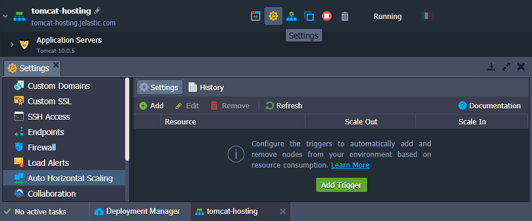

Click the **Add** button to configure the triggers for a specific layer and resource type (CPU, RAM, Network, Disk) within your environment. Specify the required conditions of scaling and **Apply** changes.

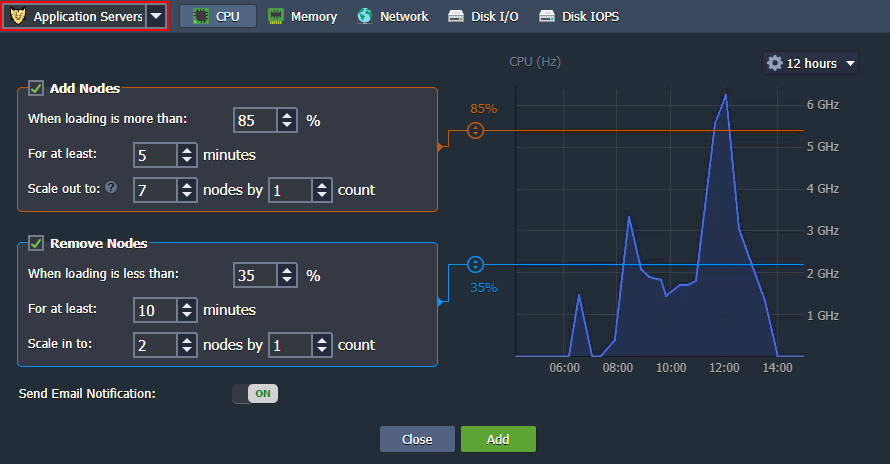

Find out more about [automatic horizontal scaling](https://cloudmydc.com/) in the corresponding document.

## Automatic Tomcat Clustering

The platform can automatically configure a reliable Tomcat Cluster of the following topology in a single click:

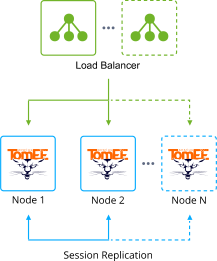

Just enable the [**Auto-Clustering**](https://cloudmydc.com/) option via the dashboard, as it is shown in the picture below:

:::tip Note

The **Auto-Clustering** feature for Tomcat and TomEE is available since the following stack versions:

- **Tomcat** - _10.0.5; 9.0.45; 8.5.64; 7.0.108_
- **TomEE** - _9.0.0-M3; 8.0.5_

Older versions can still operate with the preceding [clustering](https://cloudmydc.com/) and [session replication](https://cloudmydc.com/) functionality instead.

:::

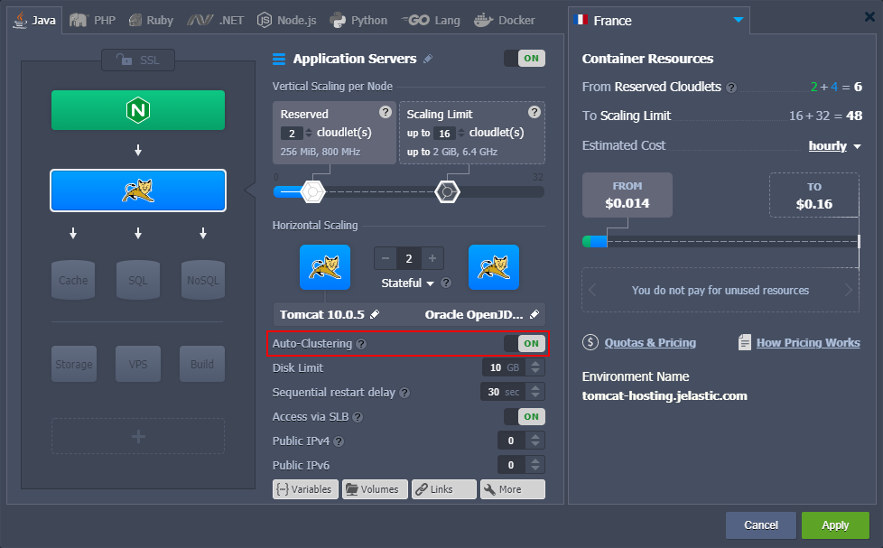

## Deploy Application to Tomcat Environment

There are several options for [deploying an application](https://cloudmydc.com/) at the platform, but the most straightforward way is to upload an archive to the [Deployment Manager](https://cloudmydc.com/).

:::tip

Tomcat and TomEE servers are provided with a special **_HOT_DEPLOY_** variable (not set by default) that defines whether the server should be restarted (_false, disabled, 0_) or not (_true, enabled, 1_) during the application deployment.

**Hot deploy** (without restart) is relatively faster and allows avoiding downtime during the deployment process. However, it is not supported by some applications and thus is disabled by default.

:::

1. Open **Deployment Manager** at the bottom of the dashboard and click the **Upload** button in the Archive tab.

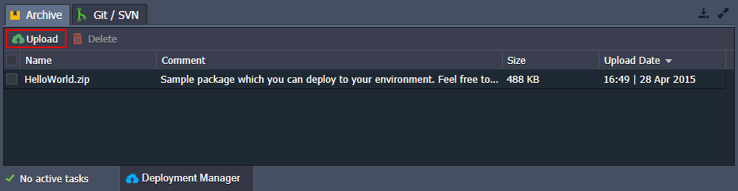

2. **Browse** your local files and **Upload** your project (or provide it via **_URL_**). Common Java archives have _WAR, EAR, or ZIP_ extension.

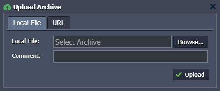

3. Hover over the required package in the list and click the appeared **Deploy to** button:

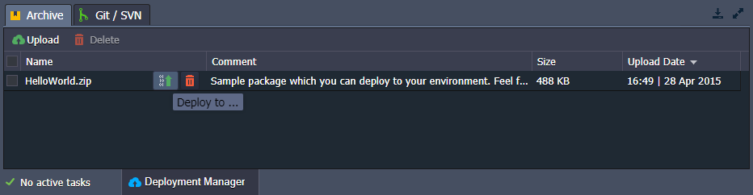

4. Choose the appropriate environment, specify a context name (or leave the default ROOT value) and start deploying the application.

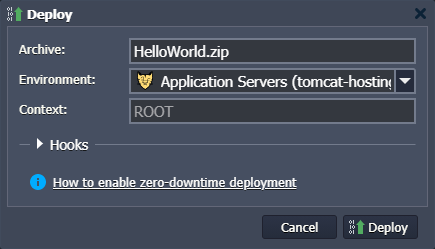

:::tip Note

At this step, you can also add [deployment hooks](https://cloudmydc.com/) to execute your custom scripts before or after the application deployment.

:::

5. When the process is completed, you can see your project within deployments of the environment.

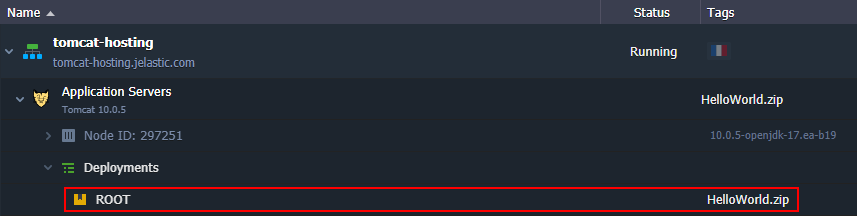

There are more options for deploying your application to Tomcat, for example, via Git/SVN using [Maven build node](https://cloudmydc.com/). For more information, refer to the [Deployment Guide](https://cloudmydc.com/).

## Tomcat Configurations

This chapter will cover some settings and features that help optimize your work with the Tomcat web server.

## Environment Variables

In order to make your application more portable and flexible, you can use **environment variables** instead of specifying the required values in the application code each time. The platform provides you with many Tomcat [default environment variables](/docs/EnvironmentManagement/EnvironmentVariables/Environment%20Variables#default-environment-variables) for the most common stack data. You can also add [custom environment variables](/docs/EnvironmentManagement/EnvironmentVariables/Custom%20Environment%20Variables) for your Tomcat node to make its management even more convenient.

## Configuration Files

The Tomcat configuration files are available for editing right from the dashboard. To access them, click the **Config** button next to the server.

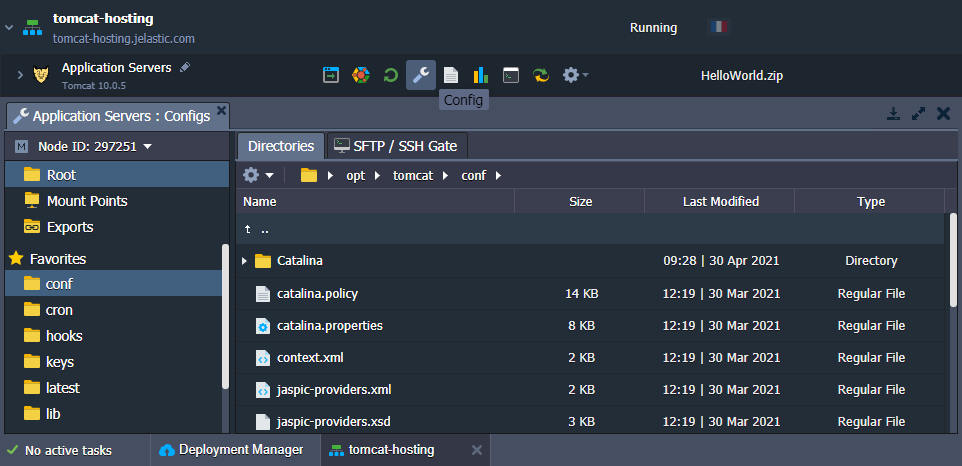

The most frequently used directories are added to the Favorites list for quick access. You can learn more about [Tomcat server configurations](https://cloudmydc.com/) in the linked document.

## Tomcat Security Settings

In order to restrict access to your project deployed to the Tomcat server, we recommend two possible solutions: set up **user authentication** and **deny access** to your web application from specific IP addresses. The detailed instruction is described in the article on how to [Secure Tomcat Hosting](https://cloudmydc.com/).

Another way to ensure the security of your applications is the **Container Firewall** feature. It lets you control your node’s availability both from inside and outside of the platform. Configure Tomcat container firewall using the information from the [Container Firewall Management](https://cloudmydc.com/) article.

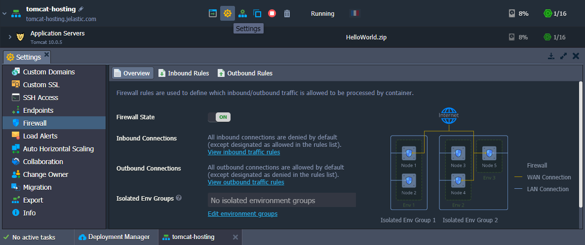

## Multiple Domains on Single Tomcat Server

You can set up multiple domain names on the Tomcat server to increase the usability, efficiency, and scalability of your application, as well as save your costs without having to configure separate instances. For this, adjust the Tomcat configuration files as described in the [multiple domains](https://cloudmydc.com/) instruction.

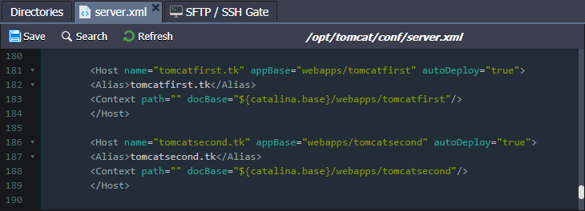

As you can see, the platform makes Tomcat hosting easy and flexible. The cloud platform provides a wide range of already predefined settings for you not to bother about routine tasks. At the same time, it leaves the server fully customizable for specific complex configurations. Get started with effortless Tomcat cloud hosting from the [PaaS](https://cloudmydc.com/) and enjoy the benefits in a turnkey package.
