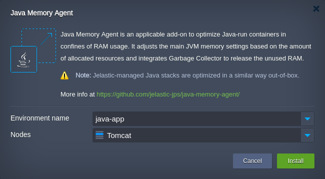
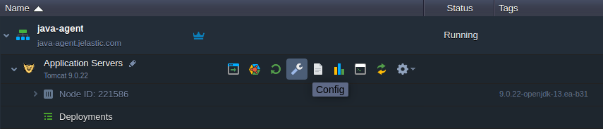
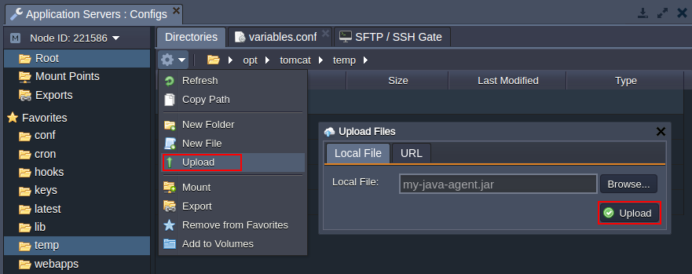
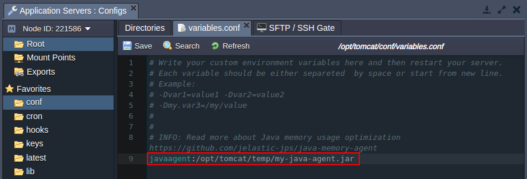
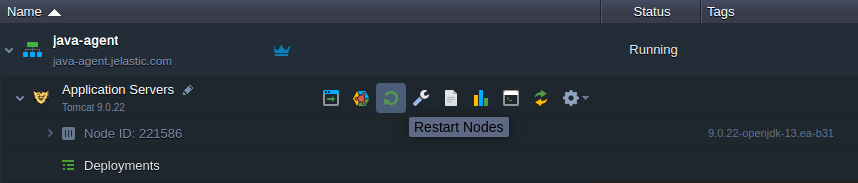

## Java Agent Integration

**Java agent** is an interceptor in front of the application’s main method. Generally, it is a .jar package statically loaded in the _PreMain-Class_ method, which implements a mechanism of re-defining the running classes' content. The platform allows you to automatically launch such an applet at startup (just after the JVM is initialized).

:::tip

All of the platform-certified Java stacks runs the **_jelastic-gc-agent.jar_** Java agent as a part of the standard optimization. It performs periodical Full GC calls to reduce the memory usage and release unused RAM back to OS. Due to [the platform contribution to the Java development](https://cloudmydc.com/), similar functionality is natively implemented since the _12th_ version of JDK.

Refer to the [Memory Agent](https://cloudmydc.com/) add-on to learn more about the platform automatic optimization of the managed Java stacks or use it to optimize any custom Java container.

:::

Follow the next steps to add a custom Java agent into a container:

1. Log in to the platform dashboard with your credentials and click the **Config** button for the application server in your Java environment:

2. In the opened [configuration file manager](https://cloudmydc.com/), you can **Upload** your Java agent **.jar** file to any preferable location. Use the **Actions** list at the top panel (for the current folder) or the context menu when hovering over the particular directory.

Provide a link to the required file or locate it on the local machine to **Upload**.

3. Next, switch to the [**_variables.conf_**](https://cloudmydc.com/) file (the exact location vary based on the particular software stack) to provide custom variables and [JVM options](https://cloudmydc.com/). Here, you can specify the javaagent parameter with a path to the required **_jar_** file. For example: _javaagent:/opt/tomcat/temp/my-java-agent.jar_

Don’t forget to **Save** the changes with the appropriate button above the editor.

4. To apply the newly added settings, you need to **Restart Nodes** of your application server layer using the same-named option.

That’s all! Now, your custom Java agent is up and running.
