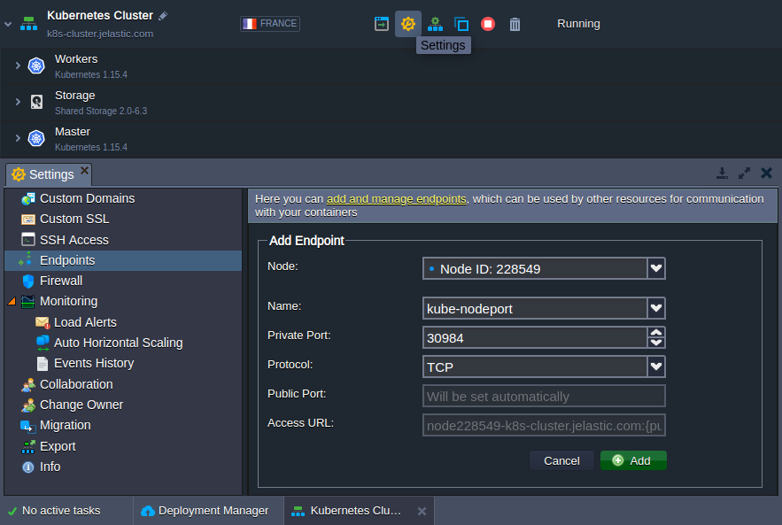

## Kubernetes Cluster: Exposing Services

While components of your application can communicate with each other by [service names](https://cloudmydc.com/) using the internal network, external connections require additional configurations.

Kubernetes supports three service types to establish an internal and external connections to application:

- [ClusterIP](https://cloudmydc.com/)
- [NodePort](https://cloudmydc.com/)
- [LoadBalancer](https://cloudmydc.com/)

## ClusterIP

The **_ClusterIP_** service is the default K8s service. It makes application accessible by other applications within K8s cluster. No external access provided.

Simple _ClusterIP_ service example:

```bash
kind: Service
apiVersion: v1
metadata:
  name: nginx1
  namespace: test
spec:
  type: ClusterIP
  selector:
    app: nginx
  ports:
    - port: 80
```

## NodePort

The most basic way to establish an external connection to a service is to expose it via **_[NodePort](https://cloudmydc.com/)_** directly. As the name implies, this type of service opens a specific port on the nodes, any traffic sent to this port is forwarded to your service. By default, the nodePort for your service is selected randomly from the 30000-32767 range.

:::danger Note

This method has several downsides that should be considered when configuring the Kubernetes Cluster (one service per port, restricted range of ports, etc.). As a result, the NodePort service type can be used for the demo or other temporary applications. However, the production solutions usually require more complex configuration with ingresses and LoadBalancer service options. Follow our guide(s) to create verified configurations for your application and put in production:

- [Ingresses](https://cloudmydc.com/)
- [Using Public IPs in Kubernetes Service](https://cloudmydc.com/)

:::

Here is an example of the NodePort type service configuration:

```bash
kind: Service
apiVersion: v1
metadata:
  name: nginx1
  namespace: test
  labels:
    run: nginx
spec:
  type: NodePort
  selector:
    run: nginx
  ports:
    - port: 80
      targetPort: 80
```

If needed, a particular nodePort can be selected for your service. For example, the following code can be used to configure a redirect from the 30984 port:

```bash
ports: - port: 80
targetPort: 80
nodePort: 30984
```

:::danger Note

Manually provided nodePort value should be from the allowed range (30000-32767) and unique (to prevent collision with other services).

:::

In case [public IP](https://cloudmydc.com/) is attached to the Kubernetes worker nodes, no additional actions are required.

Otherwise, the obtained port should be exposed from the platform side. Navigate to the Kubernetes environment **Settings > Endpoints** and click **Add**. In the opened frame, provide the following data:

- **_Node_** - choose any worker node from the list
- **_Name_** - set any preferred endpoint name
- **_Private_** Port - provide the nodePort from the previous step
- **_Protocol_** - select the TCP option

<div style={{
    display:'flex',
    justifyContent: 'center',
    margin: '0 0 1rem 0'
}}>



</div>

Click **Add** to confirm. It may take up to a few minutes for the platform to expose a port and redirect requests to the NodePort service.

## LoadBalancer

The service **_[LoadBalancer](https://cloudmydc.com/)_** type is the commonly used way to provide a service on the Internet. It requires the public IP attached to any worker node.

Keep in mind that with LoadBalancer type all traffic is directly forwarded to the service with no filtering, routing, etc. The **port** parameter is an incoming port on the Internet which the service maps to a targetPort on the application side.

For example:

```bash
kind: Service
apiVersion: v1
metadata:
name: nginx1
namespace: test
spec:
type: LoadBalancer
selector:
app: nginx
ports: - port: 80
targetPort: 8080
```
