## Kubernetes Cluster: Helm Integration

Kubernetes provides multiple options to deploy applications. One of the most common methods is to use the **[Helm](https://cloudmydc.com/)** package manager. If you are looking to run a popular or any relatively known solution in your Kubernetes cluster, most likely it can be found as a preconfigured package that can be installed in a matter of minutes. Helm helps you install Kubernetes applications from remote repositories as well as create local Helm charts.

Helm is available on all control plane nodes of the **Kubernetes Cluster** by default and requires no additional configuration. Just connect to the node (e.g. via [Web SSH](http://localhost:3000/docs/Deployment%20Tools/SSH/SSH%20Access/Web%20SSH)), and you can start working with Helm. The package manager version is automatically updated during the [Kubernetes Cluster upgrades](https://cloudmydc.com/).

Helm works with three big concepts:

- A **Chart** is a Helm package that contains all of the resource definitions necessary to run an application, tool, or service inside a Kubernetes cluster.
- A **Repository** is a place where charts can be collected and shared.
- A **Release** is an instance of a chart running in a Kubernetes cluster. One chart can be installed many times into the same cluster (with its own unique release name), e.g. several database instances.

Helm installs **_charts_** into Kubernetes, creating a new **_release_** for each installation. And to find new charts, you can search Helm chart **_repositories_**.

In this guide, we’ll cover all the main stages of working with Helm:

- [searching for charts and working with repositories](https://cloudmydc.com/)
- [installing new Helm applications](https://cloudmydc.com/)
- [managing existing applications](https://cloudmydc.com/)

:::tip Tip

Helm is useful not only for its ready-to-use solutions, but also as a versioning and standardization tool for project development. At first, when you are working on a small project, the scripted deployment approach can be enough for your needs. However, the complexity can rump up pretty quickly, requiring more and more adjustments to your YAML files. For example, even deploying into staging and production environments requires tweaks like database URLs.

At some point, you may feel that it’s hard to keep track of the interaction and dependencies of the components. Usually, this means that your environment’s complexity is outgrowing your custom deployment scripts. In such a situation, it might be a good time to consider Helm as a potential solution that will replace your homegrown scripts. The [Chart Development Guide](https://cloudmydc.com/) will explain how to develop your own charts.

:::

## Finding Helm Charts

There are a lot of preconfigured solutions that can be installed inside the Kubernetes Cluster in a matter of minutes. Helm package manager has a central hub with a lot of ready-to-use solutions. Also, you can work with custom repositories.

Helm comes with a powerful **_search_** command that can be used to search two different source types:

- **_helm search hub_** searches the [Artifact Hub](https://cloudmydc.com/) (distributed community Helm chart repository), which lists helm charts from dozens of repositories

For example, you can find all publicly available charts for WordPress by running:

```bash
helm search hub wordpress
```

<div style={{
    display:'flex',
    justifyContent: 'center',
    margin: '0 0 1rem 0'
}}>

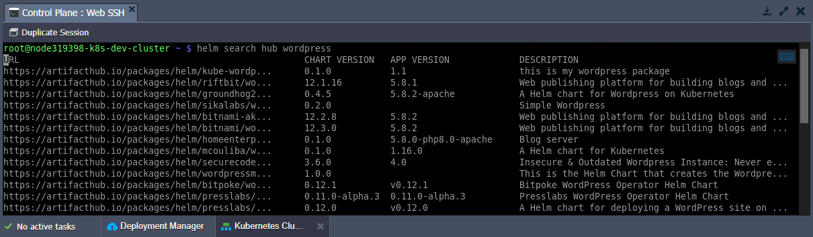

</div>

- **_helm search repo_** searches the repositories you have added to your local helm client (with helm repo add). This search is done over local data, and no public network connection is needed

Helm 3 (used since Kubernetes 1.18.10) no longer ships with a default chart repository. You can use the **_helm repo_** commands to add, list, and remove repositories. For example, let’s add popular [Bitnami](https://cloudmydc.com/) repositories:

```bash
helm repo add bitnami https://charts.bitnami.com/bitnami
```

<div style={{
    display:'flex',
    justifyContent: 'center',
    margin: '0 0 1rem 0'
}}>

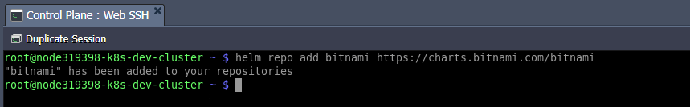

</div>

You can see which repositories are configured using the **_helm repo list_** command:

```bash
helm repo list
```

<div style={{
    display:'flex',
    justifyContent: 'center',
    margin: '0 0 1rem 0'
}}>

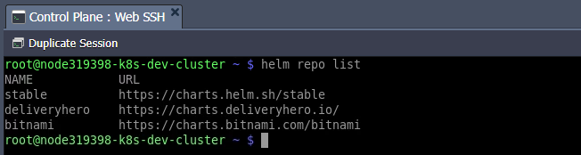

</div>

Because chart repositories frequently change, you can make sure your Helm client is up to date by running:

```bash
helm repo update
```

<div style={{
    display:'flex',
    justifyContent: 'center',
    margin: '0 0 1rem 0'
}}>

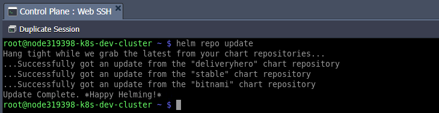

</div>

## Installing Helm Package

To install a new package, use the **_helm install_** command. At its simplest, it takes two arguments:

- **_{name}_** - a release name that you pick (e.g. mywordpress)
- **_{chart}_** - the name of the chart you want to install (e.g. _[bitnami/wordpress](https://cloudmydc.com/)_)

Additionally, you can provide chart options to customize the application (see more details in the [managing Helm section](https://cloudmydc.com/)). For example, let’s change the blog name with the _--set wordpressBlogName=‘My Blog!'_ parameter.

```bash
helm install --set wordpressBlogName='My Blog!' mywordpress bitnami/wordpress
```

<div style={{
    display:'flex',
    justifyContent: 'center',
    margin: '0 0 1rem 0'
}}>

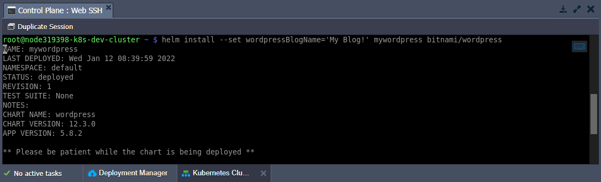

</div>

Installing a chart creates a new release object. If you want Helm to generate a name for you, leave off the release name and use the --generate-name parameter.

During installation, the helm client will print useful information about created resources, release state, and any additional configuration steps. Let’s follow the steps to ensure that our WordPress instance is working fine.

:::danger Note

WordPress is a rather complex solution that requires additional components such as **Storage** and **public IP**. If not provided during the Kubernetes Cluster installation, you can add them via the platform dashboard.

<div style={{
    display:'flex',
    justifyContent: 'center',
    margin: '0 0 1rem 0'
}}>

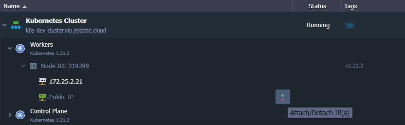

</div>

<div style={{
    display:'flex',
    justifyContent: 'center',
    margin: '0 0 1rem 0'
}}>

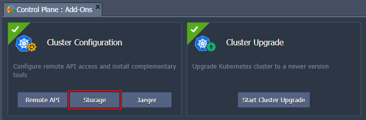

</div>

:::

Get the WordPress URL and admin credentials by running the commands below:

```bash
export SERVICE_IP=$(kubectl get svc --namespace default mywordpress --template "{{ range (index .status.loadBalancer.ingress 0) }}{{ . }}{{ end }}")
printf "WordPress URL: http://$SERVICE_IP/\nWordPress Admin URL: http://$SERVICE_IP/admin\nUsername: user\nPassword: $(kubectl get secret --namespace default mywordpress -o jsonpath="{.data.wordpress-password}" | base64 --decode)\n"
```

<div style={{
    display:'flex',
    justifyContent: 'center',
    margin: '0 0 1rem 0'
}}>

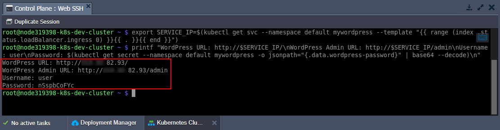

</div>

Now, use the obtained data to access your WordPress site and admin.

<div style={{
    display:'flex',
    justifyContent: 'center',
    margin: '0 0 1rem 0'
}}>

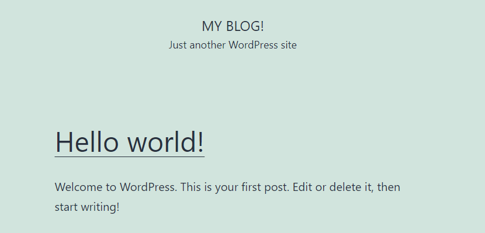

</div>

<div style={{
    display:'flex',
    justifyContent: 'center',
    margin: '0 0 1rem 0'
}}>

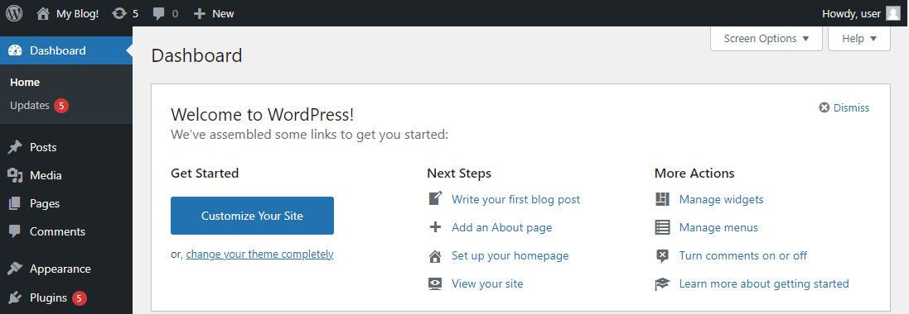

</div>

As you can see, our custom blog name (My Blog!) provided via the **_--set_** parameter is automatically applied.

## Managing Helm Applications

Helm provides several commands to work with installed charts. The list of actions includes release upgrade and recovery, status and values check, etc.

:::tip Tip

For more information on commands, take a look at Helm’s built-in help - **_helm help_**.

<div style={{
    display:'flex',
    justifyContent: 'center',
    margin: '0 0 1rem 0'
}}>

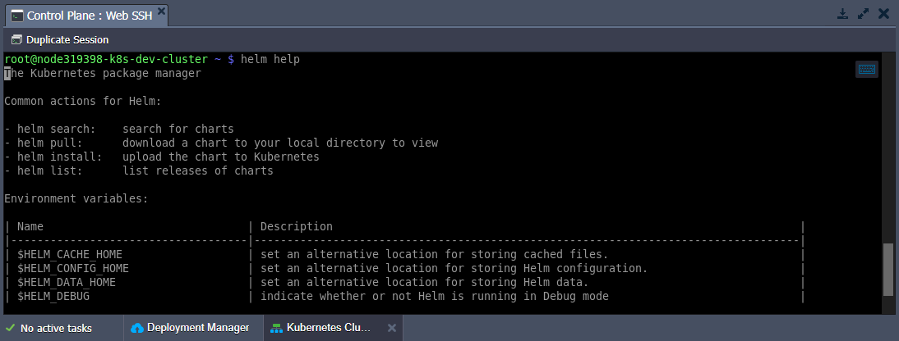

</div>

To see a description of a specific command and its flags, run **_helm {command} --help_**.

:::

1. To keep track of a release’s state or to re-read configuration information, you can use **_helm status_**:

```bash
helm status mywordpress
```

<div style={{
    display:'flex',
    justifyContent: 'center',
    margin: '0 0 1rem 0'
}}>

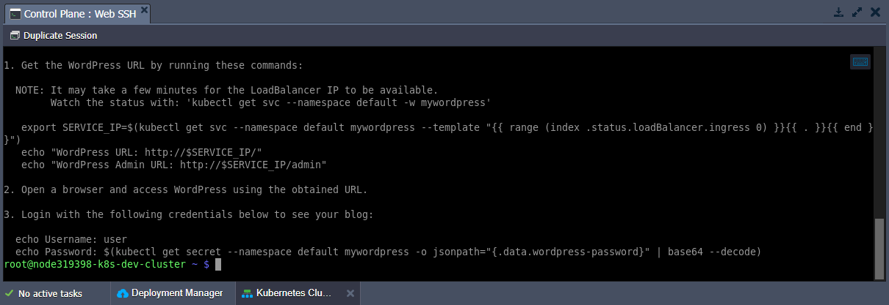

</div>

2. Often, you will want to customize the chart to use your preferred configurations. It can be done by providing the required values via either the **--values** (**-f**) or **--set** flags during installation and upgrade procedures. The former one passes custom values in a separate YAML file, while the latter one - directly from the command line (e.g. --set a=b,c=d or --set outer.inner=value).

You can specify these flags multiple times with --set having higher precedence. In case of contradiction, the priority goes to the last (right-most) override.

:::tip Tip

You can check the default list of values for the package with the following command (the less utility helps navigate through the response conveniently):

```bash
helm show values bitnami/wordpress | less
```

<div style={{
    display:'flex',
    justifyContent: 'center',
    margin: '0 0 1rem 0'
}}>

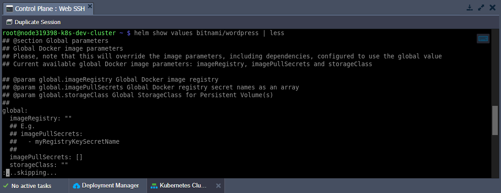

</div>
:::

3. You can use the **_helm upgrade_** command to upgrade the release to a new chart version or change your release’s configuration. During the procedure, the Helm tries to perform the least invasive upgrade by updating only things that have been changed since the last release.

:::tip Tip

If needed, you can use the upgrade command with the **--reset-values** flag to reset any custom values and use the ones built into the chart.

:::

Due to the specifics of our WordPress chart from the [installing section](https://cloudmydc.com/), you must provide current passwords when upgrading the release. Let’s add these values into corresponding variables for convenience:

```bash
export WORDPRESS_PASSWORD=$(kubectl get secret --namespace "default" mywordpress -o jsonpath="{.data.wordpress-password}" | base64 --decode)
export MARIADB_ROOT_PASSWORD=$(kubectl get secret --namespace "default" mywordpress-mariadb -o jsonpath="{.data.mariadb-root-password}" | base64 --decode)
export MARIADB_PASSWORD=$(kubectl get secret --namespace "default" mywordpress-mariadb -o jsonpath="{.data.mariadb-password}" | base64 --decode)
```

Now, you can provide passwords via the **--set** flag:

```bash
helm upgrade --set wordpressPassword=$WORDPRESS_PASSWORD,mariadb.auth.rootPassword=$MARIADB_ROOT_PASSWORD,mariadb.auth.password=$MARIADB_PASSWORD mywordpress bitnami/wordpress
```

<div style={{
    display:'flex',
    justifyContent: 'center',
    margin: '0 0 1rem 0'
}}>

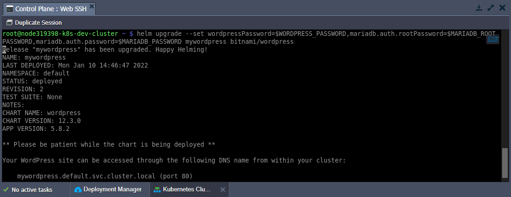

</div>

:::tip Tip

When you need to provide a lot of custom parameters, it may be more convenient to specify them in a separate YAML file.

For the WordPress example, you can prepare the following **_values-template.yaml_** file:

```bash
wordpressPassword: %WP_PASS%
mariadb:
  auth:
    rootPassword: %DB_ROOT_PWD%
    password: %DB_PWD%
```

Then you can just replace the placeholders with the actual password values (which were exported to the variables in this step before).

```bash
cat values-template.yaml | sed "s/%WP_PASS%/$WORDPRESS_PASSWORD/g" | sed "s/%DB_ROOT_PWD%/$MARIADB_ROOT_PASSWORD/g" | sed "s/%DB_PWD%/$MARIADB_PASSWORD/g"  > values.yaml
```

Then you can pass the file with the required configs (**_values.yaml_**) in the helm upgrade or helm install commands with the **_--values_** (**_-f_**) flag. Such simple steps will spare you of the necessity to specify passwords manually for each WordPress upgrade operation.

```bash
helm upgrade -f values.yaml mywordpress bitnami/wordpress
```

:::

4. The **_helm get_** command is a helpful tool for looking at a release in the cluster. For example, to see values used to generate the release:

```bash
helm get values mywordpress
```

<div style={{
    display:'flex',
    justifyContent: 'center',
    margin: '0 0 1rem 0'
}}>

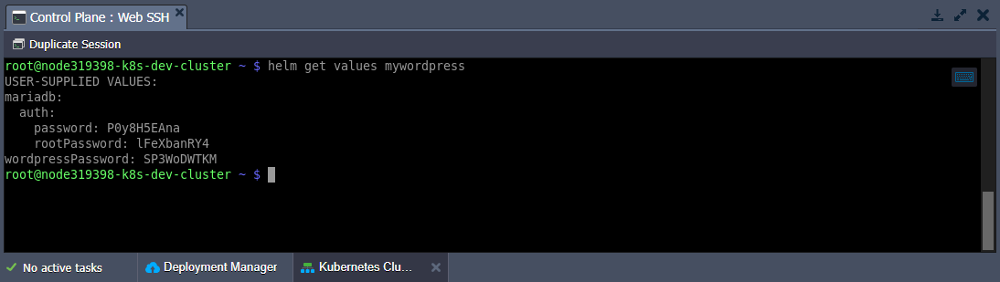

</div>

As you can see, our password values persist through the upgrade.

5. Also, it is easy to roll back to a previous release if something does not go as planned.

The appropriate **_helm rollback_** command requires two parameters - the name of the target **release** and a number of the necessary **revision**. Initial installation is always the first revision. This number is incremented by one for each install, upgrade, or rollback operation.

:::tip Tip

You can use **_helm history_** to see revision numbers for a specific release.

```bash
helm history mywordpress
```

<div style={{
    display:'flex',
    justifyContent: 'center',
    margin: '0 0 1rem 0'
}}>

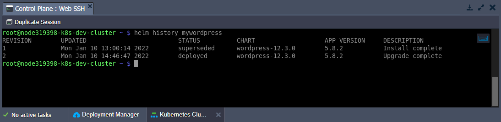

</div>

:::

```bash
helm rollback mywordpress 1
```

<div style={{
    display:'flex',
    justifyContent: 'center',
    margin: '0 0 1rem 0'
}}>

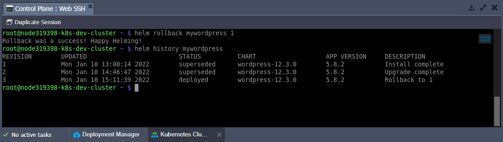

</div>

6. To uninstall a release from the cluster, use the following command:

```bash
helm uninstall mywordpress
```

<div style={{
    display:'flex',
    justifyContent: 'center',
    margin: '0 0 1rem 0'
}}>

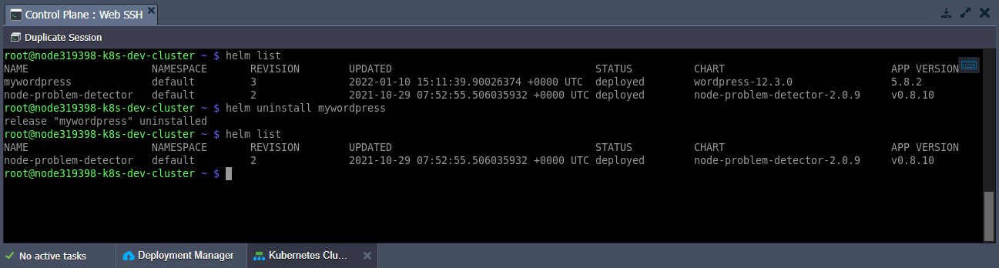

</div>

:::tip Tip

If you wish to keep a deletion release record, use the **_--keep-history_** flag.

:::

After removal, you can check your currently deployed releases with the **_helm list_** command.

That’s all the basics of working with the Helm package manager for Kubernetes. If you still have questions or need assistance, reach out to our technical experts at [Stackoverflow](https://stackoverflow.com/questions/tagged/jelastic).
