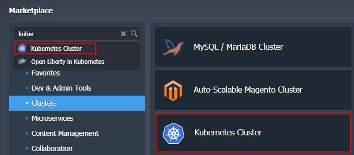
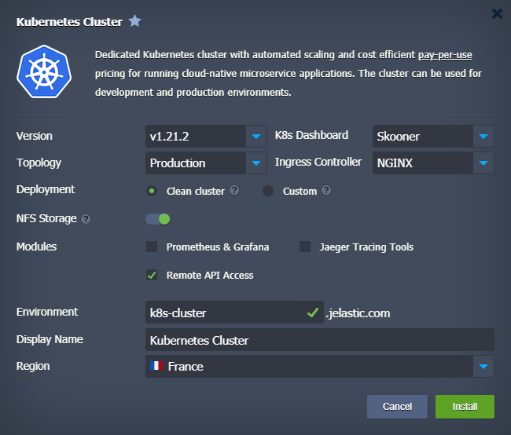

## Kubernetes Cluster: Package Installation

The **Kubernetes Cluster** solution is available for automatic installation via [platform Marketplace](/docs/Deployment%20Tools/Cloud%20Scripting%20&%20JPS/Marketplace) under the Clusters category (or use Search to locate). Note that this clustered solution is available for billing customers only.

Within the opened installation frame, customize the available options to get a cluster specifically for your needs:

- **Version** - choose a [Kubernetes version](/docs/Kubernetes%20Hosting/Kubernetes%20Cluster/Cluster%20Versions#current-versions) for your cluster
- **K8s Dashboard** - select between the v2 and Skooner options (note that some metrics in the skooner dashboard don’t work with the HAProxy ingress controller)
- **Topology**
  - _Development_ - one control-plane (1) and one scalable worker (1+)
  - _Production_ - multi control-plane (3) with API balancers (2+) and scalable workers (2+)

:::danger Note

The development topology is not recommended for production projects as it cannot handle high load reliably due to a single control-plane instance.

:::

- **Ingress Controller** - choose the preferable [ingress controller](/docs/Kubernetes%20Hosting/Application%20Deployment/Creating%20Ingresses) for your cluster (NGINX, Traefik, or HAProxy). We recommended using NGINX as it provides the most flexibility
- **Deployment**

  - _Clean cluster_ with pre-deployed HelloWorld example
  - _Custom_ helm or stack deployed via shell command - chose this option to manually provide commands for custom application deployment from the [*helm*](/docs/Kubernetes%20Hosting/Application%20Deployment/Helm%20Integration) repository

- **NFS Storage** - enable to attach a dedicated NFS Storage with dynamic volume provisioning (disable if you want to register own storage class, requires in-depth K8s knowledge)
- **Modules** (can be enabled later via the add-ons)
  - _Prometheus & Grafana_ - check to install these monitoring tools (recommended). This deployment requires an additional 5GB of disk space for persistent volumes and consumes about 500 MB of RAM
  - _Jaeger Tracing Tools_ - tick to install Jaeger tracing system for monitoring and troubleshooting
  - _Remote API Access_ - check if you plan on using the kubectl command-line tool or some other remote clients
- **Environment** - provide a name for your environment
- **Display Name** - specify an [alias](/docs/EnvironmentManagement/Environment%20Aliases)
- **Region** - choose a [region](/docs/EnvironmentManagement/Environment%20Regions/Choosing%20a%20Region) (if available)

Click **Install** and wait a few minutes for the platform to automatically configure your Kubernetes cluster.
