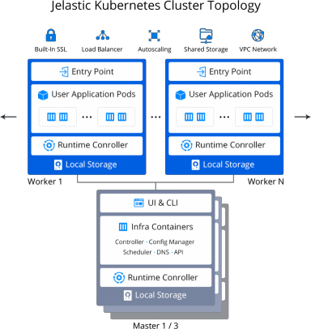

## Kubernetes Cluster: Versions & Change Logs
The platform provides a pre-packages ***Kubernetes (K8s) Cluster*** solution with automatic installation. [Kubernetes](1) is a portable, extensible, open-source platform for managing container-based workload and services, that facilitates both declarative configuration and automation. It correlates greatly with the PaaS, allowing to set up applications based on the Kubernetes system directly inside the platform.

By hosting a Kubernetes Cluster at the platform, you can get the following benefits:

- ***Easy Start*** - automated installation in several clicks do not require manual intervention
- ***Hyper Scalability*** - the cluster can be automatically scaled vertically and horizontally
- ***Multi-Cloud Availability*** - mix and match cloud options due to the project needs
- ***Simplified Management*** - a single point of management via intuitive UI and built-in Web SSH
- ***Flexible Automation*** - automate DevOps processes with open API and Cloud Scripting
- ***Cost Efficiency*** - pay only for consumed resources benefiting from container density and scalability

:::tip Tip

More specifics and in-depth description with use case examples are provided in the appropriate **[Kubernetes Cluster](1)** article on our blog.

:::

Below, we’ll overview all of the Kubernetes Cluster versions and describe implemented changes and adjustments.

## K8s Package Change Log
You can check the source code of the ***[Kubernetes Cluster](1)*** package at GitHub. You can overview changes in each of the versions by clicking on the required record in the list below.

:::danger Note

Implementation of new features/components for the **Kubernetes Cluster** solution (as well as stability testing) requires a certain amount of time. So, the package version is usually one or two minor releases behind the [Kubernetes upstream tags](1).

:::

## Current Versions
[K8s 1.25.4](1)  
[K8s 1.24.8](1)  
[K8s 1.23.14](1)  

## Release Notes Archive
[K8s 1.24.4](1)  
[K8s 1.23.10](1)  
[K8s 1.22.12](1)  
[K8s 1.21.14](1)  
[K8s 1.23.6](1)  
[K8s 1.22.10](1)  
[K8s 1.21.12](1)  
[K8s 1.22.6](1)  
[K8s 1.21.10](1)  
[K8s 1.23.4](1)  
[K8s 1.22.4](1)  
[K8s 1.21.6](1)  
[K8s 1.20.12](1)  
[K8s 1.19.16](1)  
[K8s 1.21.4](1)  
[K8s 1.20.10](1)  
[K8s 1.19.14](1)  
[K8s 1.21.2](1)  
[K8s 1.20.8](1)  
[K8s 1.19.12](1)  
[K8s 1.18.20](1)  
[K8s 1.20.6](1)  
[K8s 1.19.10](1)  
[K8s 1.18.18](1)  
[K8s 1.20.4](1)  
[K8s 1.19.8](1)  
[K8s 1.18.16](1)  
[K8s 1.18.10](1)  
[K8s 1.17.12](1)  
[K8s 1.17.4](1)  
[K8s 1.16.6](1)  
[K8s 1.16.3](1)  
[K8s 1.15.6](1)  
[K8s 1.15.5](1)  
[K8s 1.15.4](1)  
[K8s 1.15.3](1)  
[K8s 1.15.0](1)  
[K8s 1.14.3](1)  