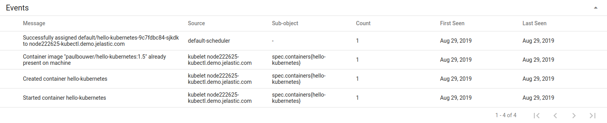
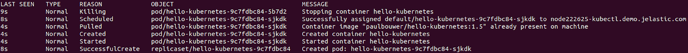

## Kubernetes Cluster: Troubleshooting

The **Kubernetes Cluster** package is an extremely complicated product, which includes multiple steps required to set up the solution. Herewith, each action can fail due to various reasons, which should be analyzed to prevent problem occurrence in the future. Below, we’ll overview the main troubleshooting steps during the different stages and for multiple log files:

- [K8s Installation](/docs/Kubernetes%20Hosting/Managing%20Kubernetes/Cluster%20Troubleshooting#k8s-installation)
- [Events Tracking](/docs/Kubernetes%20Hosting/Managing%20Kubernetes/Cluster%20Troubleshooting#events-tracking)
- [Pod Logs](/docs/Kubernetes%20Hosting/Managing%20Kubernetes/Cluster%20Troubleshooting#pod-logs)

## K8s Installation

Installation of a Kubernetes cluster is a complex but fully automated process, which already includes an error handling mechanism. The platform automatically processes the most common issues and shows their root cause directly in the dashboard. Herewith, for more complex issues, you can **Send Report** to the support team via the appropriate widget.

Such a report includes installation logs, error messages, and all other debug information required.

Also, the package automatically verifies all of the cluster components after installation. The relevant details can be viewed via the **_/var/log/k8s-health-check.log_** file on the master node. A dedicated utility script checks the health of the following components: Weave CNI Plugin, Ingres Controller, Metrics Server, Kubernetes Dashboard, Node Problem Detector, Monitoring Tools, Remote API, NFS Storage, Sample App.

If the health checker fails to verify the Running status of a component, the appropriate notification will be displayed in the installation success frame. Herewith, such a warning is not always caused by the cluster malfunction (e.g. deployments can be still in progress). You can run the **_kubectl get pods –all-namespaces_** command to check the pods' state. If all of them are Running, your cluster is doing just fine. Otherwise, contact platform support and attach K8s related logs from the **_/var/log_** directory.

## Events Tracking

You can use _kubectl_ or _Kubernetes Dashboard_ to track and analyze events for the particular or all namespaces at one (the sufficient permissions are required):

- **Events** in Kubernetes Dashboard

example output from the **_kubectl get events -n $namespace_** command

## Pod Logs

After scheduling pod(s) to run on a free node, you can follow the appropriate logs via:

- _Kubernetes Dashboard_ - navigate to the **_pod_** page and click the **Logs** button in the top right corner
- _kubectl_ - utilize commands for the [pods management](https://kubernetes.io/docs/reference/kubectl/cheatsheet/#interacting-with-running-pods)
  For example, these logs can help find the root cause of the “_Back-off restart failed container_” event for your pods.
