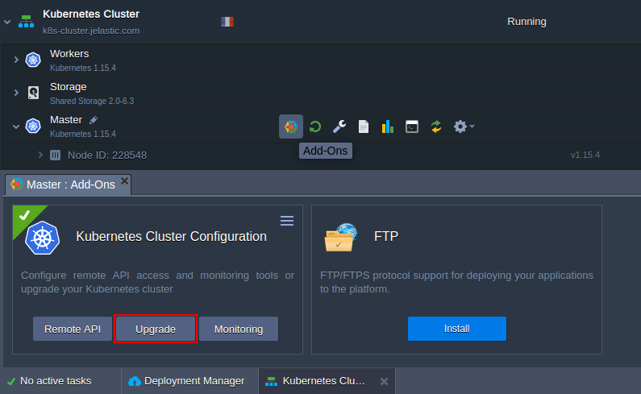
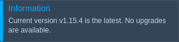

## Kubernetes Cluster: Upgrade Package

The platform actively develops the **Kubernetes Cluster** solution and regularly releases new [versions of the package](https://cloudmydc.com/). Herewith, you don’t need to recreate the whole cluster from scratch to benefit on the new features and tools - the existing environment can be upgraded with a dedicated add-on.

Hover over the Master layer and click the appeared **Add-Ons** button. Then, in the opened section, select the **Upgrade** option for the **Kubernetes Cluster Configuration** add-on panel.

Confirm an action via a pop-up, and the platform will perform an automatic update to the next version of the **Kubernetes Cluster**. If the latest version is already installed, the appropriate notification will appear on the dashboard.

:::tip Tip

Check the [Kubernetes Versions](https://cloudmydc.com/) documentation page to check the list of the currently available releases and their changelogs.

:::
