import obj from './VeleroBackups.json'

## Kubernetes Cluster: Velero Backups

**[Velero](https://cloudmydc.com/)** is an open-source backup and restoration tool for Kubernetes cluster disaster recovery. It also supports the migration of cluster resources and persistent volumes backup. Manual or scheduled backups to the external storage ensure your data safety and protection.

You can leverage Velero to achieve the following tasks:

- Back up your Kubernetes cluster or selected resources / persistent volumes and restore in case of cluster data loss.
- Replicate a whole Kubernetes cluster (e.g. create a development / testing instance based on the production one) or migrate selected resources to other clusters.

You can easily integrate Velero backups with the Kubernetes cluster on the platform. Just follow the simple steps below:

1. Start by organizing the S3-compatible storage, which Velero will use to store your backups. For example, you can use _AWS S3_, _VHI S3_, or _MinIO cluster_.

In our guide, we’ll proceed with the latter option so that you can have the whole setup under the same platform. You can install the **_[MinIO Cluster](https://cloudmydc.com/)_** at the platform in a few clicks using the Marketplace (follow the steps in the linked guide).

<div style={{
    display:'flex',
    justifyContent: 'center',
    margin: '0 0 1rem 0'
}}>

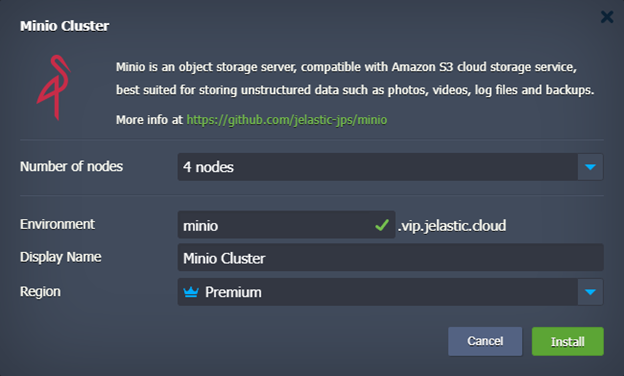

</div>

After the installation, you’ll see your MinIO installation credentials (also sent via email). You’ll need this data later on:

<div style={{
    display:'flex',
    justifyContent: 'center',
    margin: '0 0 1rem 0'
}}>

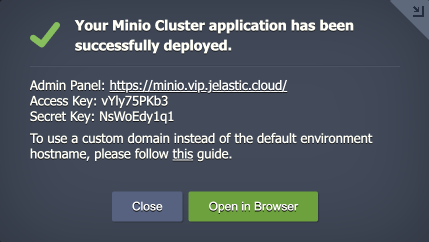

</div>

Waiting for the first server to format the disks.

2. Connect to admin panel of your MinIO cluster and create a new bucket (e.g. velero) in the storage cluster.

<div style={{
    display:'flex',
    justifyContent: 'center',
    margin: '0 0 1rem 0'
}}>

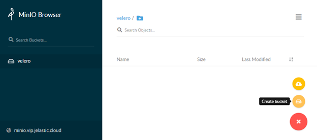

</div>

3. Find the latest **_vmware-tanzu/velero_** [release](https://cloudmydc.com/) (_v1.8.1_ in our case), click the link in the Download section and copy the URL to the **_linux amd64_** archive.

<div style={{
    display:'flex',
    justifyContent: 'center',
    margin: '0 0 1rem 0'
}}>

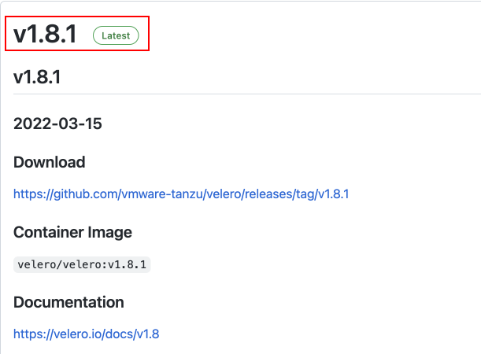

</div>

:::tip Tip

In our example, we’ll upload the velero binary to the Kubernetes Cluster server directly. However, you can keep it anywhere (e.g. locally) with the API access to the cluster.

:::

4. Connect to your Kubernetes Cluster control plane via SSH (e.g. [Web SSH](https://cloudmydc.com/)). Download the archive using the link from the previous step and extract the **_velero_** binary to the **_/usr/local/sbin_** directory.

```bash
wget https://github.com/vmware-tanzu/velero/releases/download/v1.8.1/velero-v1.8.1-linux-amd64.tar.gz
tar -zxvf velero-v1.8.1-linux-amd64.tar.gz -C /usr/local/sbin --strip-components=1 velero-v1.8.1-linux-amd64/velero
```

<div style={{
    display:'flex',
    justifyContent: 'center',
    margin: '0 0 1rem 0'
}}>

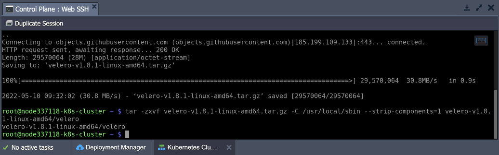

</div>

:::danger Note

If uploading via the file manager, you’ll need to adjust the file permissions:

```bash
chmod 755 /usr/local/sbin/velero
```

:::

5. Create the **_/root/credentials-velero_** file and put the S3 storage credential (see the first step):

```bash
[default]
aws_access_key_id = {accessKey}
aws_secret_access_key = {secretKey}
```

<div style={{
    display:'flex',
    justifyContent: 'center',
    margin: '0 0 1rem 0'
}}>

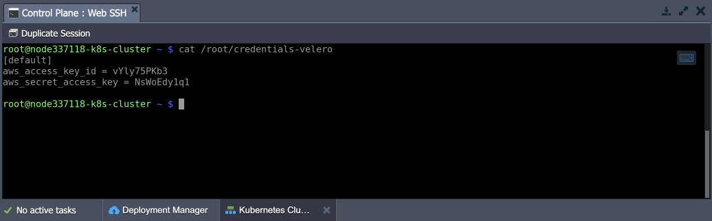

</div>

6. Adjust the command below by providing the correct values and execute it to deploy Velero. The following placeholders need adjustment:

- **_{bucket}_** - a name of the bucket (velero in our case, see the second step)
- **_{s3Url}_** - an **_http://_** link to your S3 storage (*http://minio.vip.jelastic.cloud/* in our case, see the first step)
- **_{image}_** - a velero container image (_velero/velero:v1.8.1_ in our case, see the third step)

```bash
velero install --provider aws --plugins velero/velero-plugin-for-aws:v1.4.1 --bucket {bucket} --secret-file ./credentials-velero --use-volume-snapshots=true  --backup-location-config region=default,s3ForcePathStyle="true",s3Url={s3Url} --image {image} --snapshot-location-config region="default" --use-restic
```

<div style={{
    display:'flex',
    justifyContent: 'center',
    margin: '0 0 1rem 0'
}}>

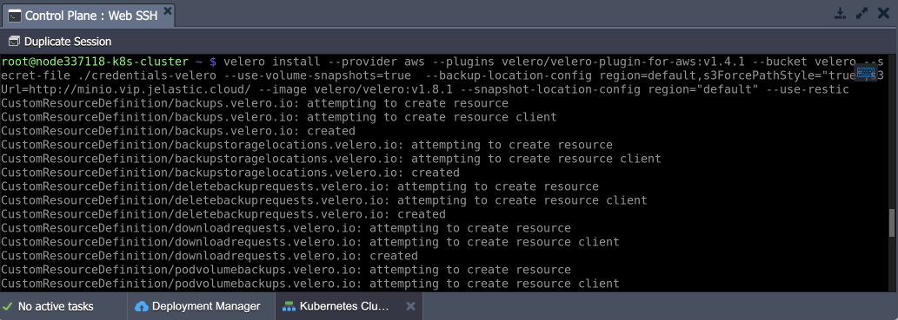

</div>

We use AWS emulation to work with S3 and **_[restic](https://cloudmydc.com/)_** add-on since we have NFS storages for which we don’t have a native snapshot functionality.

7. Let’s deploy a test application with storage and mounts to test how Velero can perform backups. We’ll use the following example application:

```bash
wget https://www.virtuozzo.com/application-platform-docs/kubernetes-velero-backups/test-instance.yaml
kubectl apply -f test-instance.yaml
```

<div style={{
    display:'flex',
    justifyContent: 'center',
    margin: '0 0 1rem 0'
}}>

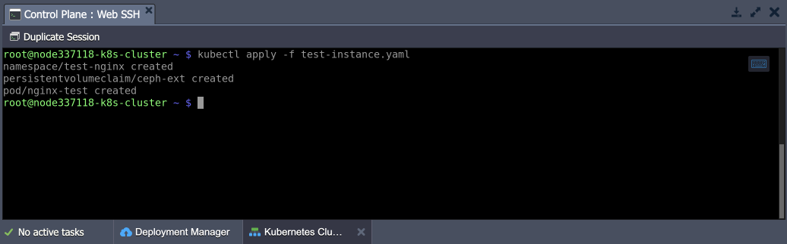

</div>

You can check the application with the following command:

```bash
kubectl get pods,pvc,pv -n test-nginx
```

<div style={{
    display:'flex',
    justifyContent: 'center',
    margin: '0 0 1rem 0'
}}>

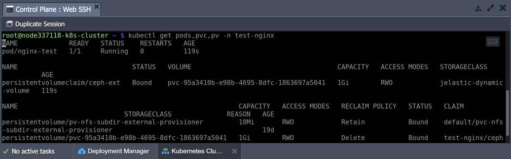

</div>

Execute the commands listed below to generate some random data that will emulate application usage.

```bash
kubectl -n test-nginx exec -it nginx-test -- /bin/bash
dd if=/dev/urandom of=/usr/share/nginx/html/test-file3.txt count=512000 bs=1024
ls -laSh /usr/share/nginx/html/
exit
```

<div style={{
    display:'flex',
    justifyContent: 'center',
    margin: '0 0 1rem 0'
}}>

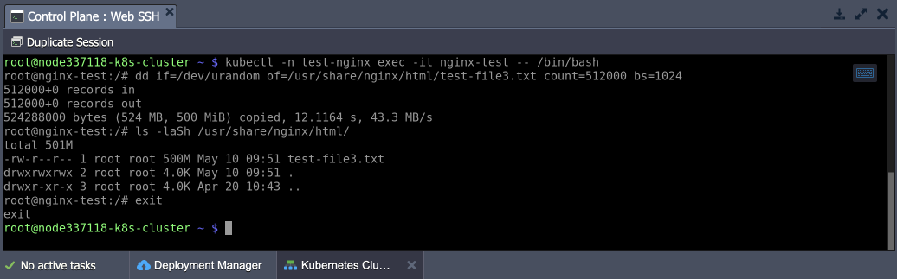

</div>

8. You need to annotate your application pods to ensure the NFS storage data is included in the backup. You can get the required storage name from the deployed application (mystorage in our case).

:::danger Note

Without the annotation, [PV and PVC](https://cloudmydc.com/) definitions are copied but not the data.

:::

```bash
kubectl -n test-nginx annotate pod/nginx-test backup.velero.io/backup-volumes=mystorage
```

<div style={{
    display:'flex',
    justifyContent: 'center',
    margin: '0 0 1rem 0'
}}>

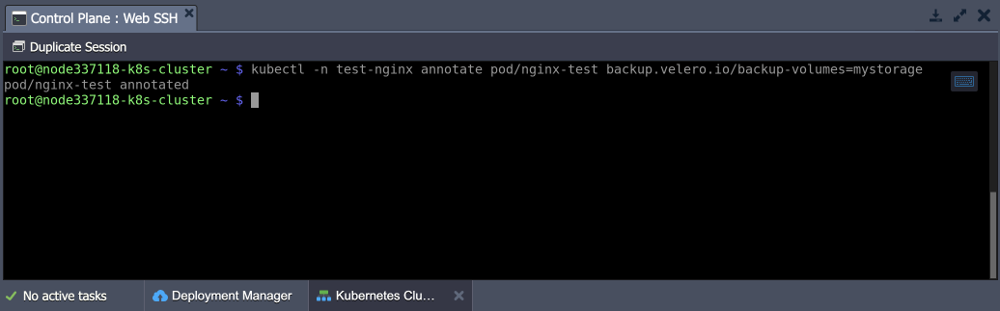

</div>

9. Now, let’s create a backup of your test application:

```bash
velero backup create test-nginx-b4 --include-namespaces test-nginx --wait
```

<div style={{
    display:'flex',
    justifyContent: 'center',
    margin: '0 0 1rem 0'
}}>

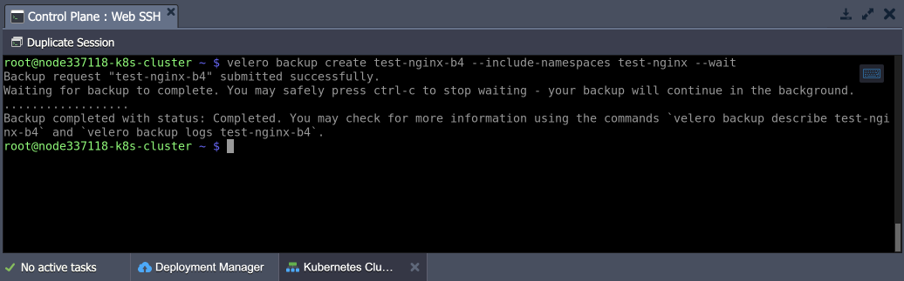

</div>

10. Check your MinIO storage. The data from Velero and restic should be present.

<div style={{
    display:'flex',
    justifyContent: 'center',
    margin: '0 0 1rem 0'
}}>

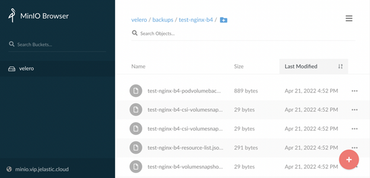

</div>

Also, check that the created backup exists and is fine.

```bash
velero get backups
```

<div style={{
    display:'flex',
    justifyContent: 'center',
    margin: '0 0 1rem 0'
}}>

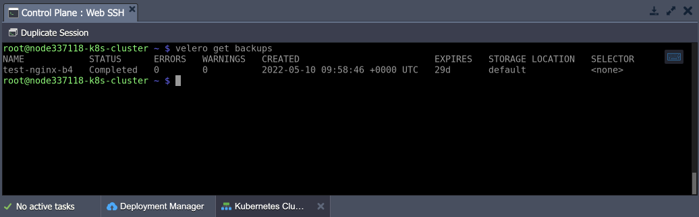

</div>

11. Let’s completely remove the example application to test the restoration process properly.

```bash
kubectl delete ns test-nginx
```

<div style={{
    display:'flex',
    justifyContent: 'center',
    margin: '0 0 1rem 0'
}}>

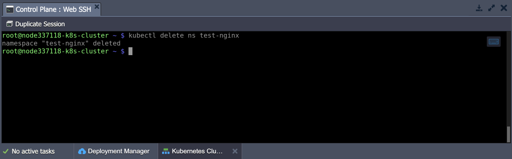

</div>

Clean up the Shared Storage data (in the **/data** directory) as well.

<div style={{
    display:'flex',
    justifyContent: 'center',
    margin: '0 0 1rem 0'
}}>

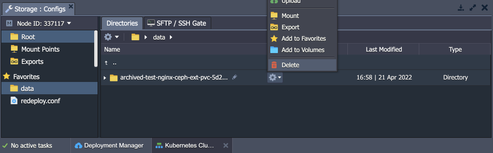

</div>

12. Once ready, restore your application from the backup with the following command:

```bash
velero restore create --from-backup test-nginx-b4
```

<div style={{
    display:'flex',
    justifyContent: 'center',
    margin: '0 0 1rem 0'
}}>

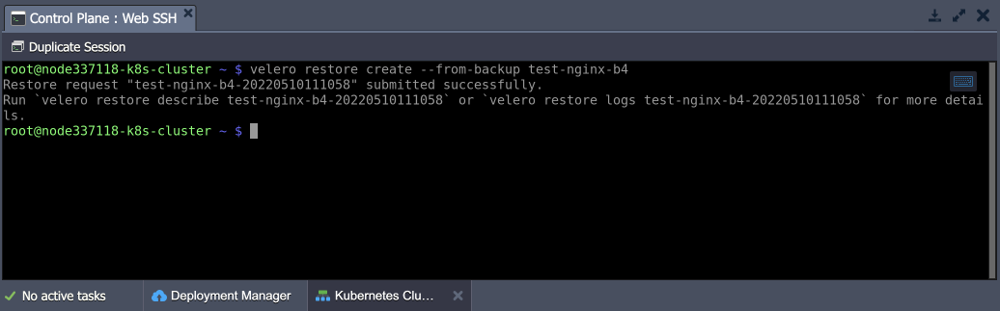

</div>

That’s it! You can verify that everything, including stored data, is restored.

## Backup Scheduling

Velero supports backup process automation through scheduling. You can create the required schedule template via cron notation (using the UTC timezone). The general syntax is the following:

```bash
velero schedule create {scheduleName} --schedule="{schedule}"
```

1. Use the table below as a reference to set the required schedule using a standard cron expression:

<div style={{
        width: '100%',
        margin: '0 0 5rem 0',
        borderRadius: '7px',
        overflow: 'hidden',
    }} >
    <div>
        <div style={{
            width: '100%',
            height: 'auto',
            border: '1px solid var(--ifm-toc-border-color)',
            display: 'grid', 
            fontWeight: '500',
            color: 'var(--table-color-primary)',
            background: 'var(--table-bg-primary-t2)', 
            gridTemplateColumns: '1fr 1fr 1fr',
            overflow: 'hidden',
        }}>
            <div style={{
                display: 'flex', 
                alignItems: 'center', 
                justifyContent: 'center',
                padding: '20px',
                wordBreak: 'break-all',
                borderRight: '1px solid var(--ifm-toc-border-color)',
            }}>
                Character Position
            </div>
            <div style={{
                display: 'flex', 
                alignItems: 'center', 
                justifyContent: 'center',
                padding: '20px',
                borderRight: '1px solid var(--ifm-toc-border-color)',
                wordBreak: 'break-all'
            }}>
               Character Period
            </div>
            <div style={{
                display: 'flex', 
                alignItems: 'center', 
                justifyContent: 'center',
                padding: '20px',
                borderRight: '1px solid var(--ifm-toc-border-color)',
                wordBreak: 'break-all'
            }}>
                Acceptable Values
            </div> 
        </div>
        {obj.data1.map((item, idx) => {
          return <div key={idx} style={{
            width: '100%',
            height: 'auto',
            border: '1px solid var(--ifm-toc-border-color)',
            display: 'grid', 
            gridTemplateColumns: '1fr 2fr 1fr',
            fontWeight: '400',
        }}>
            <div style={{
                padding: '20px',
                borderRight: '1px solid var(--ifm-toc-border-color)',
                background: 'var(--table-bg-primary-t1)',
                display: 'flex', 
                alignItems: 'center', 
                justifyContent: 'flex-start',
                wordBreak: 'break-all',
                padding: '20px',
            }}>
                {idx+1}
            </div>
            <div style={{
                padding: '20px',
                wordBreak: 'break-all'
            }}>
                {item.CharacterPeriod}
            </div>
            <div style={{
                wordBreak: 'break-all',
                 padding: '20px',
            }}>
                {item.AcceptableValues}
            </div>
        </div> 
        })}
    </div> 
</div>

For example, to create a backup every six hours:

```bash
velero schedule create myschedule --schedule="0 */6 * * *"
```

2. The schedule can also be expressed using the **_@every {duration}_** syntax. The duration can be specified using a combination of _seconds (s), minutes (m)_, and _hours (h)_.

For example, to create a backup every six hours:

```bash
velero schedule create myschedule --schedule="@every 6h"
```

3. You can add additional scheduling options (to back up a specific namespace, set backups lifetime, etc.) via dedicated parameters. Use the **_help_** flag to view the complete list of parameters:

```bash
velero schedule create --help
```

Congratulations! Now you know how to automatically back up your Kubernetes projects with Velero.
