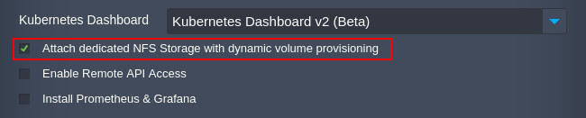

## Kubernetes Cluster: Custom Storage

Currently, the only automated option for storage backend is the [volume provisioner](https://cloudmydc.com/) based on the NFS storage. It can be selected via the package installation wizard. We recommend sticking to this option when working with the Kubernetes Cluster.

:::tip Tip

An additional option for the Gluster-based storage will be implemented in the future [package versions](https://cloudmydc.com/).

:::

If the default NFS storage does not suit your needs, it is possible to use any other preferred storage backend for your Kubernetes Cluster. You can contact the platform support to discuss the available options and to help you with the implementation.
