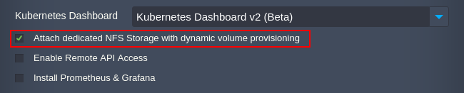
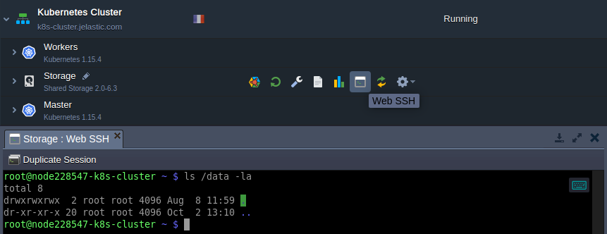

## Kubernetes Cluster: Volume Provisioner
**Kubernetes Cluster** implements persistent data with the help of *[Persistent Volumes](1)* (PV) and *[Persistent Volume Claims](1)* (PVC). **PV** is storage provisioned by an administrator, which is similar to Volumes but with lifecycle independent of any individual pod. **PVC** is a request for the PV storage with a specific size and access mode.

The platform allows automatically configure NFS volume provisioner during [installation](1). Such a solution automatically provision a persistent volume each time PVC is created. Thus, there is no need to set up PVs with desired AccessMode or *[StorageClass](1)* manually.

:::tip Tip

The platform implementation of the NFS volume provisioner for the Kubernetes Cluster package uses a dedicated [Shared Storage Container](1). You can find it in the environment topology.

The ***jelastic-dynamic-volume*** is a default StorageClass in Kubernetes Cluster. Herewith, all data is stored in the **/data** directory.

:::