<div style={{
    display: 'grid',
    gridTemplateColumns: '0.5fr 1fr',
    gap: '10px'
}}>
<div>
<div style={{
    display: 'flex',
    alignItems: 'center',
    justifyContent: 'cetner',
}}>

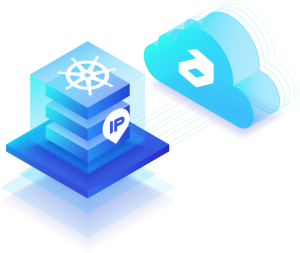

</div>
</div>
<div>

In this post we’d like to show how to expose applications via a public [IP address](/docs/ApplicationSetting/External%20Access%20To%20Applications/Public%20IP) attached to one of the nodes of a Kubernetes cluster environment in Jelastic PaaS. It can be done in two possible ways - attaching IP to [Dedicated Load Balancer](/docs/Load%20Balancers/Load%20Balancing) or to K8s Worker node.

</div>
</div>

## Dedicated Load Balancer for Application Access

1. First of all, install the Kubernetes cluster from Jelastic marketplace and deploy the application. As an example, we go with Jakarta EE Cargo Tracker.

2. Click **Change Environment Topology** next to your Kubernetes cluster. In the opened window add a Dedicated Load Balancer node and attach a public IP address to it.

<div style={{
    display:'flex',
    justifyContent: 'center',
    margin: '0 0 1rem 0'
}}>

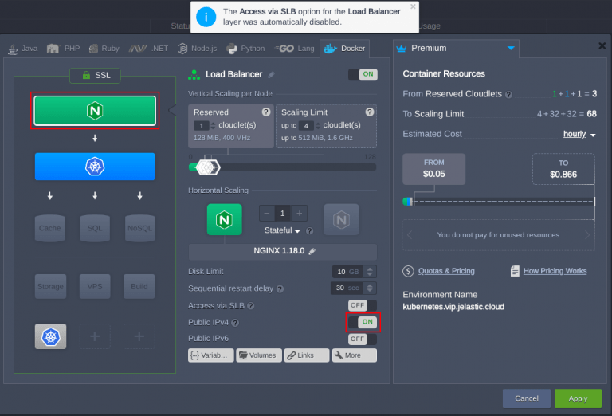

</div>

Here we use the NGINX load balancer node, but you can choose any other available ([HAProxy](/docs/Load%20Balancers/HAProxy), [LS Web ADC](/docs/Load%20Balancers/LiteSpeed%20Web%20ADC), [Varnish](/docs/Load%20Balancers/Varnish)). Once the topology is changed it should look like as follows:

<div style={{
    display:'flex',
    justifyContent: 'center',
    margin: '0 0 1rem 0'
}}>

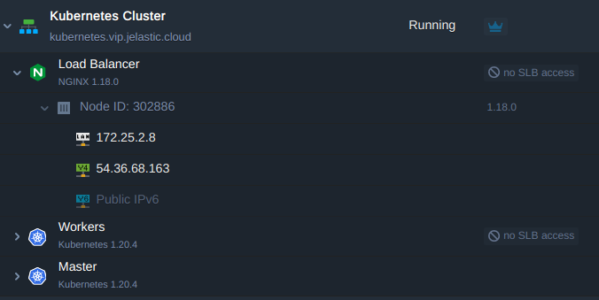

</div>

<div style={{
    display:'flex',
    justifyContent: 'center',
    margin: '0 0 1rem 0'
}}>

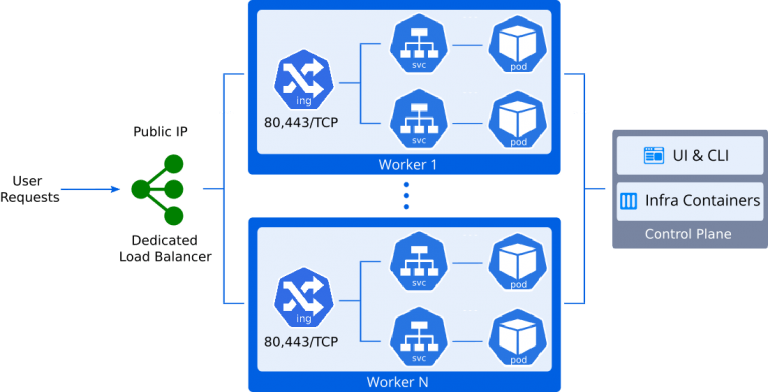

</div>

3. After that, create an [A record](/docs/ApplicationSetting/Domain%20Name%20Management/Custom%20Domain%20Name#how-to-configure-dns-record) for a [custom domain](/docs/ApplicationSetting/Domain%20Name%20Management/Custom%20Domain%20Name) using the IP address added at the previous step. For example **_cargo-tracker.jele.website_**.

<div style={{
    display:'flex',
    justifyContent: 'center',
    margin: '0 0 1rem 0'
}}>

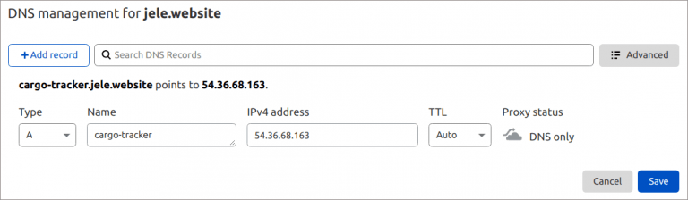

</div>

4. Now you may bind the custom domain to the K8s cluster and send a request to issue a trusted Let’s Encrypt SSL certificate to secure applications’ traffic.

- Go to the load balancer [Add-Ons](/docs/Deployment%20Tools/Cloud%20Scripting%20&%20JPS/Marketplace) and find **Let’s Encrypt Free SSL**.

<div style={{
    display:'flex',
    justifyContent: 'center',
    margin: '0 0 1rem 0'
}}>

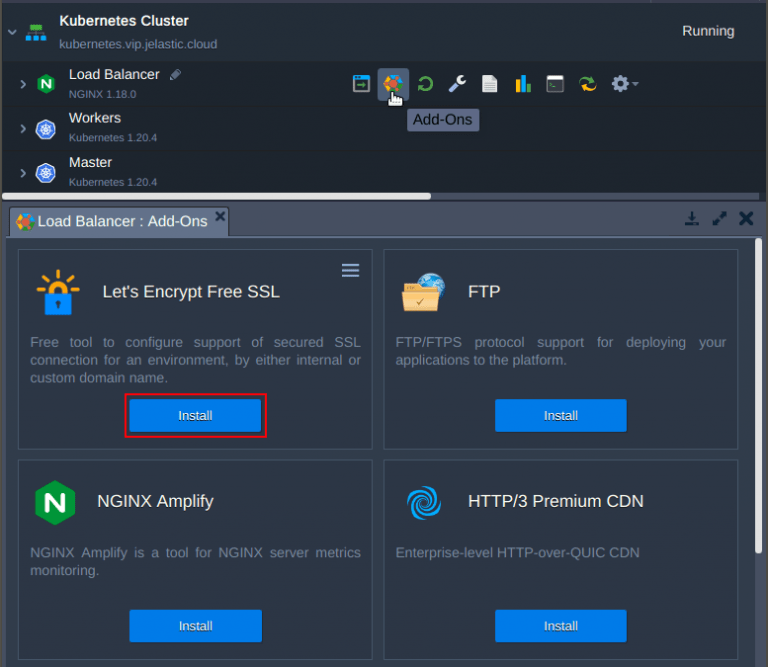

</div>

Enter the custom domain name that we have came up with and apply it.

<div style={{
    display:'flex',
    justifyContent: 'center',
    margin: '0 0 1rem 0'
}}>

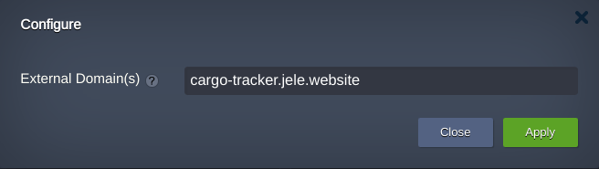

</div>

Now the Cargo Tracker application is available using a custom domain name ***https://cargo-tracker.jele.website*** and traffic is encrypted with the valid Let’s Encrypt SSL certificate.

## Kubernetes Worker Node Public IP Address for Application Access

Let's take a look at another way to make application available outside of the Kubernetes cluster. The essence of this method is to make it directly accessible through a public IP address attached to one of worker nodes.

<div style={{
    display:'flex',
    justifyContent: 'center',
    margin: '0 0 1rem 0'
}}>

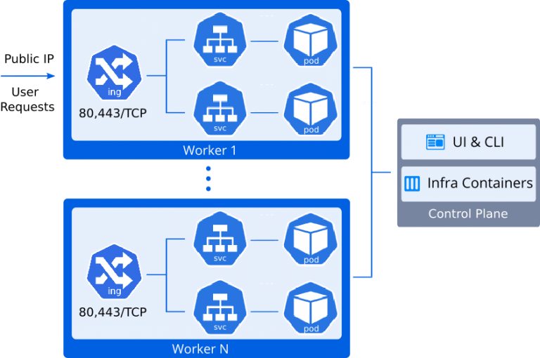

</div>

Let’s proceed on the same cluster with the Cargo Tracker application deployed.

1. Click **Change Environment Topology** and add the public IP address to the worker node.

<div style={{
    display:'flex',
    justifyContent: 'center',
    margin: '0 0 1rem 0'
}}>

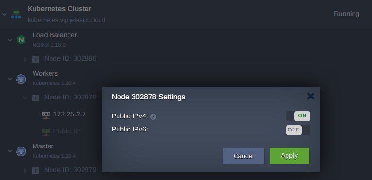

</div>

2. Create the A record for a custom domain mapping to the newly added IP address. Use a domain name different from that one used in the previous chapter. For example: **_cargo-tracker-worker.jele.website_**.

3. Then, go to the add-ons of the Control Plane node and install [Certificate Manager](https://cert-manager.io/docs/). Along with a cert-manager controller there will be installed an NGINX ingress controller with LoadBalancer service type. It will hold the IP attached to the worker node, and will be serving the “nginx-cert” ingress class resources.

<div style={{
    display:'flex',
    justifyContent: 'center',
    margin: '0 0 1rem 0'
}}>

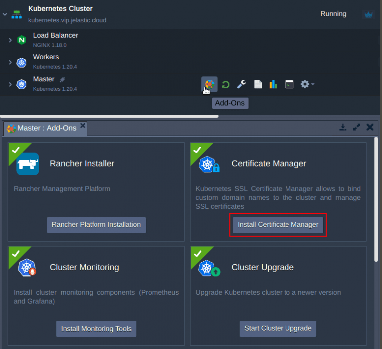

</div>

4. Enter the custom domain name and apply it.

<div style={{
    display:'flex',
    justifyContent: 'center',
    margin: '0 0 1rem 0'
}}>

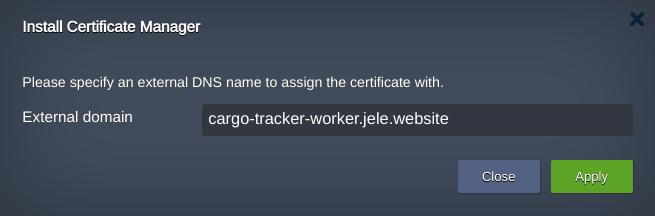

</div>

5. Upon installation, the add-on installs a test application **_helloworld-cert_**. Let’s delete the resources it takes:

**_$ kubectl delete deploy hello-cert-manager_**
**_$ kubectl delete svc hello-cert-manager_**
**_$ kubectl delete ing helloworld-cert_**

<div style={{
    display:'flex',
    justifyContent: 'center',
    margin: '0 0 1rem 0'
}}>

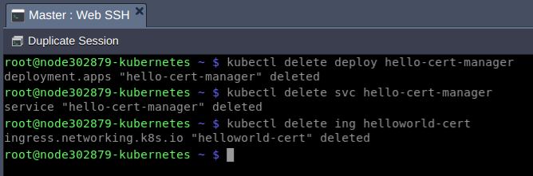

</div>

6. Finally, create an ingress resource **_cargo-tracker-worker_** that will terminate application SSL traffic and handle routing to the cargo-tracker service. For example **_cargo-tracker-worker-ingress.yaml_**:

```bash
apiVersion: networking.k8s.io/v1
kind: Ingress
metadata:
name: cargo-tracker-worker
namespace: default
annotations:
kubernetes.io/ingress.class: nginx-cert
cert-manager.io/cluster-issuer: "letsencrypt-prod"
kubernetes.io/tls-acme: "true"
nginx.ingress.kubernetes.io/affinity: "cookie"
nginx.ingress.kubernetes.io/affinity-mode: "persistent"
nginx.ingress.kubernetes.io/session-cookie-expires: "172800"
nginx.ingress.kubernetes.io/session-cookie-max-age: "172800"
spec:
tls:

- hosts:
  - cargo-tracker-worker.jele.website
    secretName: external-domain-tls
    rules:
- host: cargo-tracker-worker.jele.website
  http:
  paths: - path: /
  pathType: ImplementationSpecific
  backend:
  service:
  name: cargo-tracker
  port:
  number: 80
```

**$ kubectl apply -f cargo-tracker-worker-ingress.yaml**

7. Upon creating the ingress, a Let's Encrypt SSL certificate will be automatically issued for this domain name with Certificate Manager. Wait for a minute and check application availability by custom domain name: https://cargo-tracker-worker.jele.website.

Congratulations! You’ve successfully exposed your application in two different ways and thus, you should see two ingresses:

- **_cargo-tracker_** - serves application traffic that flows via public IP address of dedicated load balancer
- **_cargo-tracker-worker_** - serves application traffic that flows directly through the public IP address that is attached to the K8s worker node

<div style={{
    display:'flex',
    justifyContent: 'center',
    margin: '0 0 1rem 0'
}}>

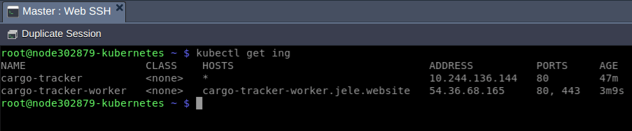

</div>

Sure, in production you need only one ingress depending on the chosen implementation. Explore easy and scalable Kubernetes hosting with Jelastic service providers worldwide.
