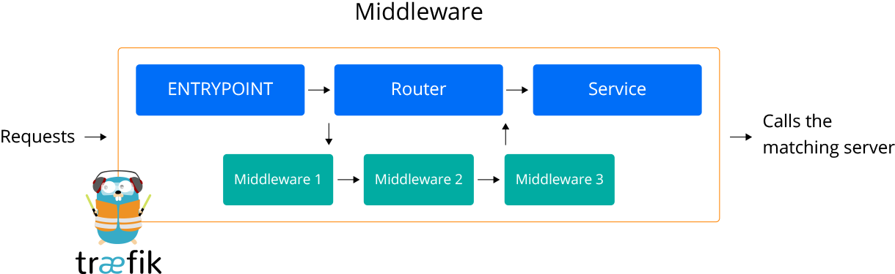
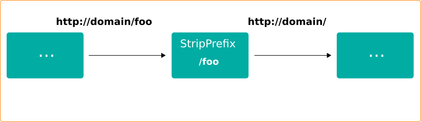
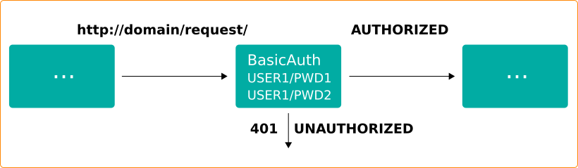
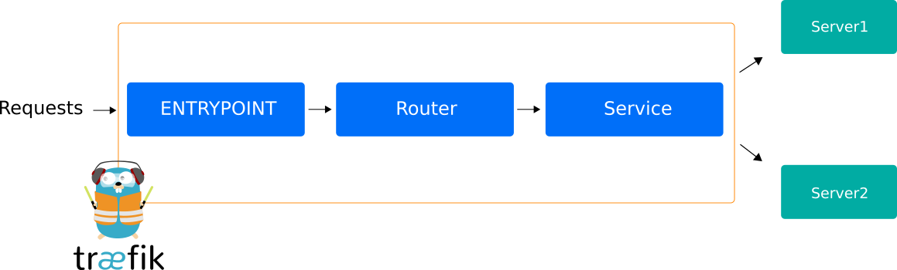
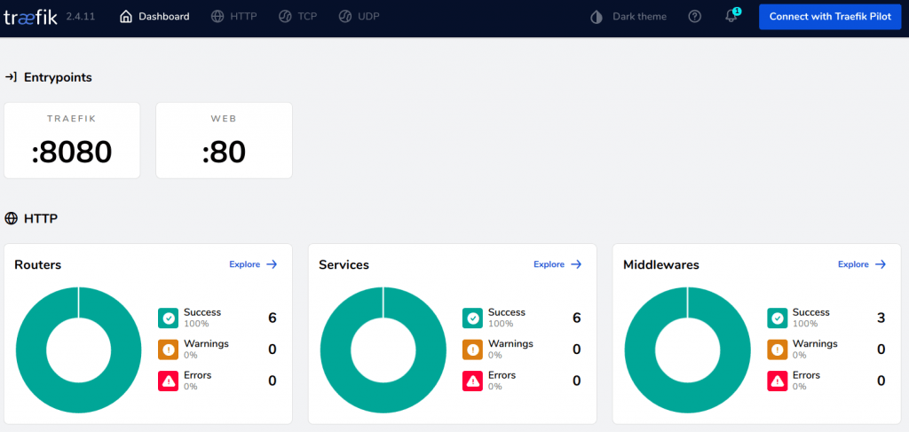

<div style={{
    display: 'grid',
    gridTemplateColumns: '0.55fr 1fr',
    gap: '10px'
}}>
<div>
<div style={{
    display: 'flex',
    alignItems: 'center',
    justifyContent: 'cetner',
}}>


</div>
</div>
<div>

Jelastic Kubernetes cluster can be installed with NGINX, Traefik, or HAProxy ingress controllers. In this post, we will take a closer look at Traefik and its evolution in Jelastic Kubernetes Service (Jelastic KS).

At the moment all issued Jelastic Kubernetes versions support Traefik v1, but commencing from K8s version 1.21.2, Traefik v2 will be used instead.

A number of internal components of Traefik were conceptually redesigned moving from v1 to v2. Below we will cover some of them we consider more important.

</div>
</div>

## No Frontends and Backends

The basic concepts such as frontend and backend have been replaced with a combination of routers, services, and middleware.
With Traefik v1, it is considered the router replaces the frontend and the service takes over the backend role, whilst each router refers to a service.

In order to increase flexibility tweaking the requests before they will be sent to the services, the middleware pieces were attached to the routers in Traefik v2. These middleware can be chained together to fit any scenario. Also, any router can then link to the desired middleware instance.

## Middleware

There are a [number of middlewares available](https://doc.traefik.io/traefik/middlewares/overview/#available-middlewares). Besides serving traditional ingresses for HTTP requests, separate middleware entities allow to modify the request parameters, the HTTP headers, some are responsible for redirects logic, other ones add authentication capabilities, etc.

Before the request will be sent to the service it can be modified with middleware(s) attached to a router.

<div style={{
    display:'flex',
    justifyContent: 'center',
    margin: '0 0 1rem 0'
}}>



</div>

The couple of examples for middlewares used in the requests routing:

- **stripPrefix** - allows to remove a prefix from the path. This middleware is supposed to be used if your backend serves the path "/" , but should be exposed externally on a specific prefix, e.g. "/foo". This middleware is a replacement of **frontend.rule.type** annotation in Traefik v1.

```bash
http:
  middlewares:
    test-stripprefix:
      stripPrefix:
        prefixes:
          - "/foo"
```

<div style={{
    display:'flex',
    justifyContent: 'center',
    margin: '0 0 1rem 0'
}}>



</div>

- **basicAuth** middleware for implementing basic authorization. For example:

```bash
http:
  middlewares:
    test-auth:
      basicAuth:
        users:
          - "user1:$apr1$Kveg6cv0$yJn5mwyfBy7luzZ9Fi1AH0"
          - "user2:$apr1$w70ASLDx$1UJmrFL/lVoltjmAz4UDH/"
```

This middleware is an alternative to specifying credentials via [Kubernetes Secrets](https://kubernetes.io/docs/concepts/configuration/secret/) and restricts access to the services:

<div style={{
    display:'flex',
    justifyContent: 'center',
    margin: '0 0 1rem 0'
}}>



</div>

And it is a replacement for the Traefik v1 annotation

```bash
traefik.ingress.kubernetes.io/auth-type: "basic".
```

## Several Middlewares at a Time

Middleware employment (as well as other routing components) is optional. Routing logic can use either several middlewares or none at all. For example, in the Ingress below one middleware handles authentication purposes, and another one strips a source path prefix.

```bash
---
apiVersion: networking.k8s.io/v1
kind: Ingress
metadata:
  name: monitoring-prometheus-alertmanager
  namespace: kubernetes-monitoring
  annotations:
    kubernetes.io/ingress.class: traefik
    traefik.ingress.kubernetes.io/router.middlewares:
       kubernetes-monitoring-alert-auth@kubernetescrd,
       kubernetes-monitoring-alert-prefix@kubernetescrd
spec:
  rules:
  - http:
      paths:
      - path: /prometheus-alert
        pathType: Prefix
           backend:
           service:
            name: monitoring-prometheus-alertmanager
            port:
              number: 80

---
apiVersion: traefik.containo.us/v1alpha1
kind: Middleware
metadata:
  name: alert-auth
  namespace: kubernetes-monitoring
spec:
  basicAuth:
    secret: monitoring-prometheus

---
apiVersion: traefik.containo.us/v1alpha1
kind: Middleware
metadata:
  name: alert-prefix
  namespace: kubernetes-monitoring
spec:
  stripPrefix:
    prefixes:
      - /prometheus-alert

```

## Providers

Traefik v2 introduces the concept of a [provider](https://doc.traefik.io/traefik/providers/overview/), which is an infrastructure component that provides information regarding routing to the Traefik. Once the Traefik detects any changes, it automatically updates the routes. The Kubernetes Ingress Traefik provider offers the traditional [Kubernetes ingress](https://kubernetes.io/docs/concepts/services-networking/ingress/) controller functionality.

Aside from the standard Ingress, Jelastic KS now supports an [IngressRoute](https://doc.traefik.io/traefik/user-guides/crd-acme/#ingressroute-definition) which is the Custom Resource Definition (CRD) implementation of a [Traefik HTTP router](https://doc.traefik.io/traefik/routing/routers/#configuring-http-routers). This implementation improved accessibility to the K8s clusters without writing annotations. You can get familiar with an [example](https://github.com/jelastic-jps/kubernetes/blob/v1.21.2/addons/jaeger/hotrod-app-traefik.yaml) of how to use IngressRoute in our K8s repository.

## Services

Among other features, Traefik v2 supports specific Services that are responsible for configuring how to reach the actual Kubernetes services that will ultimately handle incoming requests.

<div style={{
    display:'flex',
    justifyContent: 'center',
    margin: '0 0 1rem 0'
}}>



</div>

```bash
http:
  services:
    my-service:
      loadBalancer:
        servers:
        - url: "http://<private-ip-server-1>:<private-port-server-1>/"
        - url: "http://<private-ip-server-2>:<private-port-server-2>/"
```

Also, Traefik offers a set of internal services. You can see an example in the config file from the Jelastic KS repository: there is an access to a built-in Traefik v2 dashboard service via IngressRoute provided.

<div style={{
    display:'flex',
    justifyContent: 'center',
    margin: '0 0 1rem 0'
}}>



</div>

These are only a few main changes in the new Traefik v2 which is implemented within [Jelastic Kubernetes v1.21.2+](https://github.com/jelastic-jps/kubernetes/tree/v1.21.2). You can check a full list in the official [documentation related to transition from Traefik v1 to v2](https://doc.traefik.io/traefik/migration/v1-to-v2/).

Get started with Kubernetes Service that can be automatically deployed, scaled and updated using Jelastic PaaS and don’t forget to keep an eye on [new releases](/docs/Kubernetes%20Hosting/Kubernetes%20Cluster/Cluster%20Versions#current-versions).
