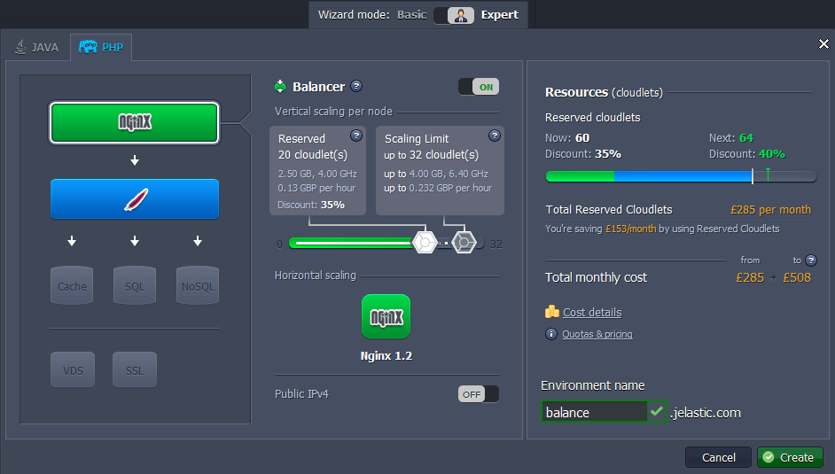
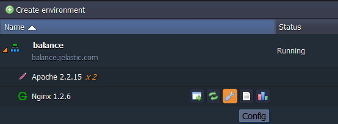
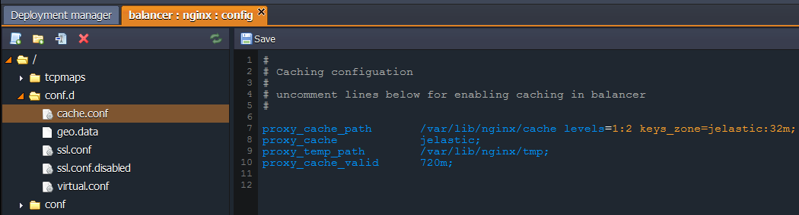
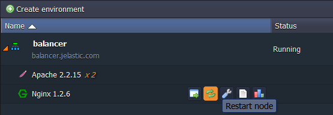

## Caching in NGINX Balancer
Caching in NGINX is the process of storing data in front of web servers. For example, the files a user automatically requests by looking at a web-page can be stored in your NGINX cache directory. When a user returns to a page he’s recently looked at, the browser can get those files from the NGINX cache directory rather than the original server, saving time and traffic.

So caching improves performance while accessing to a resource in two ways:

- reduces the access time to the resource by copying it closer to the user.
- increases the resource building speed by reducing the number of accesses. For example, instead of building the homepage of your blog at each request, you can store it in a cache.

This instruction shows how to set up a caсhe on the NGINX-balancer in the platform.

With NGINX-balancer you can use caching for reducing application servers load. To perform that just come through the next steps:

1. Log into the platform dashboard.
2. Click the **Create Environment** button.

3. Create the environment with a few application servers and **NGINX** as a balancer, specify the cloudlet limits, type the name of the environment and click **Create** button.

In a minute your environment will be created and appears in the environment list.

4. For setting up the cache click **Config** button for NGINX node in your environment and navigate to ***conf.d > cache.conf***.

5. For enabling cache uncomment lines as it is shown in the picture below.

- **proxy_cache_path** */var/lib/nginx/cache [levels=levels] keys_zone=name:size*
This directive sets path and other parameters of a cache.
   - The *levels* parameter defines hierarchy levels of a cache.
   - The *keys_zone* parameter configure name and RAM size of the zone (for example jelastic:32m).

- **proxy_cache** zone | **off**, where zone - identifier of the cache.
This directive defines a shared memory zone used for caching. The same zone can be used in several places. The off parameter disables caching inherited from the previous configuration level.

- **proxy_temp_path** */var/lib/nginx/tmp [level1 [level2 [level3]]]*
This defines a directory for storing temporary files with data received from proxied servers. Up to three-level subdirectory hierarchy can be used underneath the specified directory.

- **proxy_cache_valid** *{number}m*
It specify the time during which the NGINX should keep cash. For example 720m.

To find info about other available directives follow the [link](1).

:::tip Tip

If it is necessary to clear the cache you can just use **proxy_cache_valid** directory with the 0m parameter value.

:::

6. Save the changes and restart the node.

