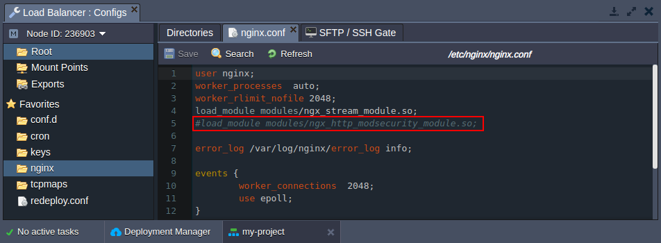
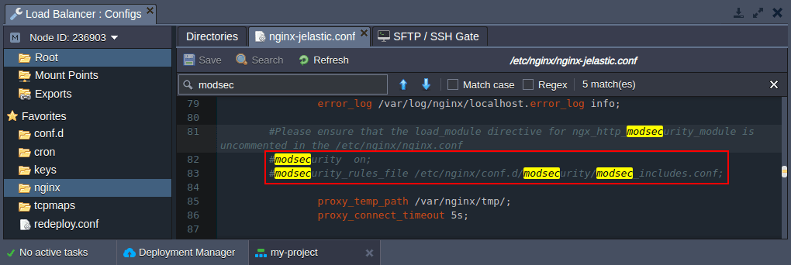
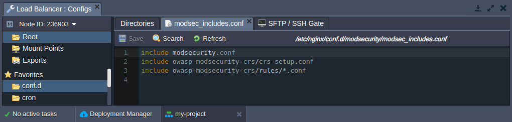
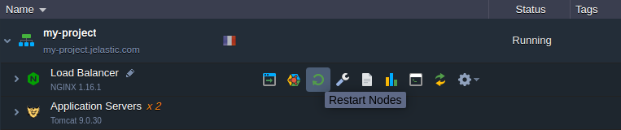
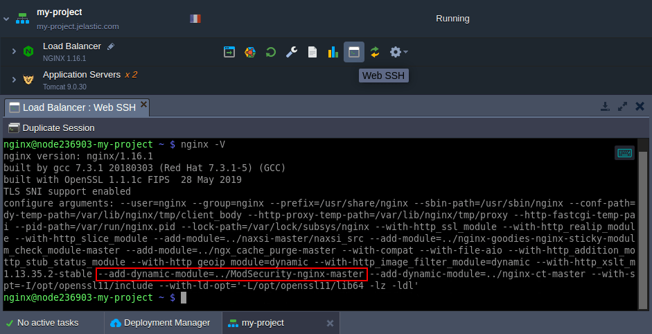
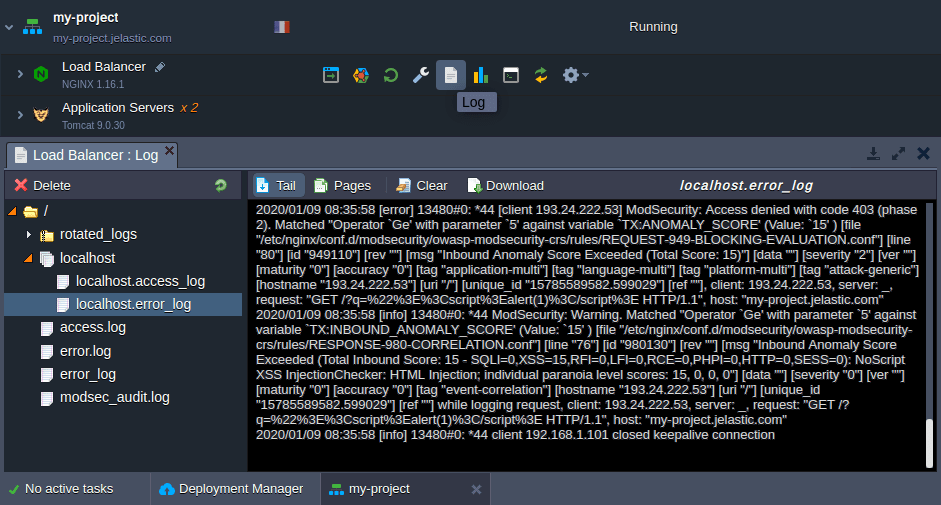

## work todo

## How to Enable ModSecurity Web Application Firewall inside NGINX Server

**[ModSecurity](https://cloudmydc.com/)** is an open-source, cross-platform web application firewall (WAF) module that helps to detect and prevent various attacks against web applications. The module can block common code injection attacks that ensures higher level of server security. It comes with a set of rules for cross website scripting, SQL injection, bad user agents, session hijacking, trojans, and other exploits.

Jelastic certified NGINX stacks (application servers and load balancer) are provided with the already pre-built ModSecurity module. You can follow just a few steps to enable this functionality on your containers:

1.  Load the ModSecurity shared NGINX module by uncommenting the next line in the **/etc/nginx/nginx.conf** file:

```bash
#load_module modules/ngx_http_modsecurity_module.so;
```

<div style={{
    display:'flex',
    justifyContent: 'center',
    margin: '0 0 1rem 0'
}}>



</div>

**Save** the changes to the file.

2.  Next, enable the ModSecurity functionality by uncommenting the following lines in the same **_/etc/nginx/nginx.conf_** config for the NGINX application server stack (or **_/etc/nginx/nginx-jelastic.conf_** for the load balancer, like in our case).

```bash
#modsecurity on;
#modsecurity_rules_file /etc/nginx/conf.d/modsecurity/modsec_includes.conf;
```

<div style={{
    display:'flex',
    justifyContent: 'center',
    margin: '0 0 1rem 0'
}}>



</div>

:::tip Tip

You can use the **Search** field to quickly locate the required strings.

:::

Don’t forget to Save the file after adjustments.

3.  According to the **_/etc/nginx/conf.d/modsecurity/modsec_includes.conf_** config, an _[OWASP ModSecurity Core Rule Set (CRS)](https://owasp.org/www-project-modsecurity-core-rule-set/)_ is included by default (provides generic protection from unknown vulnerabilities often found in web applications).

<div style={{
    display:'flex',
    justifyContent: 'center',
    margin: '0 0 1rem 0'
}}>



</div>

Also, if needed, you can upload your custom rules as <b><i>\*.conf</i></b> files to the **/etc/nginx/conf.d/modsecurity/owasp-modsecurity-crs/rules** folder.

4. Restart the appropriate NGINX node to apply all of the performed customizations.

<div style={{
    display:'flex',
    justifyContent: 'center',
    margin: '0 0 1rem 0'
}}>



</div>

Now, your application is protected with ModSecurity.

5. You can verify that it is loaded by executing the **_nginx -V_** command on the node (e.g. via [Web SSH](/docs/Deployment%20Tools/SSH/SSH%20Access/Web%20SSH)) and looking for the ModSecurity module in the list.

<div style={{
    display:'flex',
    justifyContent: 'center',
    margin: '0 0 1rem 0'
}}>



</div>

6. The operability of the ModSecurity can be checked by simulating an attack on your application. For example, try adding the **/?q="><script>alert(1)</script>** string to your environment domain. If the module works as intended, the **403 error page** should be displayed, and the appropriate action [logged](/docs/ApplicationSetting/Built-in%20Monitoring/Log%20Files) to the error log file:

<div style={{
    display:'flex',
    justifyContent: 'center',
    margin: '0 0 1rem 0'
}}>



</div>

As you can see, the ModSecurity is up and working to keep your web application secure.

Start free trial and ensure high-level protection while running your projects with [Jelastic Multi-Cloud PaaS](https://cloudmydc.com/).
