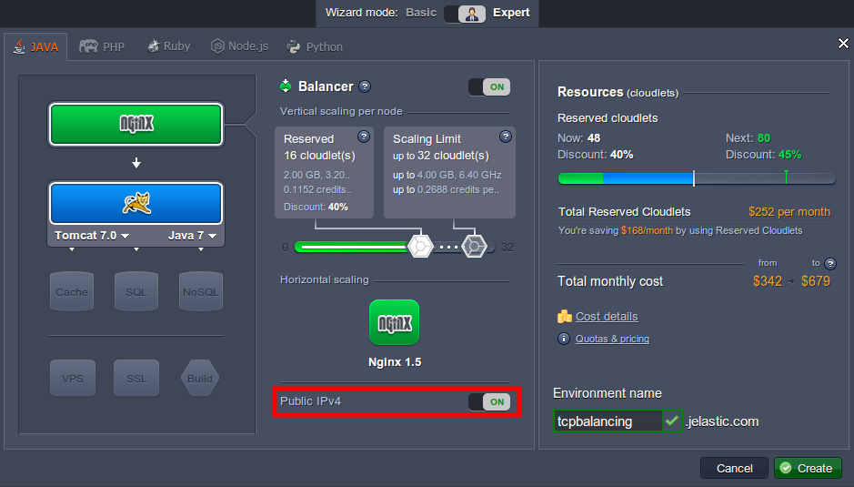
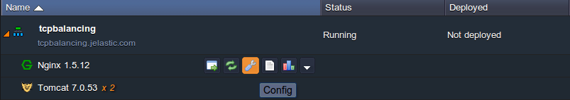
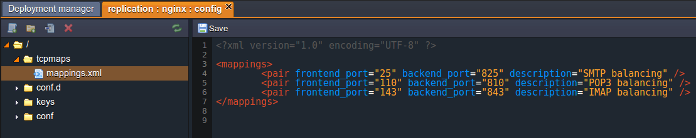

## TCP Load Balancing
Load balancing ensures high system availability through the distribution of workload across multiple components. Using multiple components with load balancing, instead of a single component, may increase reliability through redundancy. The platform uses NGINX for two types of load balancing: **TCP** and **HTTP**.

Platform clients can use **TCP** for balancing requests to databases, mail servers and other distributable applications with network support. Also TCP can be used instead of HTTP if faster balancing is needed. In this case you just need to note that this fastness is achieved through omitting the process of handling requests.

**TCP load balancing** component receives a connection request from a client application through a network socket. This component decides which node in the environment receives the request. For this requests distribution, the platform uses Round Robin Algorithm.

When the connection is established, requests from the client application continue to go through the same connection to the chosen node. The application cannot determine which instance is selected.

The existing connection can be lost only if a problem occurs, such as a temporary network failure or something like that. The next time a request is received, a new connection is created. This connection can go to any instance in the environment.

To get **TCP balancing** at your environment follow the instruction:

1. Create environment with two or more application servers (for example, **Tomcat**). In this case the **NGINX** will be added automatically. Note that you need to switch on **Public IP** for your **NGINX** node.

2. Click **Config** for NGINX in your environment.

3. In the opened tab navigate to **tcpmaps > mappings.xml** and specify ***frontend*** and ***backend*** ports. **Save** the changes.

***Frontend*** is a port to which a user is going to be connected.
***Backend*** is a port to which the request will be forwarded by the balancer.

4. **Restart** NGINX node.

That’s all. Now your environment uses TCP balancing for your application servers.