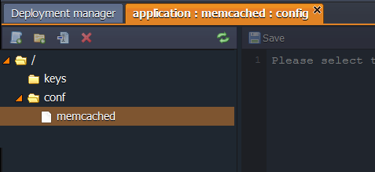

import obj from './MemcachedConfiguration.json'

The following Memcached configuration files are available:

    

        

            

                Folder
            

            

               File
            

            

                Path
            
 
        

        {obj.data1.map((item, idx) => {
          return 

            

                {item.Folder}
            

            

                {item.File}
            

            

                {item.Path}
            

        
 
        })}
    
 

More information about Memcached usage you can find in the [Memcached](/docs/Memcached/Memcached%20System) document.

## CONF

The main Memcached configuration file is located in the **conf** folder.

## KEYS

The **keys** directory is used as a location for uploading any private key which is needed for your application.
Generate the key, save it as a simple file and upload to the **key** folder.
Now you can use it for different cases by simply stating the path to your key:

_/var/lib/jelastic/keys/{key_file_name}_

