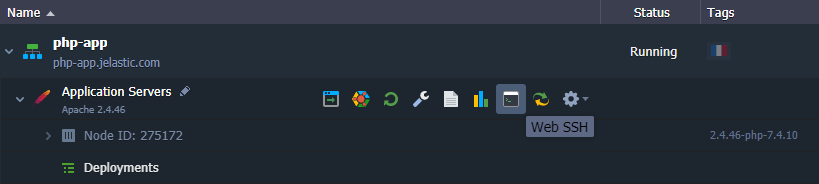
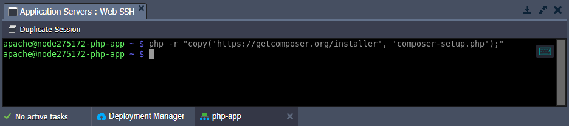
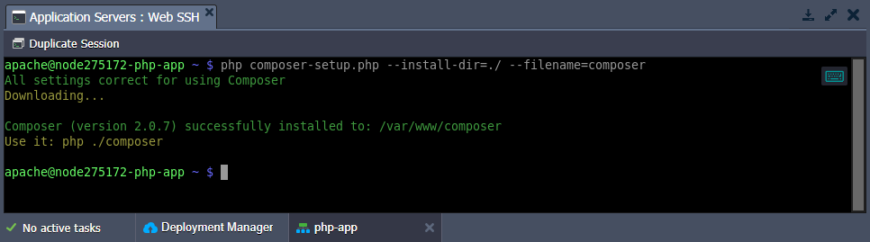
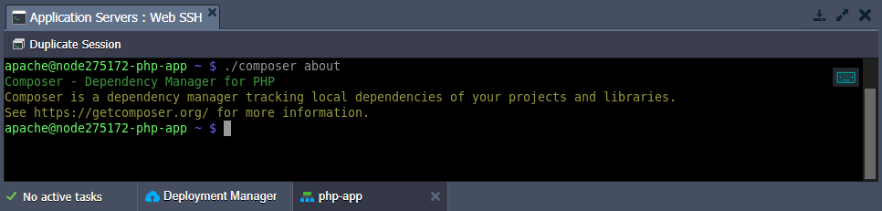
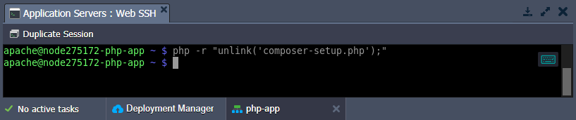

## PHP Composer for Smart Dependency Management of Your Cloud Applications

<div style={{
    display: 'grid',
    gridTemplateColumns: '0.15fr 1fr',
    gap: '10px'
}}>
<div>
<div style={{
    display: 'flex',
    alignItems: 'center',
    justifyContent: 'cetner',
}}>

<!-- Image Url changes -->


</div>
</div>
<div>

<!-- Content changes -->

[**Composer**](https://cloudmydc.com/) is one of PHP’s most popular dependency management tools inspired by the node’s [npm](https://cloudmydc.com/) and ruby’s [bundler](https://cloudmydc.com/). It will smartly manage all the required libraries and packages for your application. Running on a per-project basis, **Composer** determines which versions of which packages your project depends on and installs them in a working directory. Moreover, this tool provides the [autoload](https://cloudmydc.com/) feature to keep your packages up-to-date.

</div>
</div>

The **Composer** is integrated into all PHP application servers (_Apache, NGINX, LiteSpeed, LEMP_, and _LSSMP_) by default. It is installed to the **/usr/local/bin** folder, which is added to the PATH variable, making Composer operable from anywhere on the node via the _composer_ shortcut (e.g. _composer about_). Additionally, if the project has a **_composer.json_** file, Composer can manage dependencies directly during the installation using the _Post-Deploy_ [hook script](https://cloudmydc.com/). All you need to do is move to your project directory and run the _composer install_ command:

```bash
cd $WEBROOT/{project_name}
composer install
```

## Composer Update

You are automatically provided with the latest version of Composer during the node creation. However, if a newer version of Composer is released, you can easily get it without the necessity of recreating a whole container. Follow the next steps to install the latest composer version into your PHP container:

1. Connect to the appropriate node via SSH. For example, using the built-in [Web SSH](http://localhost:3000/docs/Deployment%20Tools/SSH/SSH%20Access/Web%20SSH).

<div style={{
    display:'flex',
    justifyContent: 'center',
    margin: '0 0 1rem 0'
}}>



</div>

2. Download Composer installer with the following command:

```bash
php -r "copy('https://getcomposer.org/installer', 'composer-setup.php');"
```

<div style={{
    display:'flex',
    justifyContent: 'center',
    margin: '0 0 1rem 0'
}}>



</div>

3. Install Composer into the current directory.

```bash
php composer-setup.php --install-dir=./ --filename=composer
```

<div style={{
    display:'flex',
    justifyContent: 'center',
    margin: '0 0 1rem 0'
}}>



</div>

:::tip Tip

If needed, you can move to the required directory before the operation or adjust the path via the _install-dir_ parameter. However, you cannot install to the **/usr/local/bin/** directory with the initial Composer instance.

:::

4. Let’s run this _local version_ of the Composer (i.e. using relative or absolute path) to ensure that everything works as expected. For example:

```bash
./composer about
```

<div style={{
    display:'flex',
    justifyContent: 'center',
    margin: '0 0 1rem 0'
}}>



</div>

:::tip Tip

If the dependency manager works fine, we recommend removing the installer (as it’s not needed anymore).

```bash
php -r "unlink('composer-setup.php');"
```

<div style={{
    display:'flex',
    justifyContent: 'center',
    margin: '0 0 1rem 0'
}}>



</div>

:::

That’s all! The latest version of the Composer is successfully installed and is ready for use.
