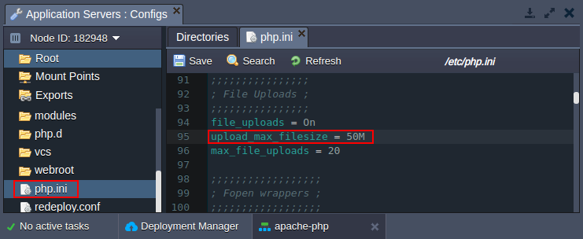

## Apache PHP

The platform adapts a robust, commercial-grade, and open-source [Apache HTTP Server](https://cloudmydc.com/) ("_httpd_") to create a secure, efficient, and scalable application server for PHP hosting. **Apache PHP** stack by the platform provides out-of-box support of the PHP programming language and HTTP/2 protocol ([SSL](https://cloudmydc.com/) is required) through utilizing the **_php7_module_** and **_http2_module_** modules respectively.

:::tip Notes:

- This template utilizes a modern **_systemd_** initialization daemon.
- The list of all modules loaded on the server can be viewed with the **_apachectl -M_** command or at the default **_phpinfo_** page.

:::

To get your _Apache PHP_ server, follow the steps below:

1. Log into your PaaS account and click **New Environment** at the top.

2. Within the opened _topology wizard_, switch to the **PHP** tab and select **_Apache_** as your application server. Set other configurations up to your needs (e.g. [cloudlets limit](https://cloudmydc.com/), [public IPs](https://cloudmydc.com/), [region](/docs/EnvironmentManagement/Environment%20Regions/Choosing%20a%20Region), etc.).

Type your environment name and click **Create**.

3. Once the environment is created, you can click the **Open in Browser** button next to the _Apache_ application server:

4. Within the opened default page, you’ll see your server’s **_phpinfo_** data.

Now, you can [deploy](https://cloudmydc.com/) your PHP application into the environment.

## Apache Configuration

Apache PHP has some main configuration files that you may want to adjust to customize your application server up to your specific needs:

- **_/etc/php.ini_** - lists [directives](https://cloudmydc.com/) that configure your **PHP** setup
- **_/etc/httpd/conf.d/php.conf_** - configures PHP scripts execution
- **_/etc/httpd/conf/httpd.conf_** - lists [directives](https://cloudmydc.com/) that configure your **Apache** server

As an example, we’ll show how you can change the size of the files, which can be uploaded to your application.

1. Click the **Config** button for your Apache server to access the [configuration file manager](/docs/ApplicationSetting/Configuration%20File%20Manager):

2. Open the **_/etc/php.ini_** file (available through the Favorites shortcut) and locate the next parameters:

- **_upload_max_filesize_** - maximum size of files that can be uploaded to the server (_100MB_ by default)
- **_post_max_size_** - maximum size of the POST data that PHP will accept (_100MB_ by default)

:::danger Note

Regardless of these settings, the maximum file size that can be uploaded via the platform file manager from the local machine is _150MB_ (may vary based on the hosting provider settings). To operate larger files, use the **URL** option or attach [public IP](/docs/ApplicationSetting/External%20Access%20To%20Applications/Public%20IP) and use your own manager (for example, [FTP add-on](https://cloudmydc.com/)).

:::

3. Don’t forget to **Save** the changes and **Restart Nodes** of your application server to apply new settings.

For the detailed info on the PHP servers configuration refer to the appropriate guides:

- [PHP Dev Center](https://cloudmydc.com/)
- [PHP.INI Security Settings](https://cloudmydc.com/)
- [PHP Extensions](https://cloudmydc.com/)
- [PHP Accelerators](https://cloudmydc.com/)
- [PHP Auto Configurations](https://cloudmydc.com/)
