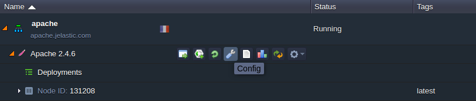
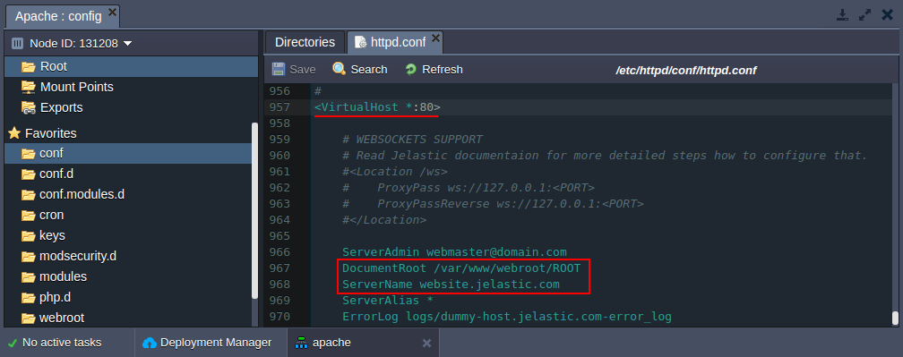
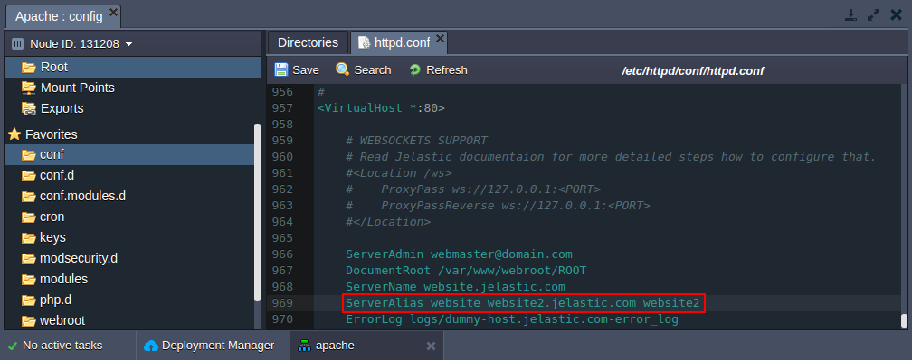

## Name-Based Virtual Host in Apache

The term Virtual Host refers to the practice of running more than one web site on a single machine. Virtual hosts can be "<u>IP-based</u>", meaning that you have a different IP address for every web site, or "<u>Name-based</u>", meaning that you have multiple names running on each IP address. The fact that they are running on the same physical server is not apparent to the end user.

To use name-based Virtual Host come through the next steps:

1.

Click **Config** button for Apache server in your environment.

2.

Navigate to the **_/etc/httpd/conf/httpd.conf_** file.

3.

Before you actually start configuring your virtual host make sure you have the **NameVirtualHosts** line uncommented:

4.

Then find **< VirtualHost >** block. You should create < VirtualHost > block for each different host that you would like to serve.

Note, that the argument to the < VirtualHost > directive must match a defined NameVirtualHost directive (in our case it is \*:80). Inside each < VirtualHost > block, you will need at minimum 2 directives:

- **ServerName** directive to uniquely identify a virtual host. Preferably enter here the main hostname of your site.
- **DocumentRoot** directive to show where in the filesystem the content for that host lives.

5.

If many servers want to be accessible by more than one name, you can use the **ServerAlias** directive, placed inside the < VirtualHost > section. You can enter there all the names which people can use to see your web site. Entering this names you can also use “\*” and “?” wildcards characters.

6.

Finally, you can fine-tune the configuration of the virtual hosts by placing other directives inside the < VirtualHost > containers. Most directives can be placed in these containers and will then change the configuration only of the relevant virtual host.

To find out if a particular directive is allowed follow the [link](https://cloudmydc.com/). Configuration directives set in the main server context (outside any < VirtualHost > container) will be used only if they are not overridden by the virtual host settings.
