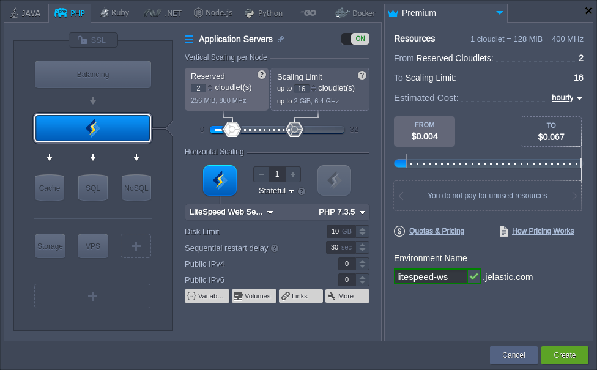
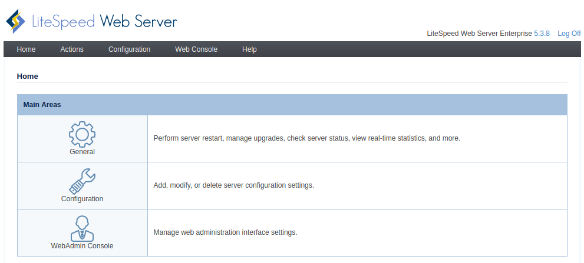
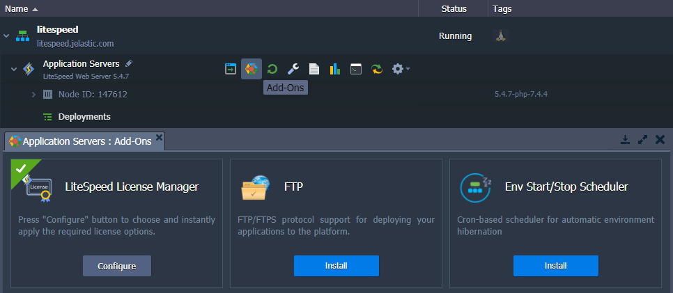
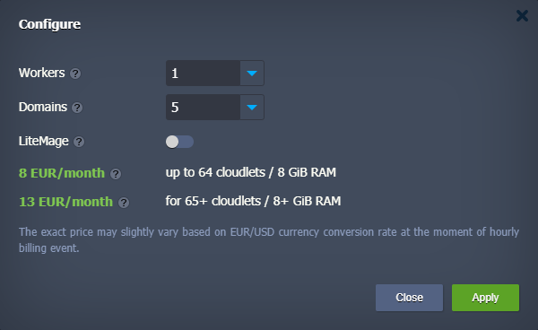
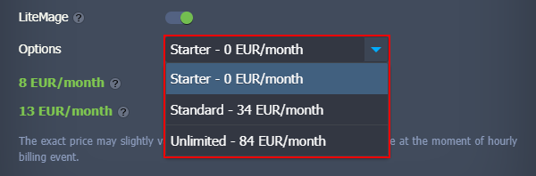

import obj from './LiteSpeedWebServer.json'

## LiteSpeed Web Server

:::tip

The **LiteSpeed Web ADC** stack is [HTTP/3](https://cloudmydc.com/) ready with the feature support enabled by default. However, a [public IP address](https://cloudmydc.com/) is required to bypass the Shared Load Balancer and work directly with the server over HTTP/3.

:::

The [**LiteSpeed Web Server**](https://cloudmydc.com/) is a high performance and low memory consumption PHP web server with high scalability. It is built based on the best practices of the PHP hosting, utilizing the benefits of both _Apache_ and _NGINX_ implementations, and integrating its own optimizations.

The feature-rich structure of the LiteSpeed application server includes the following specifics:

- an event-driven architecture (like NGINX) consumes fewer resources than Apache process-based model, ensuring better performance with minimum memory and CPU usage
- full compatibility with commonly used Apache features including _mod_rewrite_, _.htaccess_, and _mod_security_
- individual optimization for the most popular hosting platforms (e.g. _WordPress_, _Magento_, _Drupal_, _Joomla_, etc.)
- support of the caching plugins, cutting-edge anti-DDoS features, built-in WAF security, etc.

:::danger Note

Being a commercial software, LiteSpeed Web Server cannot be distributed freely, i.e. requires the license to be applied to the platform. If working with this application server, you’ll be charged an [additional fee](https://cloudmydc.com/) for usage of the license mentioned above.

:::

The creation of a new LiteSpeed Web Server instance in the platform is straightforward.

1. Log in to the dashboard and click the **New Environment** button at the top of the page.

2. Within the opened topology wizard, switch to the **_PHP_** engine tab and choose **LiteSpeed Web Server** as your application server.

:::tip

You may want to adjust some [dedicated environment variables](https://cloudmydc.com/) to customize your LiteSpeed Web Server:

- **_JELASTIC_AUTOCONFIG_** - enables (_enabled_, by default) or disables (_disabled_) autoconfiguration of the LiteSpeed worker processes count based on the allocated RAM and number of CPU cores
- **_LSWS_MAX_CHILDREN_** - redefines the maximum children process limit for the server. The variable is hidden by default as the platform sets this value equal to the number of available CPU cores (usually ensures the best operability). You need to manually add this variable and restart the server to redefine the value
- **_REDIS_ENABLED_** - enables (_true_) or disables (_false_, by default) object caching with Redis
- **_WAF_** - enables (_true_) or disables (_false_, by default) Web Application Firewall with the [Comodo](https://cloudmydc.com/) default ruleset
- **_WP_PROTECT_** - configures an action for the [WordPress Brute Force Attack Protection](https://cloudmydc.com/) feature (_off|on|drop|deny|throttle|captcha; off_ by default)
- **_WP_PROTECT_LIMIT_** - sets a limit for the [WordPress Brute Force Attack Protection](https://cloudmydc.com/) feature (_0|1|2-1000; 10_ by default)

:::

Configure any other required parameters ([cloudlets](/docs/PlatformOverview/Cloudlet), disk space, [regions](https://cloudmydc.com/), etc.) and proceed with the **Create** button.

3. After creation, you can view the default _phpinfo_ data on the server by clicking **Open in Browser** next to your LiteSpeed server:

4. To start managing the server, access the **Admin Panel** with the appropriate button in the **_Additionally_** list next to the layer (access credentials are sent via email after the node creation).

:::danger Note

There are some specifics while working with the platform implementation of the LiteSpeed via the admin panel:

- to ensure container stability, the [platform-native redeploy feature](https://cloudmydc.com/) should be used instead of the **Actions > Version Manager** functionality

- the notification about the license key expiration in the **Actions > Server Log Viewer** should be ignored as the leasing is automatically managed by the platform

:::

The application [deployment](https://cloudmydc.com/) process is the same as for any other application server.

## License Pricing

The platform seamlessly integrates the cost of the LiteSpeed license in accordance with the fair **pay-as-you-go** principles. Namely, the license is billed only for active containers on an hourly basis for 730 hours per month. In addition, license lifecycle management is fully automated:

- new licenses are issued for every newly-created container (e.g. during environment provisioning or horizontal scaling)
- updated while changing available resource limits within each container
- decommissioned while stopping the environment or scaling in

Based on your needs, you can select the required plan using a dedicated **_LiteSpeed License Manager_** add-on that is automatically installed on all the LiteSpeed-based nodes (LS Web Server, [LS ADC](https://cloudmydc.com/), [LLSMP](https://cloudmydc.com/)).

:::tip

By default, a license type is selected based on the RAM (i.e. number of cloudlets) available after the node creation:

- up to 2 GB (16 cloudlets) - free of charge
- up to 8 GB (64 cloudlets) - 0.014$ per hour (**10$** per month)
- over 8 GB (64 cloudlets) - 0.022$ per hour (**16$** per month)

:::

Add-on allows choosing the LiteSpeed plan by specifying the required limits for:

- **_Workers_** - indicates how many processes will be spawned to do general server work
- **_Domains_** - sets the [top-level domains](https://cloudmydc.com/)' limit (subdomains are unlimited); any domain that exceeds the specified limit will result in a 403 error

    

        

            

                License Plan Name
            

            

               Domain Limit
            

            

               Workers
            
 
            

               RAM Limit, GB
(max cloudlets)
            
 
            

              Pricing (USD)
            
 
        

        {obj.data1.map((item, idx) => {
          return 

            

                {item.LicensePlanName}
            

            

                {item.DomainLimit}
            

            

                {item.Workers}
            

            

                {item.RAMLimit}
            

            

                {item.Pricing}
            

        
 
        })}
    
 

Additionally, the add-on can automatically configure a **LiteMage Cache** extension for your server - a popular, fast, full page caching solution that caches dynamic pages as static files. Just turn on the appropriate setting within the add-on frame and choose the required plan (determines the number of [publicly cached objects](https://cloudmydc.com/)) in the appeared **Options** field:

- Starter - 1500 cached objects (**0** USD/month)
- Standard - 25000 cached objects (**40** USD/month)
- Unlimited - unlimited cached objects (**100** USD/month)

:::danger Note

The exact cost may vary slightly for the platforms with a currency other than USD; it depends on the conversion rate at the moment of the hourly billing event. All the account charges can be viewed via the [**Billing History**](https://cloudmydc.com/) in the dashboard.

:::
