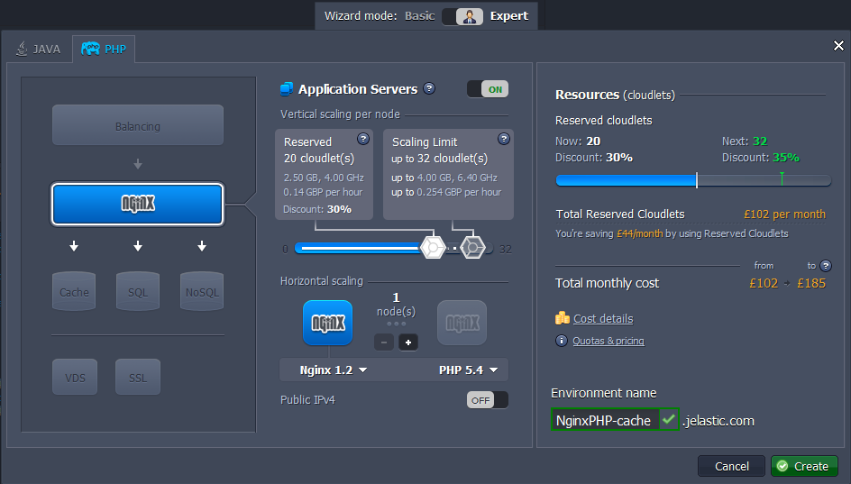
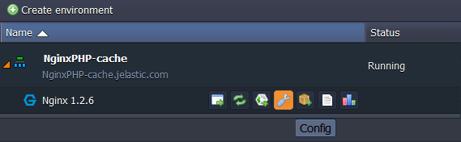
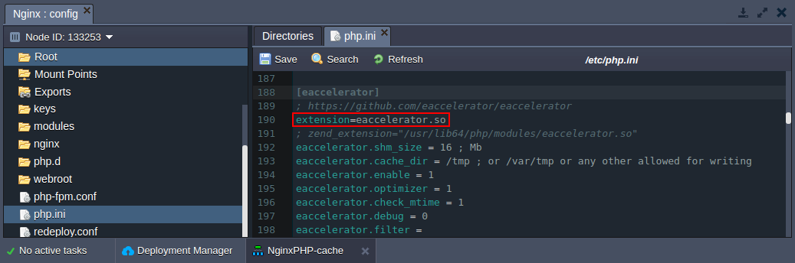
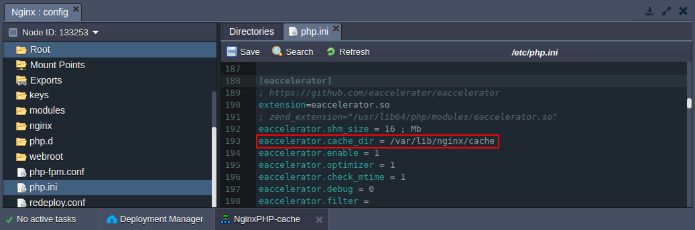
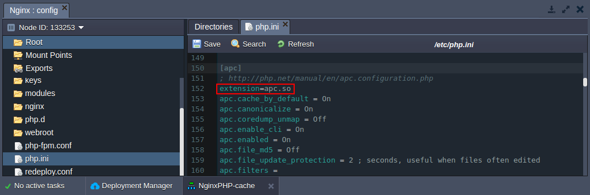

## Caching in NGINX App Server

Caching in NGINX is the process of storing data in front of web servers. For example, the files a user automatically requests by looking at a web-page can be stored in your NGINX cache directory. When a user returns to a page he’s recently looked at, the browser can get those files from the NGINX cache directory rather than the original server, saving time and traffic.

So caching improves performance while accessing to a resource in two ways:

- reduces the access time to the resource by copying it closer to the user.
- increases the resource building speed by reducing the number of accesses. For example, instead of building the homepage of your blog at each request, you can store it in a cache.

This instruction shows how to set up a caсhe on the NginxPHP server in the platform.

With **NginxPHP server** you can use the caching for improving performance through getting from the cache already compiled html replies for repeated PHP queries.

:::tip Note

We limit the size of the disk cache to 5 GB.

:::

To perform caching follow the instruction:

1. Log into the platform dashboard.

2. Click the **Create environment** button.

3. Create the environment with the NGINX as an application server, specify the cloudlet limits, type the name of the environment and click **Create** button.

In a minute your environment will be created and appears in the environment list.

4. For setting up the cache click **Config** button for NGINX node in your environment and navigate to **etc > php.ini**.

5. For enabling cache on your NginxPHP server you can use APC or eAccelerator.

- **_eAccelerator_**

For using eAccelerator you should uncomment it in the **Accelerators** section:

Now you need to specify the directory which will be used for the disk cache. For that add the following line as it is shown in the picture below:

        

        

          1
        

        

           eaccelerator.cache_dir = /var/lib/nginx/cache
        

    

All additional settings you can find [here](https://cloudmydc.com/).

- **_APC_**

To use APC accelerator you should just uncomment it in the Accelerators section:

To find out what additional APC functions are available follow the [link](https://cloudmydc.com/).

That’s all! Now, you can use **NGINX caching** for your PHP applications.
